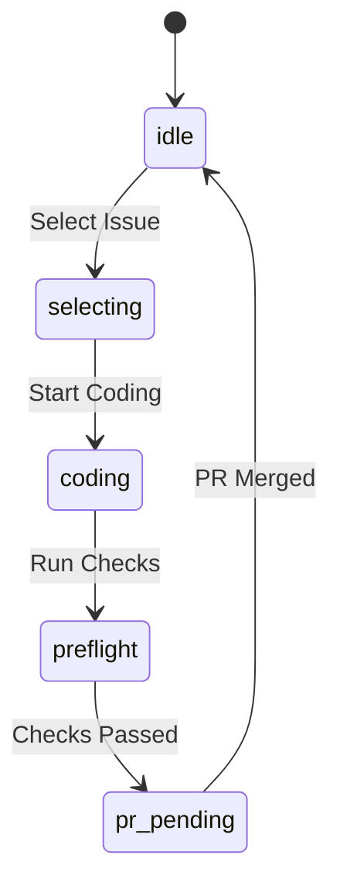

# 🤖 Luma AI Architect V2: Workflow Guardian

> **Version:** 1.1.0  
> **Status:** Production Ready 🚀  
> **Goal:** Autonomous AI Software Architect for Multi-Repo Projects

---

## 🏗️ System Architecture

```mermaid
flowchart TB
    subgraph Luma["Luma Workflow Guardian"]
        SM[State Manager]
        GP[GitHub Project Sync]
        PC[Pre-flight Checker]
        UI[Terminal UI (ui.py)]
        ACT[Actions Logic (actions.py)]
    end
    
    SM <--> LS[.luma_state.json]
    GP <--> GH[GitHub API / gh CLI]
    PC --> DR[Docs/Rules Files]
    ACT --> SM
    UI --> ACT
```

### Core Components:
- **State Manager:** Tracks project status (Idle, Coding, PR Pending) via `.luma_state.json`.
- **GitHub Project Sync:** Deep integration with GitHub Projects (Kanban).
- **Pre-flight Checker:** Enforces definition of done (Tests, Lint, etc.) before PR.
- **SBE Generator:** AI-powered Specification by Example for pre-coding phase. 🆕
- **Modular Codebase:** Clean separation of concerns (`ui.py`, `actions.py`, `config.py`).

---

## 🚦 Workflow Phases (State Machine)



| State | Description |
|-------|-------------|
| `idel` | Waiting for new task |
| `selecting` | Browsing Kanban for 'Ready' issues |
| `coding` | Active development (Analyst/Coder/Reviewer active) |
| `preflight` | Pre-PR validation |
| `pr_pending` | PR created, waiting for merge |

---

## 📂 File Structure

```
Luma/
├── luma_core/
│   ├── actions.py           # Business logic for menu actions
│   ├── config.py            # Centralized configuration
│   ├── sbe.py               # [NEW] SBE core module
│   ├── ui.py                # UI & Display logic
│   ├── state_manager.py     # State management
│   ├── github_project.py    # GitHub Sync
│   ├── preflight_checker.py # Validation
│   ├── tools.py             # Agent tools
│   └── agents/
│       ├── analyst.py       # Issue analysis agent
│       ├── sbe_agent.py     # [NEW] SBE generator agent
│       └── ...              # Other agents
├── docs/
│   └── templates/
│       └── sbe_template.md  # [NEW] SBE template
├── v1_legacy/               # Archived V1 code
├── main.py                  # Entry Controller
└── README.md                # Documentation
```

---

## 🛠️ Prerequisites

- **Python 3.9+**
- **GitHub CLI (`gh`)**: Must be authenticated.
- **LLM Keys**: `.env` configured with `GOOGLE_API_KEY` or `OPENROUTER_API_KEY`.

---

## 🚀 Usage

```bash
# Start the Workflow Guardian
python main.py
```

---

## 📋 Features & Progress

- [x] **State Management**: Robust JSON-based state tracking.
- [x] **GitHub Integration**: Syncs issues and moves Kanban cards.
- [x] **Pre-flight Checker**: Auto-validates code before PR.
- [x] **UI Upgrade**: "Boxed" UI with emoji and responsive width.
- [x] **Modular Architecture**: Easy to extend and maintain.
- [x] **SBE Generator**: AI-powered Specification by Example (Menu: S). 🆕
