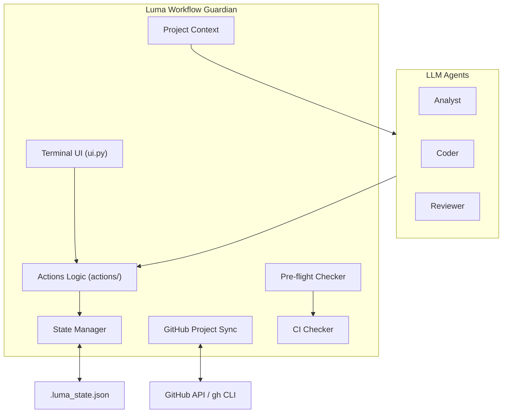
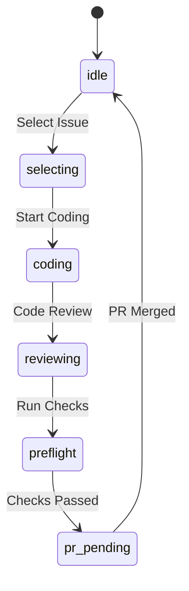

# 🤖 Luma AI Architect V2: Workflow Guardian

> **Version:** 1.6.0  
> **Status:** Production Ready 🚀  
> **Goal:** Autonomous AI Software Architect for Multi-Repo Projects

---

## 🏗️ System Architecture



### Core Components:
- **State Manager:** Tracks project status (Idle, Coding, PR Pending) via `.luma_state.json`.
- **GitHub Project Sync:** Deep integration with GitHub Projects (Kanban) with automatic repository and Kanban detection. 🆕
- **Pre-flight Checker:** Enforces definition of done (Tests, Lint, etc.) before PR.
- **CI Checker:** Runs CI checks (linting, testing) as a background process. 🆕
- **Project Context:** Provides LLM agents with context from across multiple specified repositories. 🆕
- **Worktree Orchestrator:** Multi-agent support for Git worktrees, enabling isolated development environments. 🆕
- **SBE Generator:** AI-powered Specification by Example for pre-coding phase.
- **Smart Fallback:** Error Classification, Rate Limit circumvention, specific per-model timeouts, and fallback index reset on provider change.
- **Modular Codebase:** Clean separation of concerns (`ui.py`, `actions/`, `config.py`).

---

## 🚦 Workflow Phases (State Machine)



| State | Description |
|-------|-------------|
| `idle` | Waiting for new task |
| `selecting` | Browsing Kanban for 'Ready' issues |
| `coding` | Active development (Analyst/Coder/Reviewer active) |
| `reviewing` | AI Review and PR preparation |
| `preflight` | Pre-PR validation |
| `pr_pending` | PR created, waiting for merge |

---

## 📂 File Structure

```
Luma/
├── luma_core/
│   ├── actions/             # Modular business logic for menu actions
│   ├── config.py            # Centralized configuration (supports deep merging)
│   ├── sbe.py               # SBE core module
│   ├── ui.py                # UI & Display logic
│   ├── state_manager.py     # State management
│   ├── github_project.py    # GitHub Sync
│   ├── preflight_checker.py # Validation
│   ├── ci_checker.py        # [NEW] CI checks logic
│   ├── project_context.py   # [NEW] Multi-repo context loader for agents
│   ├── error_classifier.py  # Error identification for Fallback 
│   ├── tools.py             # Agent tools
│   └── agents/
│       ├── analyst.py       # Issue analysis agent
│       ├── sbe_agent.py     # SBE generator agent
│       └── ...              # Other agents
├── docs/
│   └── templates/
│       └── sbe_template.md  # SBE template
├── v1_legacy/               # Archived V1 code
├── AGENTS.md                # Project conventions & agent roles
├── main.py                  # Entry Controller
└── README.md                # Documentation
```

---

## 🛠️ Prerequisites

- **Python 3.9+**
- **GitHub CLI (`gh`)**: Must be authenticated.
- **LLM Keys**: `.env` configured with `GOOGLE_API_KEY` (single) or `GOOGLE_API_KEYS` (multi-key comma-separated). Supports `OPENROUTER_API_KEY` and `CODEX_CLI_API_KEY`.

---

## 📏 Quick Story Points Guide

Luma uses Story Points to estimate complexity and uncertainty, not elapsed time.

| Points | Meaning | Typical Shape |
|-------|---------|---------------|
| `1` | Very small | Clear, routine, almost no surprises |
| `2` | Small | Slightly more detail, still straightforward |
| `3` | Medium | Multiple steps or a few decisions |
| `5` | Large | Needs planning, has real uncertainty |
| `8` | Very large | Risky or broad enough that it should likely be split |

Quick rule of thumb:

- Use `1` when the work is obvious and tightly scoped.
- Use `2` when it is still small, but not trivial.
- Use `3` when there are multiple steps, moving parts, or decision points.
- Use `5` when planning is required and uncertainty is meaningful.
- Use `8` when the scope is broad, risky, or should be broken down first.

Notes:

- In this repo, work smaller than `1` should usually still be rounded up to `1`.
- Story Points are not calendar time. A one-day task can still be `3` or `5` if uncertainty and coordination are high.

Further reading:

- [Story Points Convention](docs/story_points.md)
- [Story Points Cheat Sheet](docs/story_points_cheatsheet.md)
- [Programming Examples Appendix](docs/story_points_programming_examples.md)

---

## 🚀 Usage

```bash
# Start the Workflow Guardian
python main.py
```

### Headless CLI Contract

Luma also supports a machine-readable headless contract for external callers such as Zenith.

#### Metadata Preflight

Use metadata mode to verify the running Luma revision and contract before invoking actions:

```bash
python main.py --meta --json
```

Successful output is emitted on `stdout` as JSON:

```json
{
  "status": "success",
  "mode": "metadata",
  "result": {
    "version": "1.6.0",
    "git_commit": "7346548185cd82dd8bea308f65015a256bc50646",
    "dirty": true,
    "contract_version": "2.0",
    "supported_actions": ["code_review", "guided_workflow", "create_issue", "select_issue"],
    "python_version": "3.9.6"
  }
}
```

Field contract:

- `version`: Luma version resolved from the repository version sources.
- `git_commit`: Current `HEAD` commit hash.
- `dirty`: Whether the repository has local uncommitted changes.
- `contract_version`: External CLI contract version for compatibility checks.
- `supported_actions`: Stable list of headless actions supported by this Luma build.
- `python_version`: Python runtime version for the current process.

Metadata mode is intentionally machine-readable. Use `--meta --json` and do not combine `--meta` with `--auto` or `--action`.

#### Headless Action Execution

Use headless action mode for external automation:

```bash
python main.py --auto --action code_review --json --project 12
```

`--headless` is supported as an alias for `--auto`:

```bash
python main.py --headless --action code_review --json --project 12
```

Contract guarantees:

- In headless `--json` mode, `stdout` is reserved for machine-readable JSON only.
- Diagnostics, warnings, and startup noise are routed to `stderr`.
- Interactive mode remains unchanged when headless flags are not used.

---

## 📋 Features & Progress

- [x] **State Management**: Robust JSON-based state tracking.
- [x] **GitHub Integration**: Syncs issues and moves Kanban cards.
- [x] **Pre-flight Checker**: Auto-validates code before PR.
- [x] **UI Upgrade**: "Boxed" UI with emoji and responsive width.
- [x] **Modular Architecture**: Easy to extend and maintain.
- [x] **SBE Generator**: AI-powered Specification by Example (Menu: S).
- [x] **Draft Code Review**: Generate rich PR context with one click (Menu: D).
- [x] **Spec-Driven Dev**: Native integration of GitHub Spec Kit (Spec -> Plan -> Build).
- [x] **Smart Fallback**: Optimized fallback chain with intelligent Rate Limit handling.
- [x] **Cross-Repo Context & Planning**: Agents can plan and access context across multiple repositories. 🆕
- [x] **Background CI**: CI checks now run as a background process for a non-blocking workflow. 🆕
- [x] **Automated Issue Metrics**: Automatically calculates, prompts for, and fills story points and effort. 🆕
- [x] **LLM Key Rotation**: Supports multiple Google API keys with automatic failover and cooldown. 🆕
- [x] **Standardized Logging**: Clear visibility of which account/model is being used per request, with enhanced error handling and logging for Gemini CLI. 🆕
- [x] **Auto-Export Failed Prompts**: Automatically exports failed LLM prompts with human-readable timestamps for debugging. 🆕
- [x] **Headless CLI Logging**: Action-level logging for headless CLI executions, directing diagnostics to stderr. 🆕
- [x] **Reviewing Phase**: Dedicated state for AI code review with direct PR creation support. 🆕
- [x] **Portable dotfiles bootstrap**: Template for creating portable dotfiles with AI integration. 🆕
- [x] **Expanded Headless Contract**: Support for guided workflow, issue creation, and issue selection. 🆕
- [x] **Dynamic Project Resolution**: Enhanced project key detection via path logic. 🆕
- [x] **Auto-Project Integration**: New issues are automatically added to the configured GitHub Project. 🆕
- [x] **Worktree Orchestration**: Multi-agent support for Git worktrees. 🆕
- [x] **Automatic Detection**: Automatic GitHub repository and Kanban board discovery. 🆕