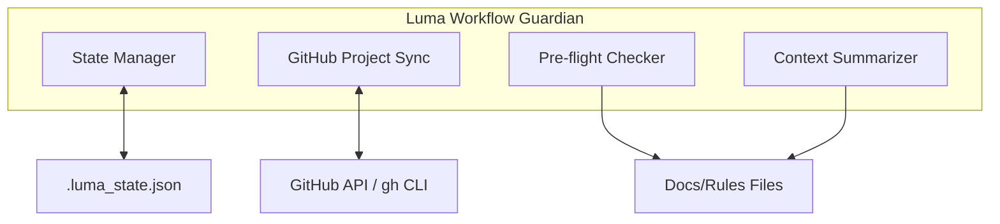
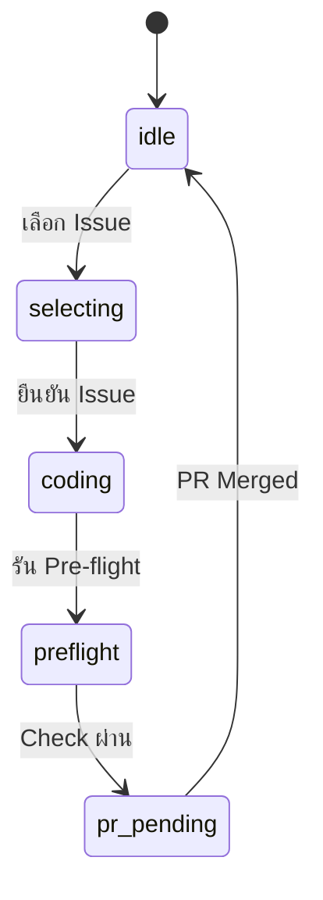

# 🤖 Luma AI Architect V2: Workflow Guardian

> **Status:** Phase 1 & 2 Implementation  
> **Branch:** `v2-guardian`  
> **Goal:** เปลี่ยนจาก Static Menu เป็น State-based Workflow Orchestrator

---

## 🏗️ System Architecture



### Core Components:
- **State Manager:** ติดตามสถานะโปรเจกต์ผ่านไฟล์ `.luma_state.json`
- **GitHub Project Sync:** เชื่อมต่อกับ GitHub Project (Kanban) ผ่าน `gh` CLI
- **Pre-flight Checker:** ตรวจสอบเงื่อนไข Definition of Done ก่อนสร้าง PR
- **Context Summarizer:** ดึงกฎสำคัญจาก Docs มาย้ำเตือนก่อนเริ่มงาน

---

## 🚦 Workflow Phases (State Machine)



| State | Description | ข้อมูลที่ต้องมี |
|-------|-------------|----------------|
| `idle` | รอเริ่มงานใหม่ | - |
| `selecting` | กำลังเลือก Issue | `available_issues[]` |
| `coding` | เริ่มพัฒนา | `active_issue`, `active_branch` |
| `preflight` | ตรวจสอบความเรียบร้อย | `checklist_results` |
| `pr_pending` | สร้าง PR แล้ว | `pr_url`, `pr_number` |

---

## 📂 File Structure

```
Luma/
├── luma_core/
│   ├── state_manager.py     # [NEW] State management
│   ├── github_project.py    # [NEW] GitHub Project sync
│   ├── preflight_checker.py # [FUTURE] Pre-flight checks
│   ├── context_summarizer.py# [FUTURE] Rules summarizer
│   └── (existing files)
├── schemas/
│   └── luma_rules_v1.schema.json
├── tests/
│   ├── test_state_manager.py
│   └── test_github_project.py
├── v1_legacy/               # Original codebase
│   ├── main.py
│   └── github_fetcher.py
├── main.py                  # [NEW] V2 entry point
└── README.v2.md             # This file
```

---

## 🛠️ Prerequisites

- **GitHub CLI (`gh`)**: ต้องติดตั้งและ Login แล้ว
- **Permissions**: Token ต้องมีสิทธิ์ Project V2

```bash
# Verify gh CLI
gh auth status
gh project list --owner oatrice
```

---

## 📊 Supported Projects

| Project | Number | ID |
|---------|--------|----|
| JarWise Kanban | 7 | `PVT_kwHOATfKEM4BMuLi` |
| Tetris Kanban | 6 | `PVT_kwHOATfKEM4BKZK5` |

---

## 🚀 Getting Started

```bash
# Activate V2 branch
git checkout v2-guardian

# Run Luma V2
python main.py
```

---

## 📋 Implementation Progress

- [x] Phase 0: Setup (branch, folder structure)
- [ ] Phase 1: State Management
- [ ] Phase 2: GitHub Project Integration
- [ ] Phase 3: Pre-flight Checker
- [ ] Phase 4: Context Summarizer
- [ ] Phase 5: UI Upgrade
