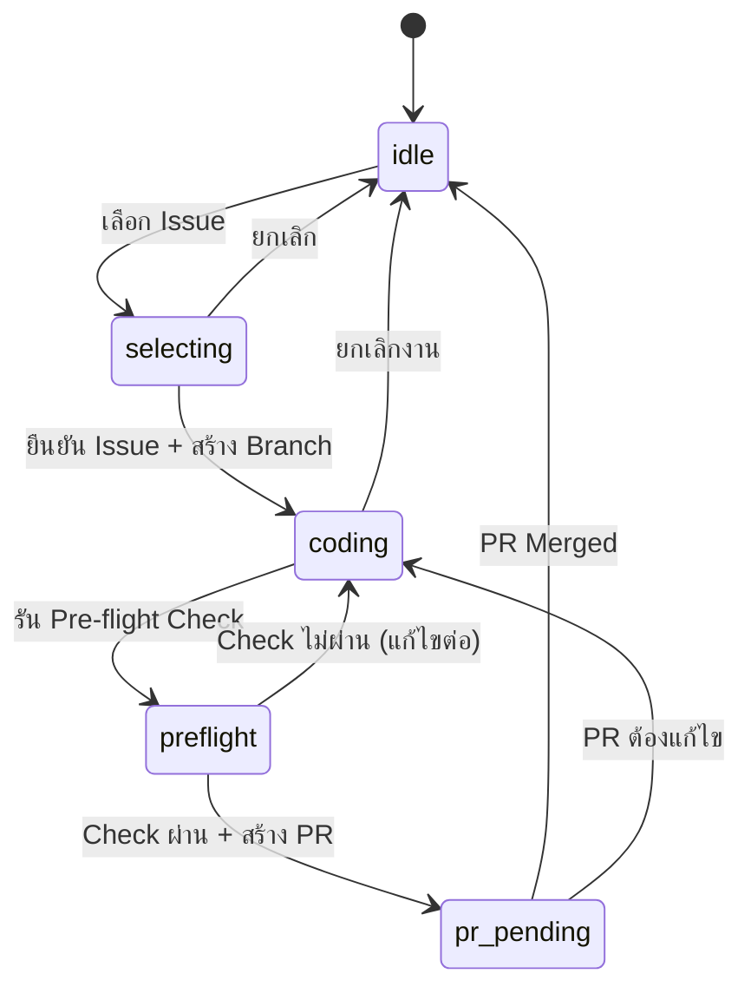

# Granular Task Breakdown: Phase 1 & 2

> 📅 Created: 2025-01-19  
> 🎯 Purpose: รายละเอียด Atomic Tasks และแผนการทดสอบ

---

## 📊 Phase 1: State Management

### 1.1 State Machine Design



**State Definitions:**

| State | เงื่อนไขเข้า | ข้อมูลที่ต้องมี |
|-------|-------------|----------------|
| `idle` | เริ่มต้น / งานเสร็จ | - |
| `selecting` | เลือกเมนู Issue | `available_issues[]` |
| `coding` | ยืนยัน Issue | `active_issue`, `active_branch` |
| `preflight` | รัน Pre-flight | `checklist_results` |
| `pr_pending` | สร้าง PR แล้ว | `pr_url`, `pr_number` |

---

### 1.2 LumaState Data Structure

```python
# File: luma_core/state_manager.py

from dataclasses import dataclass, field, asdict
from typing import Optional, List, Dict, Any
from datetime import datetime
from enum import Enum
import json
import os

class WorkflowPhase(Enum):
    IDLE = "idle"
    SELECTING = "selecting"
    CODING = "coding"
    PREFLIGHT = "preflight"
    PR_PENDING = "pr_pending"

@dataclass
class IssueData:
    number: int
    title: str
    html_url: str
    body: Optional[str] = None
    project_item_id: Optional[str] = None
    project_id: Optional[str] = None

@dataclass
class LumaState:
    version: str = "1.0"
    project_key: str = ""
    phase: WorkflowPhase = WorkflowPhase.IDLE
    active_issue: Optional[IssueData] = None
    active_branch: Optional[str] = None
    started_at: Optional[str] = None
    checklist: Dict[str, bool] = field(default_factory=dict)
    pr_url: Optional[str] = None
    pr_number: Optional[int] = None
    last_updated: str = field(default_factory=lambda: datetime.now().isoformat())
```

---

### 1.3 Atomic Tasks Breakdown

#### Task 1.3.1: `save_state()`

**Input:**
```python
def save_state(state: LumaState, project_path: str) -> bool
```

**Output:**
- `True` ถ้า save สำเร็จ
- `False` ถ้า error

**Logic:**
```python
def save_state(state: LumaState, project_path: str) -> bool:
    state_file = os.path.join(project_path, ".luma_state.json")
    try:
        data = asdict(state)
        # Convert Enum to string
        data["phase"] = state.phase.value
        data["last_updated"] = datetime.now().isoformat()
        
        with open(state_file, "w", encoding="utf-8") as f:
            json.dump(data, f, indent=2, ensure_ascii=False)
        return True
    except Exception as e:
        print(f"❌ Error saving state: {e}")
        return False
```

**Test Cases:**
| TC# | Scenario | Expected |
|-----|----------|----------|
| 1.3.1-A | Save valid state | File created, returns True |
| 1.3.1-B | Save to read-only dir | Returns False, error logged |
| 1.3.1-C | State with None values | Handles gracefully |

---

#### Task 1.3.2: `load_state()`

**Input:**
```python
def load_state(project_path: str) -> LumaState
```

**Output:**
- `LumaState` object (existing or new default)

**Logic:**
```python
def load_state(project_path: str) -> LumaState:
    state_file = os.path.join(project_path, ".luma_state.json")
    
    if not os.path.exists(state_file):
        return LumaState()  # Return default state
    
    try:
        with open(state_file, "r", encoding="utf-8") as f:
            data = json.load(f)
        
        # Convert phase string to Enum
        data["phase"] = WorkflowPhase(data.get("phase", "idle"))
        
        # Reconstruct IssueData if exists
        if data.get("active_issue"):
            data["active_issue"] = IssueData(**data["active_issue"])
        
        return LumaState(**data)
    except json.JSONDecodeError:
        print("⚠️ Corrupted state file, resetting...")
        return LumaState()
    except Exception as e:
        print(f"⚠️ Error loading state: {e}")
        return LumaState()
```

**Test Cases:**
| TC# | Scenario | Expected |
|-----|----------|----------|
| 1.3.2-A | File exists, valid JSON | Returns loaded state |
| 1.3.2-B | File not exists | Returns default state |
| 1.3.2-C | File corrupted JSON | Returns default, warning shown |
| 1.3.2-D | File has unknown fields | Ignores extra fields |

---

#### Task 1.3.3: `transition_to()`

**Input:**
```python
def transition_to(
    state: LumaState, 
    new_phase: WorkflowPhase,
    **kwargs  # Additional data needed for transition
) -> Tuple[bool, str]
```

**Output:**
- `(True, "success message")` หรือ `(False, "error reason")`

**Transition Rules:**
```python
VALID_TRANSITIONS = {
    WorkflowPhase.IDLE: [WorkflowPhase.SELECTING],
    WorkflowPhase.SELECTING: [WorkflowPhase.IDLE, WorkflowPhase.CODING],
    WorkflowPhase.CODING: [WorkflowPhase.IDLE, WorkflowPhase.PREFLIGHT],
    WorkflowPhase.PREFLIGHT: [WorkflowPhase.CODING, WorkflowPhase.PR_PENDING],
    WorkflowPhase.PR_PENDING: [WorkflowPhase.IDLE, WorkflowPhase.CODING],
}

TRANSITION_REQUIREMENTS = {
    (WorkflowPhase.SELECTING, WorkflowPhase.CODING): ["active_issue", "active_branch"],
    (WorkflowPhase.PREFLIGHT, WorkflowPhase.PR_PENDING): ["pr_url"],
}

def transition_to(state: LumaState, new_phase: WorkflowPhase, **kwargs) -> Tuple[bool, str]:
    # Check valid transition
    if new_phase not in VALID_TRANSITIONS.get(state.phase, []):
        return False, f"Cannot transition from {state.phase.value} to {new_phase.value}"
    
    # Check requirements
    key = (state.phase, new_phase)
    if key in TRANSITION_REQUIREMENTS:
        for req in TRANSITION_REQUIREMENTS[key]:
            if req not in kwargs or kwargs[req] is None:
                return False, f"Missing required data: {req}"
    
    # Apply transition
    state.phase = new_phase
    for k, v in kwargs.items():
        if hasattr(state, k):
            setattr(state, k, v)
    
    # Special actions
    if new_phase == WorkflowPhase.CODING:
        state.started_at = datetime.now().isoformat()
    elif new_phase == WorkflowPhase.IDLE:
        state.active_issue = None
        state.active_branch = None
        state.pr_url = None
    
    return True, f"Transitioned to {new_phase.value}"
```

**Test Cases:**
| TC# | Scenario | Expected |
|-----|----------|----------|
| 1.3.3-A | Valid: idle → selecting | Returns (True, _) |
| 1.3.3-B | Invalid: idle → coding | Returns (False, _) |
| 1.3.3-C | coding → preflight missing issue | Returns (False, _) |
| 1.3.3-D | selecting → coding with data | State updated correctly |

---

### 1.4 Example `.luma_state.json`

```json
{
  "version": "1.0",
  "project_key": "2",
  "phase": "coding",
  "active_issue": {
    "number": 17,
    "title": "[Web | Android] Manage Jars (Edit %, Name, Icon)",
    "html_url": "https://github.com/oatrice/JarWise-Root/issues/17",
    "body": "# 🎯 Objective\nImplement the Manage Jars feature...",
    "project_item_id": "PVTI_lAHOATfKEM4A-M8dzgjwwDQ",
    "project_id": "PVT_kwHOATfKEM4BMuLi"
  },
  "active_branch": "feat/17-manage-jars",
  "started_at": "2025-01-19T15:00:00",
  "checklist": {
    "requirement_analysis": true,
    "feature_analysis": false,
    "impact_analysis": false
  },
  "pr_url": null,
  "pr_number": null,
  "last_updated": "2025-01-19T15:30:00"
}
```

---

### 1.5 Verification Plan (Phase 1)

#### Manual Tests

```bash
# Test 1: Save/Load cycle
cd /Users/oatrice/Software-projects/Luma
python3 -c "
from luma_core.state_manager import LumaState, save_state, load_state, WorkflowPhase
state = LumaState(project_key='2', phase=WorkflowPhase.CODING)
save_state(state, '/tmp/test_project')
loaded = load_state('/tmp/test_project')
print(f'Phase: {loaded.phase.value}')  # Should print: coding
"

# Test 2: Corrupted file handling
echo "invalid json{" > /tmp/test_project/.luma_state.json
python3 -c "
from luma_core.state_manager import load_state
state = load_state('/tmp/test_project')
print(f'Phase: {state.phase.value}')  # Should print: idle (default)
"

# Test 3: Transition validation
python3 -c "
from luma_core.state_manager import LumaState, transition_to, WorkflowPhase
state = LumaState()
ok, msg = transition_to(state, WorkflowPhase.CODING)
print(f'Result: {ok}, {msg}')  # Should print: False, Cannot transition...
"
```

#### Unit Tests (`tests/test_state_manager.py`)

```python
import pytest
from luma_core.state_manager import *

class TestSaveLoad:
    def test_save_creates_file(self, tmp_path):
        state = LumaState(project_key="test")
        assert save_state(state, str(tmp_path)) == True
        assert (tmp_path / ".luma_state.json").exists()
    
    def test_load_nonexistent_returns_default(self, tmp_path):
        state = load_state(str(tmp_path))
        assert state.phase == WorkflowPhase.IDLE
    
    def test_load_corrupted_returns_default(self, tmp_path):
        (tmp_path / ".luma_state.json").write_text("not valid json")
        state = load_state(str(tmp_path))
        assert state.phase == WorkflowPhase.IDLE

class TestTransitions:
    def test_valid_idle_to_selecting(self):
        state = LumaState()
        ok, _ = transition_to(state, WorkflowPhase.SELECTING)
        assert ok == True
        assert state.phase == WorkflowPhase.SELECTING
    
    def test_invalid_idle_to_coding(self):
        state = LumaState()
        ok, msg = transition_to(state, WorkflowPhase.CODING)
        assert ok == False
        assert "Cannot transition" in msg
    
    def test_coding_sets_started_at(self):
        state = LumaState(phase=WorkflowPhase.SELECTING)
        issue = IssueData(number=1, title="Test", html_url="http://...")
        transition_to(state, WorkflowPhase.CODING, active_issue=issue, active_branch="feat/1")
        assert state.started_at is not None
```

---

## 🔗 Phase 2: GitHub Project Integration

### 2.1 Discovered Project Data

จาก `gh project list --owner oatrice`:

| Project | Number | ID | Items |
|---------|--------|-----|-------|
| JarWise Kanban | 7 | `PVT_kwHOATfKEM4BMuLi` | 41 |
| Tetris Kanban | 6 | `PVT_kwHOATfKEM4BKZK5` | 103 |
| Luma Kanban | 5 | `PVT_kwHOATfKEM4BKOOI` | 0 |

**Item Structure (จาก `gh project item-list`):**
```json
{
  "content": {
    "number": 17,
    "repository": "oatrice/JarWise-Root",
    "title": "[Web | Android] Manage Jars...",
    "type": "Issue",
    "url": "https://github.com/oatrice/JarWise-Root/issues/17"
  },
  "id": "PVTI_lAHOATfKEM4A-M8dzgjwwDQ",
  "status": "Backlog",
  "title": "..."
}
```

---

### 2.2 Atomic Tasks Breakdown

#### Task 2.2.1: `fetch_kanban_cards()`

**Input:**
```python
def fetch_kanban_cards(
    project_number: int,
    owner: str = "oatrice",
    status_filter: Optional[str] = None
) -> List[KanbanCard]
```

**Output:**
```python
@dataclass
class KanbanCard:
    item_id: str          # "PVTI_..."
    issue_number: int
    title: str
    status: str           # "Backlog" | "Ready" | "In Progress" | "Done"
    repository: str       # "oatrice/JarWise-Root"
    url: str
    body: Optional[str] = None
```

**Implementation:**
```python
import subprocess
import json

def fetch_kanban_cards(project_number: int, owner: str = "oatrice", 
                       status_filter: Optional[str] = None) -> List[KanbanCard]:
    cmd = ["gh", "project", "item-list", str(project_number), 
           "--owner", owner, "--format", "json"]
    
    try:
        result = subprocess.run(cmd, capture_output=True, text=True, timeout=30)
        
        if result.returncode != 0:
            print(f"❌ gh CLI error: {result.stderr}")
            return []
        
        data = json.loads(result.stdout)
        cards = []
        
        for item in data.get("items", []):
            content = item.get("content", {})
            
            # Skip non-issues
            if content.get("type") != "Issue":
                continue
            
            card = KanbanCard(
                item_id=item.get("id"),
                issue_number=content.get("number"),
                title=item.get("title") or content.get("title"),
                status=item.get("status", "Unknown"),
                repository=content.get("repository"),
                url=content.get("url"),
                body=content.get("body")
            )
            
            # Apply filter
            if status_filter and card.status.lower() != status_filter.lower():
                continue
                
            cards.append(card)
        
        return cards
        
    except subprocess.TimeoutExpired:
        print("❌ gh CLI timeout")
        return []
    except json.JSONDecodeError as e:
        print(f"❌ JSON parse error: {e}")
        return []
```

**Test Cases:**
| TC# | Scenario | Expected |
|-----|----------|----------|
| 2.2.1-A | Valid project, no filter | Returns all cards |
| 2.2.1-B | Valid project, status="Ready" | Returns only Ready items |
| 2.2.1-C | Invalid project number | Returns empty list |
| 2.2.1-D | gh CLI not logged in | Returns empty list, error shown |

---

#### Task 2.2.2: `move_card_to_status()`

**Input:**
```python
def move_card_to_status(
    project_id: str,      # "PVT_..."
    item_id: str,         # "PVTI_..."
    new_status: str       # "In Progress"
) -> bool
```

**Implementation:**
```python
def move_card_to_status(project_id: str, item_id: str, new_status: str) -> bool:
    # Step 1: Get field ID for "Status"
    field_query = '''
    query($projectId: ID!) {
      node(id: $projectId) {
        ... on ProjectV2 {
          fields(first: 20) {
            nodes {
              ... on ProjectV2SingleSelectField {
                id
                name
                options { id name }
              }
            }
          }
        }
      }
    }
    '''
    
    # Run query via gh api graphql
    cmd = ["gh", "api", "graphql", "-f", f"query={field_query}", 
           "-f", f"projectId={project_id}"]
    result = subprocess.run(cmd, capture_output=True, text=True)
    
    if result.returncode != 0:
        print(f"❌ Failed to get project schema")
        return False
    
    data = json.loads(result.stdout)
    
    # Find Status field and option ID
    status_field_id = None
    option_id = None
    
    for field in data["data"]["node"]["fields"]["nodes"]:
        if field and field.get("name") == "Status":
            status_field_id = field["id"]
            for opt in field.get("options", []):
                if opt["name"].lower() == new_status.lower():
                    option_id = opt["id"]
                    break
            break
    
    if not status_field_id or not option_id:
        print(f"❌ Status field or option '{new_status}' not found")
        return False
    
    # Step 2: Mutate
    mutation = '''
    mutation($projectId: ID!, $itemId: ID!, $fieldId: ID!, $optionId: String!) {
      updateProjectV2ItemFieldValue(
        input: {
          projectId: $projectId
          itemId: $itemId
          fieldId: $fieldId
          value: { singleSelectOptionId: $optionId }
        }
      ) {
        projectV2Item { id }
      }
    }
    '''
    
    cmd = ["gh", "api", "graphql",
           "-f", f"query={mutation}",
           "-f", f"projectId={project_id}",
           "-f", f"itemId={item_id}",
           "-f", f"fieldId={status_field_id}",
           "-f", f"optionId={option_id}"]
    
    result = subprocess.run(cmd, capture_output=True, text=True)
    
    if result.returncode == 0:
        print(f"✅ Moved to '{new_status}'")
        return True
    else:
        print(f"❌ Failed to move: {result.stderr}")
        return False
```

**Test Cases:**
| TC# | Scenario | Expected |
|-----|----------|----------|
| 2.2.2-A | Valid IDs, valid status | Returns True, card moved |
| 2.2.2-B | Invalid project ID | Returns False |
| 2.2.2-C | Status name not found | Returns False |
| 2.2.2-D | No permissions | Returns False |

---

#### Task 2.2.3: `get_current_in_progress()`

**Input:**
```python
def get_current_in_progress(project_number: int, owner: str = "oatrice") -> Optional[KanbanCard]
```

**Logic:**
```python
def get_current_in_progress(project_number: int, owner: str = "oatrice") -> Optional[KanbanCard]:
    cards = fetch_kanban_cards(project_number, owner, status_filter="In Progress")
    
    if not cards:
        return None
    
    # Return first (or could return oldest by sorting)
    return cards[0]
```

---

#### Task 2.2.4: `sync_kanban_on_action()`

**Logic for auto-sync:**
```python
def sync_kanban_on_action(action: str, state: LumaState, project_config: dict) -> None:
    """
    Auto-sync Kanban status based on Luma action
    
    Actions:
    - "select_issue": Move to "In Progress"
    - "create_pr": Move to "In Review" 
    - "pr_merged": Move to "Done"
    """
    if not state.active_issue:
        return
    
    project_id = project_config.get("kanban", {}).get("project_id")
    item_id = state.active_issue.project_item_id
    
    if not project_id or not item_id:
        return
    
    status_map = {
        "select_issue": "In Progress",
        "create_pr": "In Review",
        "pr_merged": "Done"
    }
    
    new_status = status_map.get(action)
    if new_status:
        move_card_to_status(project_id, item_id, new_status)
```

---

### 2.3 gh CLI Commands Reference

```bash
# List projects
gh project list --owner oatrice --format json

# List items in project 7 (JarWise Kanban)
gh project item-list 7 --owner oatrice --format json

# Get project field schema (via GraphQL)
gh api graphql -f query='
query {
  node(id: "PVT_kwHOATfKEM4BMuLi") {
    ... on ProjectV2 {
      fields(first: 20) {
        nodes {
          ... on ProjectV2SingleSelectField {
            id
            name
            options { id name }
          }
        }
      }
    }
  }
}'

# Move item to new status (via GraphQL mutation)
gh api graphql -f query='
mutation {
  updateProjectV2ItemFieldValue(
    input: {
      projectId: "PVT_kwHOATfKEM4BMuLi"
      itemId: "PVTI_..."
      fieldId: "PVTSSF_..."
      value: { singleSelectOptionId: "..." }
    }
  ) {
    projectV2Item { id }
  }
}'
```

---

### 2.4 Verification Plan (Phase 2)

#### Manual Tests

```bash
# Test 1: Fetch cards
cd /Users/oatrice/Software-projects/Luma
python3 -c "
from luma_core.github_project import fetch_kanban_cards
cards = fetch_kanban_cards(7, 'oatrice')
for c in cards[:3]:
    print(f'#{c.issue_number}: {c.title} [{c.status}]')
"

# Test 2: Filter by status
python3 -c "
from luma_core.github_project import fetch_kanban_cards
ready = fetch_kanban_cards(7, 'oatrice', status_filter='Ready')
print(f'Ready items: {len(ready)}')
"

# Test 3: Get current in-progress
python3 -c "
from luma_core.github_project import get_current_in_progress
current = get_current_in_progress(7)
if current:
    print(f'Active: #{current.issue_number} {current.title}')
else:
    print('No active task')
"

# Test 4: Move card (INTERACTIVE - ต้องระวัง!)
# python3 -c "
# from luma_core.github_project import move_card_to_status
# move_card_to_status('PVT_...', 'PVTI_...', 'In Progress')
# "
```

#### Unit Tests (`tests/test_github_project.py`)

```python
import pytest
from unittest.mock import patch, MagicMock
from luma_core.github_project import *

class TestFetchKanbanCards:
    @patch('subprocess.run')
    def test_fetch_returns_cards(self, mock_run):
        mock_run.return_value = MagicMock(
            returncode=0,
            stdout='{"items":[{"id":"PVTI_1","content":{"number":1,"type":"Issue","repository":"test/repo","url":"http://...","title":"Test"},"status":"Ready","title":"Test"}]}'
        )
        cards = fetch_kanban_cards(7)
        assert len(cards) == 1
        assert cards[0].issue_number == 1
    
    @patch('subprocess.run')
    def test_fetch_handles_timeout(self, mock_run):
        mock_run.side_effect = subprocess.TimeoutExpired("gh", 30)
        cards = fetch_kanban_cards(7)
        assert cards == []
    
    @patch('subprocess.run')
    def test_filter_by_status(self, mock_run):
        mock_run.return_value = MagicMock(
            returncode=0,
            stdout='{"items":[{"id":"1","content":{"number":1,"type":"Issue","repository":"r","url":"u","title":"t"},"status":"Ready"},{"id":"2","content":{"number":2,"type":"Issue","repository":"r","url":"u","title":"t2"},"status":"Backlog"}]}'
        )
        cards = fetch_kanban_cards(7, status_filter="Ready")
        assert len(cards) == 1
        assert cards[0].status == "Ready"

class TestMoveCard:
    @patch('subprocess.run')
    def test_move_success(self, mock_run):
        # Mock both calls
        mock_run.side_effect = [
            MagicMock(returncode=0, stdout='{"data":{"node":{"fields":{"nodes":[{"id":"F1","name":"Status","options":[{"id":"O1","name":"In Progress"}]}]}}}}'),
            MagicMock(returncode=0, stdout='{}')
        ]
        result = move_card_to_status("PVT_1", "PVTI_1", "In Progress")
        assert result == True
```

---

## 📋 Summary Checklist

### Phase 1 Deliverables

- [ ] `luma_core/state_manager.py` with:
  - [ ] `LumaState` dataclass
  - [ ] `IssueData` dataclass
  - [ ] `WorkflowPhase` enum
  - [ ] `save_state()` function
  - [ ] `load_state()` function
  - [ ] `transition_to()` function
  - [ ] `VALID_TRANSITIONS` config
- [ ] `tests/test_state_manager.py` with 10+ test cases
- [ ] Manual verification passed

### Phase 2 Deliverables

- [ ] `luma_core/github_project.py` with:
  - [ ] `KanbanCard` dataclass
  - [ ] `fetch_kanban_cards()` function
  - [ ] `move_card_to_status()` function
  - [ ] `get_current_in_progress()` function
  - [ ] `sync_kanban_on_action()` function
- [ ] `tests/test_github_project.py` with 8+ test cases
- [ ] Manual verification passed

---

> ⏱️ **Estimated Time:** Phase 1 = 4-5 hours, Phase 2 = 4-5 hours
