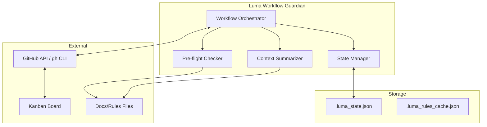

# Implementation Plan: Luma Workflow Guardian Upgrade

> 📅 Created: 2025-01-19
> 🎯 Goal: อัปเกรด Luma จาก Static Menu เป็น State-based Workflow Orchestrator

---

## 📌 Executive Summary

เปลี่ยน Luma AI Architect ให้เป็น **Workflow Guardian** ที่จะ:
1. ติดตามสถานะโปรเจกต์แบบ Real-time
2. เชื่อมต่อกับ GitHub Project (Kanban) แบบ Bi-directional
3. บังคับใช้กฎ Pre-flight Check ก่อนสร้าง PR
4. สรุปกฎสำคัญจาก Docs เมื่อเริ่มงานใหม่

---

## 🏗️ System Architecture



---

## 📦 Proposed Changes

### [NEW] `luma_core/state_manager.py`

> ระบบจัดการ State สำหรับโปรเจกต์

```python
# Key Features:
class LumaState:
    current_phase: str  # "idle" | "selecting" | "coding" | "preflight" | "pr_pending"
    active_issue: Optional[IssueData]
    active_branch: Optional[str]
    started_at: Optional[datetime]
    checklist_completed: List[str]
    
# State File: .luma_state.json
{
    "version": "1.0",
    "project_key": "2",
    "phase": "coding",
    "active_issue": {
        "number": 16,
        "title": "Add Transaction Feature",
        "html_url": "https://github.com/..."
    },
    "active_branch": "feat/16-add-transaction",
    "started_at": "2025-01-19T10:00:00Z",
    "checklist": {
        "requirement_analysis": true,
        "feature_analysis": true,
        "impact_analysis": false
    },
    "last_updated": "2025-01-19T14:00:00Z"
}
```

---

### [NEW] `luma_core/github_project.py`

> เชื่อมต่อ GitHub Project V2 ผ่าน `gh` CLI

```python
# Key Functions:
def fetch_kanban_cards(project_name: str, status: str = None) -> List[Card]
    """ดึงการ์ดจาก Kanban (Todo/In Progress/Done)"""
    
def move_card_to_status(card_id: str, status: str) -> bool
    """ย้ายการ์ดไปยังสถานะใหม่"""
    
def get_current_task_from_project() -> Optional[Card]
    """ดึงงานปัจจุบันที่อยู่ใน 'In Progress'"""
    
def sync_state_with_project(state: LumaState) -> None
    """Sync สถานะ Luma กับ GitHub Project"""
```

**Implementation via `gh` CLI:**
```bash
# ดึงการ์ดจาก Project
gh project item-list <project-number> --owner oatrice --format json

# ย้ายการ์ด (ใช้ GraphQL mutation)
gh api graphql -f query='mutation {...}'
```

---

### [NEW] `luma_core/preflight_checker.py`

> ระบบตรวจสอบเงื่อนไข Definition of Done ก่อนสร้าง PR

```python
# Key Features:
class PreflightCheck:
    name: str
    description: str
    check_type: str  # "file_modified" | "version_updated" | "custom"
    path: Optional[str]
    required: bool
    
def run_preflight_checks(project_path: str, rules_path: str) -> PreflightResult:
    """
    Returns:
    - passed: bool
    - checks: List[CheckResult]
    - blocking_issues: List[str]
    """
```

**Rules JSON Format (`rules.json`):**
```json
{
  "project": "JarWise",
  "version": "1.0",
  "preflight_checks": [
    {
      "id": "changelog_updated",
      "name": "CHANGELOG.md Updated",
      "type": "file_modified",
      "path": "CHANGELOG.md",
      "required": true,
      "message": "กรุณาอัปเดต CHANGELOG.md ก่อนสร้าง PR"
    },
    {
      "id": "version_bumped",
      "name": "Version Bumped",
      "type": "version_updated",
      "path": "package.json",
      "required": true,
      "message": "กรุณาอัปเดต version ใน package.json"
    },
    {
      "id": "docs_synced",
      "name": "Feature Docs Exists",
      "type": "file_exists",
      "path": "docs/features/*.md",
      "required": false,
      "message": "ควรมีเอกสาร Feature สำหรับงานนี้"
    },
    {
      "id": "tests_pass",
      "name": "Tests Passing",
      "type": "command",
      "command": "npm test",
      "required": true,
      "message": "Tests ต้อง Pass ก่อนสร้าง PR"
    }
  ],
  "context_rules": [
    "ตรวจสอบ Impact Analysis ก่อนแก้ไข Components ที่ใช้ร่วมกัน",
    "อย่าลืม Update Mock Data หากแก้ไข Data Model",
    "สร้าง Screenshots สำหรับ PR ถ้าเป็น UI Change"
  ]
}
```

---

### [NEW] `luma_core/context_summarizer.py`

> สรุปกฎสำคัญจาก Docs เมื่อเริ่มงานใหม่

```python
def summarize_project_rules(project_path: str) -> List[str]:
    """
    อ่าน rules จาก:
    - .agent/rules/*.md
    - .agent/workflows/*.md
    - .luma_rules.json
    
    สรุปเป็น 3-5 bullet points
    """
    
def get_context_reminders(issue_data: dict, project_path: str) -> List[str]:
    """
    สรุป Context เฉพาะสำหรับ Issue นี้
    """
```

**Example Output:**
```
📌 Context Reminders for Issue #16:
1. 🔴 MUST: สร้าง Issue/Ticket ก่อนเริ่มงาน ✅ Done
2. 🔴 MUST: ย่อย Tasks ให้จบได้ภายใน 1 วัน
3. 🟡 SHOULD: ออกแบบ Database Schema ก่อน Implement
4. 📝 Project Rule: อัปเดต Mock Data ถ้าแก้ไข Model
5. 📸 PR Rule: ใส่ Screenshots ขนาด width=400
```

---

### [MODIFY] `main.py`

> ปรับปรุง Main Menu ให้เป็น State-aware

**Before (Static Menu):**
```
📂 Active Project: JarWise - Web
📍 Path: /Users/.../JarWise/Web
🔗 Repo: oatrice/JarWise-Web
------------------------------
1. 📥 Select Next Issue (Start Coding)
2. 🚀 Create Pull Request (Deploy)
...
```

**After (State-aware Dashboard):**
```
╔══════════════════════════════════════════════════════════╗
║  🤖 Luma Workflow Guardian                               ║
╠══════════════════════════════════════════════════════════╣
║  📂 Project: JarWise - Web                               ║
║  🌿 Branch: feat/16-add-transaction                      ║
║  📍 Phase: 💻 CODING                                     ║
╠══════════════════════════════════════════════════════════╣
║  🎯 Active Task: #16 Add Transaction Feature             ║
║  ⏱️  Started: 2h 30m ago                                  ║
║  📊 Progress: 3/7 checklist items                        ║
╠══════════════════════════════════════════════════════════╣
║  ➡️  Next Step: Complete coding, then run Pre-flight     ║
╚══════════════════════════════════════════════════════════╝

📋 Actions:
  [1] 📥 Select Issue (from Kanban)
  [2] 🚀 Create PR (Pre-flight Check)
  [3] 🧐 Code Review
  [4] 📝 Update Docs
  [5] 🔄 Refresh Kanban Status
  [6] 📊 View Workflow Status
  [9] 🔀 Switch Project
  [0] ❌ Exit
```

---

### [NEW] Project Config: `.luma_rules.json`

> ไฟล์กฎสำหรับแต่ละโปรเจกต์

**Location:** `<project_root>/.luma_rules.json`

```json
{
  "$schema": "https://luma.dev/schemas/rules-v1.json",
  "project_name": "JarWise",
  "kanban": {
    "project_number": 1,
    "owner": "oatrice",
    "status_mapping": {
      "ready": "Ready",
      "in_progress": "In Progress",
      "review": "In Review",
      "done": "Done"
    }
  },
  "preflight_checks": [
    {
      "id": "changelog",
      "type": "file_modified",
      "path": "CHANGELOG.md",
      "required": true
    },
    {
      "id": "version",
      "type": "version_check",
      "files": ["package.json", "VERSION"],
      "required": true
    }
  ],
  "context_sources": [
    ".agent/rules/pre_coding_rules.md",
    ".agent/workflows/pr_guidelines.md"
  ],
  "reminders": [
    "อัปเดต Mock Data หากแก้ไข Data Model",
    "ใส่ Screenshots ใน PR สำหรับ UI Changes"
  ]
}
```

---

## 📋 Task Breakdown

### Phase 1: State Management (Day 1-2)

| # | Task | Estimate | Priority |
|---|------|----------|----------|
| 1.1 | สร้าง `state_manager.py` - LumaState class | 2h | 🔴 High |
| 1.2 | Implement save/load state to JSON | 1h | 🔴 High |
| 1.3 | สร้าง state transition logic | 2h | 🔴 High |
| 1.4 | Unit tests for state manager | 1h | 🟡 Medium |

### Phase 2: GitHub Project Integration (Day 2-3)

| # | Task | Estimate | Priority |
|---|------|----------|----------|
| 2.1 | สร้าง `github_project.py` | 1h | 🔴 High |
| 2.2 | Implement `fetch_kanban_cards()` via gh CLI | 2h | 🔴 High |
| 2.3 | Implement `move_card_to_status()` | 2h | 🔴 High |
| 2.4 | Sync state with Kanban on action | 2h | 🟡 Medium |

### Phase 3: Pre-flight Checker (Day 3-4)

| # | Task | Estimate | Priority |
|---|------|----------|----------|
| 3.1 | สร้าง `preflight_checker.py` | 1h | 🔴 High |
| 3.2 | Implement file_modified check | 1h | 🔴 High |
| 3.3 | Implement version_updated check | 1h | 🔴 High |
| 3.4 | Implement command check (run tests) | 2h | 🟡 Medium |
| 3.5 | Integrate with Create PR flow | 2h | 🔴 High |

### Phase 4: Context Summarizer (Day 4)

| # | Task | Estimate | Priority |
|---|------|----------|----------|
| 4.1 | สร้าง `context_summarizer.py` | 1h | 🟡 Medium |
| 4.2 | Parse rules from markdown files | 2h | 🟡 Medium |
| 4.3 | AI-powered summarization (optional) | 2h | 🟢 Low |
| 4.4 | Display reminders on issue select | 1h | 🟡 Medium |

### Phase 5: UI Upgrade

#### [MODIFY] [main.py](file:///Users/oatrice/Software-projects/Luma/main.py)
- **Refactor `display_header`**:
  - Show "Active Project" prominently
  - Show "Current Phase" with color/emoji status
  - Persistent "Active Task" details (Issue #, Branch)
  - "Next Step" recommendation based on state
- **Refactor `display_menu`**:
  - Dynamic menu options based on current `WorkflowPhase`
  - Disable irrelevant actions (e.g., "Create PR" when in IDLE)
  - Add "Back" or "Cancel" options where appropriate
- **Add `clear_screen` utility**:
  - Ensure clean UI redraws on state transitions
| 5.4 | Color-coded status display | 1h | 🟢 Low |

### Phase 6: Project Configuration
- **Objective**: Standardize rules and pre-flight checks across JarWise repositories using `.luma_rules.json`.
- **Deliverables**:
  - `schemas/luma_rules.schema.json`: Validation schema for rule files.
  - `luma_core/config_loader.py`: Utility to load and validate rules.
  - `JarWise/.luma_rules.json`: Root rules (changelog, versioning).
  
#### [NEW] [luma_core/rules_loader.py](file:///Users/oatrice/Software-projects/Luma/luma_core/rules_loader.py)
- `load_project_rules(path)`: Safe loading with default fallback.
- `validate_rules(rules)`: Schema validation (optional but recommended).

#### Proposed `.luma_rules.json` Structure
```json
{
  "project_name": "JarWise",
  "version_file": "package.json",
  "changelog_file": "CHANGELOG.md",
  "branches": {
    "main": "main",
    "develop": "develop"
  },
  "preflight_checks": {
    "required": ["file_modified:CHANGELOG.md", "version_updated"],
    "optional": ["test_pass"]
  },
  "context_rules": [
    "MUST update CHANGELOG.md for every PR",
    "SHOULD include screenshots for UI changes"
  ]
}
```

#### Task List
| # | Task | Estimate | Priority |
|---|------|----------|----------|
| 6.1 | Define Standard Rule Schema | 1h | 🔴 High |
| 6.2 | Implement `RulesLoader` | 1h | 🟡 Medium |
| 6.3 | Create JarWise Root Config | 30m | 🟡 Medium |
| 6.4 | Integrate RulesLoader into Main Workflow | 1h | 🔴 High |

---

## 📁 New File Structure

```
Luma/
├── main.py                          # [MODIFY] State-aware menu
├── luma_core/
│   ├── state_manager.py             # [NEW] State management
│   ├── github_project.py            # [NEW] GitHub Project integration
│   ├── preflight_checker.py         # [NEW] Pre-flight checks
│   ├── context_summarizer.py        # [NEW] Rules summarizer
│   ├── pre_coding_checker.py        # [EXISTS] Merge into workflow
│   ├── tools.py                     # [EXISTS]
│   └── ...
├── schemas/
│   └── luma_rules_v1.schema.json    # [NEW] JSON Schema
└── tests/
    ├── test_state_manager.py        # [NEW]
    ├── test_preflight.py            # [NEW]
    └── ...

JarWise/
├── .luma_rules.json                 # [NEW] Project-specific rules
├── .luma_state.json                 # [NEW] Auto-generated state file
└── .agent/
    ├── rules/
    │   └── pre_coding_rules.md      # [EXISTS]
    └── workflows/
        └── pr_guidelines.md         # [EXISTS]
```

---

## ⚠️ User Review Required

> [!IMPORTANT]
> **Breaking Changes:**
> - Main menu layout จะเปลี่ยนแปลง
> - ต้องสร้างไฟล์ `.luma_rules.json` สำหรับแต่ละโปรเจกต์

> [!WARNING]
> **Dependencies:**
> - ต้องติดตั้ง `gh` CLI และ login แล้ว
> - ต้องมี GitHub Token ที่มี Project permissions

---

## ✅ Definition of Done

- [ ] State tracking ทำงานได้ (save/load)
- [ ] เชื่อมต่อ GitHub Project ได้
- [ ] Pre-flight check block PR ถ้าไม่ผ่าน
- [ ] Context summary แสดงเมื่อเลือก Issue
- [ ] UI แสดง Active Task และ Next Step
- [ ] มี `.luma_rules.json` สำหรับ JarWise
- [ ] Tests pass

---

## 📊 Timeline

| Week | Phase | Deliverable |
|------|-------|-------------|
| Day 1-2 | Phase 1 | State Management |
| Day 2-3 | Phase 2 | GitHub Project Sync |
| Day 3-4 | Phase 3 | Pre-flight Checker |
| Day 4 | Phase 4 | Context Summarizer |
| Day 5 | Phase 5-6 | UI + Project Config |

**Total Estimated: ~5 days**

---

## 🚀 Next Steps

1. ✅ Review and approve this plan
2. สร้าง Issue ใน Luma repo สำหรับ Feature นี้
3. เริ่ม Phase 1: State Management
