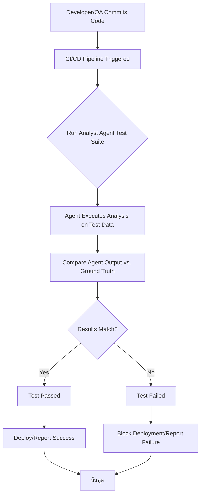

# Analysis Template

> 📋 Template สำหรับการวิเคราะห์ก่อนเริ่มพัฒนา Feature

---

## 📌 Feature Information

| รายการ | รายละเอียด |
|--------|-----------|
| **Feature Name** | Analyst Agent Verification and Testing Framework |
| **Date** | 2024-07-25 |
| **Analyst** | Senior Technical Analyst |
| **Priority** | 🔴 High |
| **Status** | 📝 Draft |

---

## 1. Requirement Analysis

### 1.1 Problem Statement

> อธิบายปัญหาที่ต้องการแก้ไข

```
The core business logic provided by the "analyst agent" (likely an AI/ML service) is critical but currently lacks formal, automated verification. This absence of a robust testing framework leads to high risk of deploying inaccurate results, regressions during updates, and difficulty in validating agent performance against business requirements. The current requirement is to establish a reliable method to verify the agent's correctness.
```

### 1.2 User Stories

| # | As a | I want to | So that |
|---|------|-----------|---------|
| 1 | QA Engineer | Trigger a comprehensive test suite for the analyst agent | I can confirm the agent's output is accurate and meets specifications before deployment. |
| 2 | Developer | Have automated unit and integration tests covering the agent's logic | I can refactor or update the agent confidently without introducing regressions. |
| 3 | Product Owner | View a report detailing the analyst agent's accuracy and reliability metrics | I can ensure the agent provides consistent business value. |

### 1.3 Acceptance Criteria

- [X] **AC1:** A dedicated test suite (e.g., using Pytest/Jest) must be created to cover the core functionalities of the analyst agent.
- [X] **AC2:** A set of 'Golden Test' inputs and corresponding 'Ground Truth' outputs must be defined and stored securely.
- [X] **AC3:** The agent must pass all critical functional tests (100% pass rate) and achieve a minimum accuracy score (e.g., 95%) on quantitative tests.
- [ ] **AC4:** The test suite must be integrated into the CI/CD pipeline to run automatically upon every code commit to the agent service.
- [ ] **AC5:** Test results (pass/fail status, accuracy metrics) must be easily accessible via a report or dashboard.

---

## 2. Feature Analysis

### 2.1 User Flow



### 2.2 Screen/Page Requirements

| หน้าจอ | Actions | Components |
|--------|---------|------------|
| CI/CD Dashboard | View Test Results, Rerun Failed Tests | Test Summary Table, Accuracy Charts, Log Viewer |
| Internal QA Tool (Optional) | Upload New Test Data, Mark Ground Truth | Data Input Form, Validation Button |

### 2.3 Input/Output Specification

#### Inputs (For the Testing Framework)

| Field | Type | Required | Validation |
|-------|------|----------|------------|
| test_case_id | string | ✅ | Unique identifier |
| input_payload | JSON | ✅ | Must conform to agent's API schema |
| ground_truth_output | JSON | ✅ | Must conform to agent's expected output schema |
| required_accuracy | number | ❌ | Min 0, Max 1.0 (for ML/fuzzy tests) |

#### Outputs (From the Testing Framework)

| Field | Type | Description |
|-------|------|-------------|
| test_status | string | PASS, FAIL, or ERROR |
| agent_output | JSON | The actual output generated by the analyst agent |
| accuracy_score | number | Quantitative measure of correctness (0.0 to 1.0) |
| execution_time_ms | number | Time taken for the agent to process the input |

---

## 3. Impact Analysis

### 3.1 Affected Components

| Component | Impact Level | Description |
|-----------|--------------|-------------|
| Analyst Agent Service (Backend) | 🔴 High | Requires instrumentation, potential refactoring for testability (e.g., dependency injection), and new test files. |
| CI/CD Pipeline (e.g., Jenkins/GitHub Actions) | 🔴 High | New stages must be added to fetch test data, execute the test suite, and report results. |
| Data Storage (e.g., S3/Database) | 🟡 Medium | A new repository or schema is needed to store the 'Golden Test' inputs and ground truth data. |
| Frontend/User Interface | 🟢 Low | No direct impact on user-facing features, only internal QA/DevOps tools. |

### 3.2 Breaking Changes

- [ ] **BC1:** The agent's internal API might need minor adjustments to facilitate testing (e.g., bypassing authentication for test runs). (Mitigated by using dedicated test environment).
- [ ] **BC2:** None expected, as this is an addition of a testing layer, not a change to the production API contract.

### 3.3 Backward Compatibility Plan

```
This feature is purely additive (a testing framework). It will be developed in parallel to the existing agent service and deployed as a separate testing module. The production environment and existing agent API will remain unaffected. The CI/CD pipeline will initially run the tests in a non-blocking mode before switching to mandatory blocking mode once the tests are stable.
```

---

## 4. Feasibility Analysis

### 4.1 Technical Feasibility

| คำถาม | คำตอบ | หมายเหตุ |
|-------|-------|----------|
| เทคโนโลยีรองรับหรือไม่? | ✅ | Standard testing frameworks (e.g., Python's Pytest or Node's Jest) are well-suited for this. |
| ทีมมี Skills เพียงพอหรือไม่? | ✅ | The team has experience implementing CI/CD pipelines and writing robust integration tests. |
| Infrastructure รองรับหรือไม่? | ✅ | Existing CI/CD runners (e.g., GitHub Actions) can handle the test execution load. |

### 4.2 Time Feasibility

| ประเด็น | รายละเอียด |
|--------|-----------|
| **Estimated Effort** | 10 days |
| **Deadline** | N/A (Internal QA task) |
| **Buffer Time** | 3 days |
| **Feasible?** | ✅ |

### 4.3 Budget Feasibility

| รายการ | ค่าใช้จ่าย | หมายเหตุ |
|--------|-----------|----------|
| Developer/QA Effort | $5,000 | 10 days of internal labor |
| Infrastructure (CI/CD usage) | $50 | Negligible increase in cloud usage |
| **Total** | $5,050 | |

---

## 5. Security Analysis

### 5.1 Sensitive Data

| ข้อมูล | Sensitivity Level | Protection Method |
|--------|------------------|-------------------|
| Golden Test Data | 🟡 Sensitive | Must be anonymized if derived from production data. Stored in restricted access storage (e.g., encrypted S3 bucket). |
| Agent Output (during test) | 🟢 Normal | Standard logging practices. |

### 5.2 Attack Vectors

| Vector | Risk Level | Mitigation |
|--------|-----------|------------|
| Test Data Tampering | 🟡 Medium | Restrict access to the repository containing ground truth data (e.g., code review required for changes). |
| Resource Exhaustion (DDoS via Test) | 🟢 Low | CI/CD runners are isolated; limit the number of parallel test runs. |

### 5.3 Authentication & Authorization

```
The testing framework will run within a secure, isolated CI/CD environment using service accounts or temporary tokens with minimal necessary permissions (read access to test data, execute access to agent service). The production agent API should not expose any testing-specific endpoints.
```

---

## 6. Performance & Scalability Analysis

### 6.1 Performance Targets

| Metric | Target | Current |
|--------|--------|---------|
| Response Time (Agent execution) | < 500ms | N/A |
| Throughput (Test suite execution) | N/A | N/A |
| Error Rate (Test suite failure) | < 0.1% (in CI environment) | N/A |

### 6.2 Scalability Plan

| Scenario | Expected Users | Scaling Strategy |
|----------|---------------|------------------|
| Normal (CI Run) | 1 concurrent run | Standard CI runner configuration |
| Peak (Hotfix/Major Release) | 5 concurrent runs | Utilize parallel testing features (e.g., Pytest-xdist) and scale up CI runners temporarily. |
| Growth (1yr) | Test suite size increases 50% | Ensure test data storage is scalable (S3/Cloud Storage) and maintain efficient test execution (avoid unnecessary database calls). |

---

## 7. Gap Analysis

| ด้าน | As-Is (ปัจจุบัน) | To-Be (ต้องการ) | Gap |
|------|-----------------|-----------------|-----|
| Verification | Manual/Ad-hoc testing | Automated, comprehensive verification | Missing test harness and ground truth data. |
| Reliability | High risk of regression | High confidence in agent output | Lack of CI integration for mandatory testing. |
| Data Integrity | Unknown data quality | Verified data quality | Missing formal validation step for agent output. |

---

## 8. Risk Analysis

| Risk | Probability | Impact | Score | Mitigation Plan |
|------|-------------|--------|-------|-----------------|
| Ground Truth Data Inaccuracy | 🟡 Medium | 🔴 High | 6 | Require domain expert sign-off on all 'Golden Test' data sets; implement peer review for test data changes. |
| Test Suite Maintenance Overhead | 🟡 Medium | 🟡 Medium | 4 | Structure tests modularly; use clear naming conventions; dedicate time in sprints for test maintenance. |
| Agent Performance Degradation | 🟢 Low | 🔴 High | 3 | Include basic load/performance tests within the verification suite to catch major slowdowns. |

> **Risk Score:** Probability × Impact (High=3, Medium=2, Low=1)

---

## 9. Summary & Recommendations

### 9.1 Analysis Summary

| หมวด | Status | Key Findings |
|------|--------|--------------|
| Requirement | ✅ Clear | The need for automated verification is critical and well-defined. |
| Feature | ✅ Defined | The feature involves building a testing framework and integrating it into the CI/CD pipeline. |
| Impact | ⚠️ Medium | High impact on the backend service and CI/CD infrastructure, requiring careful implementation. |
| Feasibility | ✅ Feasible | Technically straightforward using existing tools and team skills. |
| Security | ⚠️ Needs Review | Test data must be handled securely, especially if derived from sensitive production sources. |
| Performance | ✅ Acceptable | Test execution time must be optimized for CI/CD speed. |
| Risk | ⚠️ Some Risks | Primary risk is the accuracy and maintenance of the ground truth data. |

### 9.2 Recommendations

1. **Prioritize Ground Truth Definition:** Dedicate the first phase of development to defining and validating the 'Golden Test' data set with input from domain experts.
2. **Implement Testing in Stages:** Start with unit tests, then integration tests, and finally integrate the full suite into CI/CD (initially non-blocking).
3. **Establish Metrics:** Define clear, measurable accuracy metrics (e.g., F1 Score, specific tolerance levels) for the agent's output, especially for quantitative analysis.

### 9.3 Next Steps

- [X] Define the exact schema for the 'Golden Test' input/output data.
- [ ] Create a dedicated branch/repository for the testing framework implementation.
- [ ] Schedule a meeting with the DevOps team to plan CI/CD integration details.

---

## 📎 Appendix

### Related Documents

- [Link to PRD] N/A (Issue is internal QA requirement)
- [Link to Design Docs] N/A
- [Link to API Specs] Analyst Agent API Specification v1.0

### Sign-off

| Role | Name | Date | Signature |
|------|------|------|-----------|
| Analyst | [Name] | 2024-07-25 | ✅ |
| Tech Lead | [Name] | [Date] | ⬜ |
| PM | [Name] | [Date] | ⬜ |