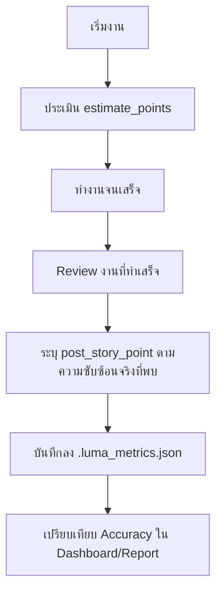

# Analysis Template

> 📋 Template สำหรับการวิเคราะห์ก่อนเริ่มพัฒนา Feature

---

## 📌 Feature Information

| รายการ | รายละเอียด |
|--------|-----------|
| **Feature Name** | Add post_story_point field to .luma_metrics.json and IssueMetricsRecord |
| **Date** | Tuesday, March 31, 2026 |
| **Analyst** | Gemini CLI |
| **Priority** | 🟡 Medium |
| **Status** | 📝 Draft |
| **Issue URL** | [Issue #20](https://github.com/oatrice/Luma/issues/20) |

---

## 1. Requirement Analysis

### 1.1 Problem Statement

ปัจจุบัน Luma เก็บเพียง `estimate_points` (ความซับซ้อนที่ประเมินไว้ก่อนเริ่มงาน) แต่ไม่มีการเก็บ `post_story_point` (ความซับซ้อนจริงที่พบหลังจากทำงานเสร็จ) ทำให้ไม่สามารถเปรียบเทียบความแม่นยำในการประเมิน (Estimation Accuracy) ได้

### 1.2 User Stories

| # | As a | I want to | So that |
|---|------|-----------|---------|
| 1 | Developer/Lead | บันทึกความซับซ้อนจริง (Post Story Points) หลังจบงาน | เปรียบเทียบกับค่าที่ประเมินไว้ตอนต้นได้ |
| 2 | Analyst | วิเคราะห์ความต่างระหว่าง Estimate vs Actual Points | ปรับปรุงกระบวนการประเมินในอนาคตให้แม่นยำขึ้น |

### 1.3 Acceptance Criteria

- [ ] **AC1:** เพิ่มฟิลด์ `post_story_point` (Optional[int] = None) ใน dataclass `IssueMetricsRecord`.
- [ ] **AC2:** ปรับปรุง function `validate`, `to_dict`, และ `from_dict` ใน `luma_core/issue_metrics.py` ให้รองรับฟิลด์ใหม่.
- [ ] **AC3:** ปรับปรุง CLI ใน `luma_core/actions/utils.py` ให้รองรับการกรอก `post_story_point` เมื่อผู้ใช้แก้ไขหรืออัปเดต metrics.
- [ ] **AC4:** ปรับปรุง `_maybe_parse_metric_line` เพื่อให้สามารถดึงข้อมูล `post_story_point` จากไฟล์ `ROADMAP.md` ได้.
- [ ] **AC5:** ตรวจสอบและปรับปรุง `summarize_issue_metrics` (ถ้าจำเป็น) เพื่อแสดงผลความแม่นยำเบื้องต้น.

---

## 2. Feature Analysis

### 2.1 User Flow

### 2.2 Screen/Page Requirements

| หน้าจอ | Actions | Components | UI Mock Status |
|--------|---------|------------|----------------|
| Manage Issue Metrics (CLI) | Edit/Update metrics | Input prompts (เพิ่มช่อง Post Story Points) | ⬜ Pending |
| Metrics Dashboard (CLI) | View summary | Table/Text output (แสดงผล Accuracy Gap) | ⬜ Pending |

### 2.3 Input/Output Specification

#### Inputs

| Field | Type | Required | Validation |
|-------|------|----------|------------|
| post_story_point | integer | ❌ | 0 or greater (แนะนำเป็นค่า Fibonacci) |

#### Outputs

| Field | Type | Description |
|-------|------|-------------|
| post_story_point | integer | ความซับซ้อนจริงที่บันทึกหลังจบงาน |
| Accuracy Gap | integer | ผลต่างระหว่าง `post_story_point` - `estimate_points` |

---

## 3. Impact Analysis

### 3.1 Affected Components

| Component | Impact Level | Description |
|-----------|--------------|-------------|
| `luma_core/issue_metrics.py` | 🔴 High | เปลี่ยนแปลงโครงสร้างข้อมูลหลัก (IssueMetricsRecord) และ logic การ parse |
| `luma_core/actions/utils.py` | 🟡 Medium | เพิ่ม User Interaction ในขั้นตอนการแก้ไข Metrics |
| `luma_core/metrics_summarizer.py` | 🟢 Low | ปรับปรุงการสรุปผลเพื่อรวมข้อมูล Post Points (ถ้าต้องการ) |
| `.luma_metrics.json` | 🟡 Medium | ข้อมูลในไฟล์จะมีการเพิ่ม field ใหม่เข้าไปหลังจากมีการบันทึก |

### 3.2 Breaking Changes

- [ ] **BC1:** ไม่มี (Backward Compatible) ข้อมูลเก่าที่ไม่มีฟิลด์นี้จะถูกกำหนดค่าเป็น `None` โดยอัตโนมัติ

### 3.3 Backward Compatibility Plan

- ฟังก์ชัน `IssueMetricsRecord.from_dict` จะรองรับข้อมูลที่ไม่มีฟิลด์ `post_story_point` โดยให้ค่าเริ่มต้นเป็น `None`.
- การแสดงผลจะข้ามฟิลด์นี้ไปหากข้อมูลเป็น `None`.

---

## 4. Feasibility Analysis

### 4.1 Technical Feasibility

| คำถาม | คำตอบ | หมายเหตุ |
|-------|-------|----------|
| เทคโนโลยีรองรับหรือไม่? | ✅ | Python Dataclasses และ JSON รองรับการเพิ่มฟิลด์ได้ง่าย |
| ทีมมี Skills เพียงพอหรือไม่? | ✅ | เป็นการแก้ไขส่วนของ Core Logic และ CLI UI |
| Infrastructure รองรับหรือไม่? | ✅ | ไม่ต้องเปลี่ยนแปลง Infrastructure |

### 4.2 Time Feasibility

| ประเด็น | รายละเอียด |
|--------|-----------|
| **Estimated Effort** | 0.5 Day |
| **Deadline** | N/A |
| **Buffer Time** | 0.2 Day |
| **Feasible?** | ✅ |

### 4.3 Budget Feasibility

| รายการ | ค่าใช้จ่าย | หมายเหตุ |
|--------|-----------|----------|
| Development | N/A | - |
| **Total** | 0 | |

---

## 5. Security Analysis

### 5.1 Sensitive Data

| ข้อมูล | Sensitivity Level | Protection Method |
|--------|------------------|-------------------|
| Metrics data | 🟢 Normal | ข้อมูลเก็บใน Local File ของ Repository |

### 5.2 Attack Vectors

| Vector | Risk Level | Mitigation |
|--------|-----------|------------|
| Invalid Input (Type mismatch) | 🟢 Low | ใช้ `validate_estimate_points` logic เพื่อกรองข้อมูลที่ไม่ใช่ integer |

---

## 6. Performance & Scalability Analysis

### 6.1 Performance Targets

- การเพิ่มหนึ่งฟิลด์ใน JSON record ไม่ส่งผลกระทบต่อ performance ในระดับที่มีนัยสำคัญ.

### 6.2 Scalability Plan

- N/A

---

## 7. Gap Analysis

| ด้าน | As-Is (ปัจจุบัน) | To-Be (ต้องการ) | Gap |
|------|-----------------|-----------------|-----|
| ข้อมูลความซับซ้อน | มีเพียงค่าประมาณการ (Estimate) | มีทั้งค่าประมาณการและค่าจริง (Post) | ขาดฟิลด์ `post_story_point` |
| การแก้ไขข้อมูลผ่าน CLI | แก้ไขได้เฉพาะ `estimate_points` | สามารถแก้ไข `post_story_point` ได้ด้วย | ขาด Prompt ใน UI |
| การประเมินความแม่นยำ | ไม่สามารถทำได้อัตโนมัติ | สามารถคำนวณ Accuracy Gap ได้ | ขาดข้อมูลเปรียบเทียบ |

---

## 8. Risk Analysis

| Risk | Probability | Impact | Score | Mitigation Plan |
|------|-------------|--------|-------|-----------------|
| ผู้ใช้อาจจะสับสนระหว่าง Estimate vs Post Points | 🟡 Medium | 🟢 Low | 2 | ระบุคำอธิบายใน CLI Prompt ให้ชัดเจน |
| ข้อมูลใน ROADMAP.md อาจจะไม่ถูก parse ถ้า format ไม่ตรง | 🟢 Low | 🟢 Low | 1 | เพิ่ม regex pattern ที่ยืดหยุ่นใน `_maybe_parse_metric_line` |

---

## 9. Summary & Recommendations

### 9.1 Analysis Summary

| หมวด | Status | Key Findings |
|------|--------|--------------|
| Requirement | ✅ Clear | ต้องการเก็บข้อมูลความซับซ้อนจริงเพื่อวิเคราะห์ Accuracy |
| Feature | ✅ Defined | เพิ่มฟิลด์ใน Dataclass และ Prompt ใน CLI |
| Impact | 🟡 Medium | กระทบ core logic แต่ไม่เกิด breaking changes |
| Feasibility | ✅ Feasible | ทำได้ทันที |
| Security | ✅ Secure | ไม่มีความเสี่ยงเพิ่มเติม |
| Performance | ✅ Acceptable | ไม่มีผลกระทบ |
| Risk | 🟢 Low | ความเสี่ยงต่ำ |

### 9.2 Recommendations

1. **Automation:** ในอนาคตอาจเพิ่ม AI Heuristic เพื่อแนะนำ `post_story_point` โดยพิจารณาจากจำนวน Commit หรือไฟล์ที่แก้ไขจริง.
2. **Reporting:** ควรเพิ่มฟิลด์ "Actual Points" ใน Report รายสัปดาห์/รายเดือน เพื่อแสดงความสำเร็จของทีมในแง่ของความซับซ้อนที่จัดการได้จริง.

### 9.3 Next Steps

- [ ] แก้ไข `luma_core/issue_metrics.py`: เพิ่ม `post_story_point` ใน `IssueMetricsRecord` และ `validate`.
- [ ] แก้ไข `luma_core/issue_metrics.py`: เพิ่ม regex ใน `_maybe_parse_metric_line`.
- [ ] แก้ไข `luma_core/actions/utils.py`: เพิ่มช่องกรอกข้อมูลใน `_edit_issue_metrics_record`.
- [ ] (Optional) แก้ไข `luma_core/metrics_summarizer.py`: เพิ่มการสรุปผล `post_story_point`.

---

## 📎 Appendix

### Related Documents

- `docs/story_points.md`: เกณฑ์การให้คะแนนความซับซ้อน (Story Points).

### Sign-off

| Role | Name | Date | Signature |
|------|------|------|-----------|
| Analyst | Gemini CLI | 2026-03-31 | ✅ |
| Tech Lead | - | - | ⬜ |
| PM | - | - | ⬜ |