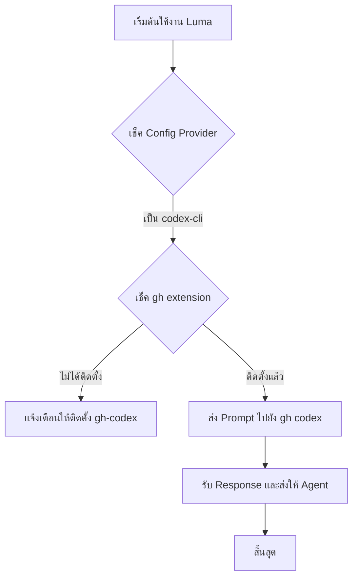

# Analysis Template

> 📋 Template สำหรับการวิเคราะห์ก่อนเริ่มพัฒนา Feature

---

## 📌 Feature Information

| รายการ | รายละเอียด |
|--------|-----------|
| **Feature Name** | เพิ่มการเชื่อมต่อกับ Provider codex-cli |
| **Date** | 31 มีนาคม 2026 |
| **Analyst** | Senior Technical Analyst |
| **Priority** | 🟡 Medium |
| **Status** | 📝 Draft |
| **Issue URL** | [Issue #16](https://github.com/oatrice/Luma/issues/16) |

---

## 1. Requirement Analysis

### 1.1 Problem Statement

ปัจจุบันระบบ Luma ยังไม่รองรับการเรียกใช้งาน `codex-cli` ผ่าน GitHub CLI (`gh`) ทำให้ไม่สามารถใช้ความสามารถของ Codex ในการช่วยเขียนโค้ดหรือวิเคราะห์โค้ดผ่านช่องทางนี้ได้ ซึ่งส่งผลให้ข้อจำกัดในการเลือกใช้งาน LLM Provider ลดน้อยลง

### 1.2 User Stories

| # | As a | I want to | So that |
|---|------|-----------|---------|
| 1 | AI Agent (Coder/Analyst) | เรียกใช้งาน Codex ผ่าน `gh cli` | สามารถใช้โมเดลที่ปรับแต่งมาเพื่อการเขียนโค้ดได้โดยตรง |
| 2 | Developer | กำหนดค่า `codex-cli` ใน configuration | สามารถสลับมาใช้ Codex เป็น provider สำรองหรือหลักได้ |

### 1.3 Acceptance Criteria

- [ ] **AC1:** ระบบสามารถตรวจสอบความพร้อมใช้งานของ `gh codex` extension ได้
- [ ] **AC2:** เพิ่ม `codex-cli` เข้าไปในรายการ Provider ใน `luma_core/llm.py` และ `config.py`
- [ ] **AC3:** สามารถส่ง Prompt และรับผลลัพธ์จาก Codex ผ่านคำสั่ง `gh` ได้อย่างถูกต้อง
- [ ] **AC4:** รองรับการจัดการ Error กรณี `codex-cli` ไม่ได้ถูกติดตั้งหรือ Session หมดอายุ

---

## 2. Feature Analysis

### 2.1 User Flow

### 2.2 Screen/Page Requirements

*ฟีเจอร์นี้เป็นระดับ Core Logic (CLI) จึงไม่มี UI หน้าจอใหม่ แต่มีการปรับปรุงส่วนแสดงผลใน Terminal*

| หน้าจอ | Actions | Components | UI Mock Status |
|--------|---------|------------|----------------|
| Terminal UI | แสดงสถานะการเชื่อมต่อ Codex | `luma_core/ui.py` | ✅ Done |
| Config Menu | เพิ่มตัวเลือก Codex | `luma_core/actions/admin_actions.py` | ⬜ Pending |

### 2.3 Input/Output Specification

#### Inputs

| Field | Type | Required | Validation |
|-------|------|----------|------------|
| prompt | string | ✅ | ข้อความคำสั่งสำหรับ Codex |
| provider_name | string | ✅ | ต้องเป็น "codex-cli" |

#### Outputs

| Field | Type | Description |
|-------|------|-------------|
| response | string | ผลลัพธ์ที่ได้จาก Codex |
| status_code | number | สถานะการทำงาน (0 = สำเร็จ) |

---

## 3. Impact Analysis

### 3.1 Affected Components

| Component | Impact Level | Description |
|-----------|--------------|-------------|
| `luma_core/llm.py` | 🔴 High | ต้องเพิ่ม Class หรือ Method สำหรับจัดการ `codex-cli` |
| `luma_core/config.py` | 🟡 Medium | เพิ่ม Schema และ Default Value สำหรับ Codex |
| `luma_core/github_client.py` | 🟡 Medium | เพิ่มการเรียกใช้ `gh` command สำหรับ extension นี้ |

### 3.2 Breaking Changes

- [ ] **BC1:** หากมีการเปลี่ยนลำดับความสำคัญของ Provider หลัก อาจส่งผลต่อพฤติกรรมเดิมของ Agent (แต่ในที่นี้เป็นการเพิ่มทางเลือก จึงไม่ถือเป็น Breaking Change ที่รุนแรง)

### 3.3 Backward Compatibility Plan

ระบบจะตรวจสอบว่า `gh codex` พร้อมใช้งานหรือไม่ หากไม่พร้อมจะทำการ Fallback กลับไปใช้ Provider พื้นฐาน (Google Gemini) ตามกลไกเดิมที่ระบบมีอยู่

---

## 4. Feasibility Analysis

### 4.1 Technical Feasibility

| คำถาม | คำตอบ | หมายเหตุ |
|-------|-------|----------|
| เทคโนโลยีรองรับหรือไม่? | ✅ | GitHub CLI รองรับ extension system อยู่แล้ว |
| ทีมมี Skills เพียงพอหรือไม่? | ✅ | มีประสบการณ์การจัดการ `subprocess` และ `gh cli` |
| Infrastructure รองรับหรือไม่? | ✅ | ต้องการเพียงการติดตั้ง extension เพิ่มเติมในเครื่องผู้ใช้ |

### 4.2 Time Feasibility

| ประเด็น | รายละเอียด |
|--------|-----------|
| **Estimated Effort** | 3 days |
| **Deadline** | - |
| **Buffer Time** | 1 day |
| **Feasible?** | ✅ |

### 4.3 Budget Feasibility

| รายการ | ค่าใช้จ่าย | หมายเหตุ |
|--------|-----------|----------|
| API Usage | ตามปริมาณการใช้ | ขึ้นอยู่กับโควต้าของ Codex บน GitHub |
| **Total** | 0 (Initial) | |

---

## 5. Security Analysis

### 5.1 Sensitive Data

| ข้อมูล | Sensitivity Level | Protection Method |
|--------|------------------|-------------------|
| GitHub Token | 🔴 Critical | ใช้ผ่าน `gh auth` พื้นฐานของระบบ |

### 5.2 Attack Vectors

| Vector | Risk Level | Mitigation |
|--------|-----------|------------|
| Command Injection | 🔴 High | ตรวจสอบและ Sanitize Prompt ก่อนส่งเข้า `subprocess` |

### 5.3 Authentication & Authorization

ใช้การ Authentication ผ่าน `gh auth status` และตรวจสอบ Permission ที่จำเป็นสำหรับการเรียกใช้งาน Codex

---

## 6. Performance & Scalability Analysis

### 6.1 Performance Targets

| Metric | Target | Current |
|--------|--------|---------|
| Latency | < 10s (เฉลี่ยของ LLM) | N/A |
| Success Rate | > 95% | N/A |

### 6.2 Scalability Plan

เนื่องจากเป็นเครื่องมือระดับ CLI ความสามารถในการขยายตัวจะขึ้นอยู่กับ Rate Limit ของ GitHub API และประสิทธิภาพของเครื่อง Local เป็นหลัก

---

## 7. Gap Analysis

| ด้าน | As-Is (ปัจจุบัน) | To-Be (ต้องการ) | Gap |
|------|-----------------|-----------------|-----|
| Provider Support | รองรับ Google, OpenRouter | เพิ่ม Codex-CLI | ขาด Implementation ใน `llm.py` |
| CLI Integration | ใช้ `gh` สำหรับ issue/pr | ใช้ `gh` สำหรับ AI Completion | ต้องศึกษา Command ของ `gh-codex` extension |

---

## 8. Risk Analysis

| Risk | Probability | Impact | Score | Mitigation Plan |
|------|-------------|--------|-------|-----------------|
| `gh-codex` เลิกสนับสนุน | 🟡 Medium | 🟡 Medium | 4 | เตรียม Provider สำรอง (Fallback) |
| ความเร็วในการตอบสนองช้า | 🔴 High | 🟡 Medium | 6 | เพิ่มระบบ Timeout และ Retry |

---

## 9. Summary & Recommendations

### 9.1 Analysis Summary

| หมวด | Status | Key Findings |
|------|--------|--------------|
| Requirement | ✅ Clear | ต้องการเพิ่มช่องทางเรียกใช้ Codex ผ่าน `gh` |
| Feature | ✅ Defined | ปรับปรุง `llm.py` และ `config.py` เป็นหลัก |
| Impact | ⚠️ Medium | กระทบเฉพาะส่วนการเรียก LLM |
| Feasibility | ✅ Feasible | สามารถทำได้ผ่าน `subprocess` |

### 9.2 Recommendations

1. ควรสร้าง Class ใหม่ใน `luma_core/llm.py` ชื่อ `CodexCliProvider` เพื่อแยก Logic ออกจากกันอย่างชัดเจน
2. ควรมีระบบตรวจสอบ (Health Check) ก่อนเริ่มรัน Agent ว่า `gh-codex` ทำงานได้จริงหรือไม่
3. ปฏิบัติตามหลัก TDD โดยเขียน Test Case สำหรับจำลองผลลัพธ์จาก `gh codex` ก่อนเริ่มเขียนโค้ดจริง

### 9.3 Next Steps

- [ ] วิจัยคำสั่งที่แน่นอนของ `gh codex` extension
- [ ] เขียน Unit Test สำหรับ `CodexCliProvider`
- [ ] แก้ไข `config.py` เพื่อรับค่าคอนฟิกใหม่

---

## 📎 Appendix

### Related Documents

- [GitHub CLI Manual](https://cli.github.com/manual/)

### Sign-off

| Role | Name | Date | Signature |
|------|------|------|-----------|
| Analyst | Senior Technical Analyst | 31/03/2026 | ✅ |
| Tech Lead | - | - | ⬜ |
| PM | - | - | ⬜ |