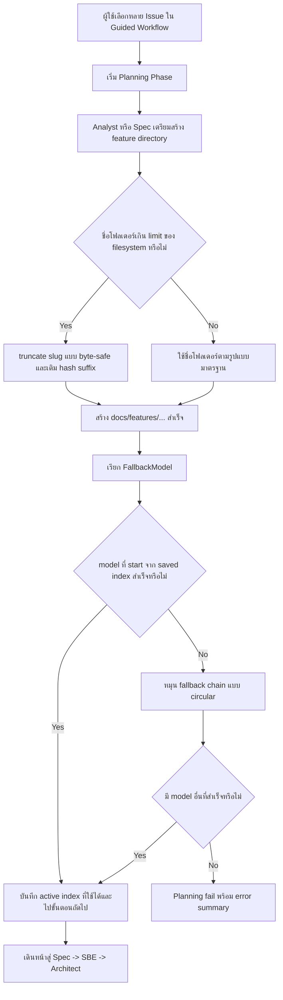

# Analysis Template

> 📋 Template สำหรับการวิเคราะห์ก่อนเริ่มพัฒนา Feature

---

## 📌 Feature Information

| รายการ | รายละเอียด |
|--------|-----------|
| **Feature Name** | Guided planning can fail on multi-issue runs due to overlong feature dirs and sticky LLM fallback |
| **Issue Number** | #35 |
| **Issue URL** | [oatrice/Luma#35](https://github.com/oatrice/Luma/issues/35) |
| **Date** | 2026-04-03 |
| **Analyst** | Codex |
| **Priority** | 🔴 High |
| **Status** | 📝 Draft |
| **Cross-Repository Scope** | `Luma-7e3c` เป็นรีโปหลักที่ต้องแก้โค้ด และ `Zenith` เป็นรีโป/ workflow ผู้ใช้งานที่ได้รับผลกระทบโดยตรงจาก Planning phase failure |

---

## 1. Requirement Analysis

### 1.1 Problem Statement

> อธิบายปัญหาที่ต้องการแก้ไข

```text
Guided Planning ของ Luma สามารถล้มเหลวระหว่างการรันหลาย issue พร้อมกันได้จาก 2 สาเหตุที่เป็นอิสระต่อกัน

1. `Analyst` และ `Spec` สร้างชื่อโฟลเดอร์ใต้ `docs/features/` จากชื่อ issue รวมแบบตรง ๆ ทำให้ basename เกิน 255 bytes และเกิด `OSError: [Errno 63] File name too long`
2. `FallbackModel` เริ่มจาก `FALLBACK_ACTIVE_INDEX` ที่บันทึกไว้ แต่ไม่วนกลับไปลอง model ต้นลิสต์ ทำให้ transient failure ของ model ที่ active อยู่สามารถหยุดทั้ง planning chain ได้ แม้ยังมี model อื่นพร้อมใช้งาน

ผลกระทบเชิงธุรกิจ/การทำงาน:
- Guided Feature Workflow หยุดใน Planning phase
- handoff `Analyst -> Spec -> SBE -> Architect` ขาดตอน
- Zenith ต้องกู้ workflow แบบ manual ทั้งที่ระบบควร self-heal ผ่าน fallback และ safe artifact naming ได้

สมมติฐาน:
- Issue URL ไม่ได้ระบุมาในต้นฉบับ จึงอนุมานจาก git remote ของรีโปนี้ว่าเป็น `https://github.com/oatrice/Luma/issues/35`
- ผลกระทบข้ามรีโปหลักคือ Luma (ตัว orchestrator/agent runtime) และ Zenith (consumer workflow ที่เรียกใช้งาน multi-issue planning)
```

### 1.2 User Stories

| # | As a | I want to | So that |
|---|------|-----------|---------|
| 1 | ผู้ใช้ Luma/Zenith ที่รัน Guided Feature Workflow | ให้ระบบสร้าง feature directory ที่ปลอดภัยแม้ title ของหลาย issue จะยาวมาก | workflow planning จะไม่ล้มเหลวตั้งแต่ต้นทางเพราะข้อจำกัดของ filesystem |
| 2 | ผู้ดูแลระบบ orchestration / AI workflow operator | ให้ fallback chain ของ LLM หมุนครบทั้งลิสต์โดยเริ่มจาก saved index และ wrap กลับต้นรายการ | planning phase จะเดินหน้าต่อได้แม้ model ที่ active อยู่ล้มเหลวชั่วคราว |
| 3 | ทีมพัฒนา Luma | มี regression tests ครอบคลุมทั้ง dirname overflow และ fallback rotation | ป้องกัน bug กลับมาอีกเมื่อแก้ agent หรือ provider chain ในอนาคต |

### 1.3 Acceptance Criteria

- [ ] **AC1:** Multi-issue planning ต้องไม่ล้มเหลวเมื่อ combined issue title ยาวมากและยังต้องสร้างโฟลเดอร์ใต้ `docs/features/` ได้สำเร็จ
- [ ] **AC2:** `Analyst` และ `Spec` ต้องใช้ naming strategy เดียวกันที่ปลอดภัยต่อ filesystem และยังคงรูปแบบ `N_issue-<issue-number>_...`
- [ ] **AC3:** เมื่อ `FALLBACK_ACTIVE_INDEX` ชี้ไปใกล้ท้าย chain แล้ว model นั้นล้มเหลว ระบบต้องวนกลับไปลอง model ก่อนหน้าได้ครบหนึ่งรอบ
- [ ] **AC4:** ต้องมี regression tests สำหรับทั้ง safe feature directory naming และ circular fallback rotation

---

## 2. Feature Analysis

### 2.1 User Flow



### 2.2 Screen/Page Requirements

> [!IMPORTANT]
> **Policy**: Web Full Implementation must be implemented and verified FIRST before Android/iOS logic.

| หน้าจอ | Actions | Components | UI Mock Status |
|--------|---------|------------|----------------|
| Terminal UI: Guided Planning Menu | เลือกหลาย issue, เริ่ม Planning phase, แสดงผลสำเร็จ/ล้มเหลว | `main.py`, `luma_core/ui.py`, `luma_core/actions/plan_actions.py`, `luma_core/actions/workflow_actions.py` | ⬜ Pending |
| Planning Artifacts Workspace | สร้าง/ค้นหา `docs/features/<feature_dir>/analysis.md` และ `spec.md` | `luma_core/agents/analyst.py`, `luma_core/agents/spec_agent.py`, `luma_core/feature_dirs.py` | ⬜ Pending |
| Background LLM Execution / Fallback Layer | โหลด saved fallback index, retry model ถัดไป, บันทึก usage และ index ที่สำเร็จ | `luma_core/llm.py`, `luma_core/config.py`, `luma_core/usage_tracker.py` | ⬜ Pending |
| Cross-Repo Consumer Workflow (Zenith) | เรียก multi-issue planning แล้วรอ handoff ต่อไปยัง SBE/Architect โดยไม่ต้อง manual recovery | Zenith workflow integration, issue selection payload, Luma planning handoff contract | ⬜ Pending |

### 2.3 Input/Output Specification

#### Inputs

| Field | Type | Required | Validation |
|-------|------|----------|------------|
| `issue_data.number` | string | ✅ | ต้องรองรับทั้งเลขเดียวและรูปแบบหลาย issue เช่น `13-14-15-8` |
| `issue_data.title` / `task` | string | ✅ | ต้อง sanitize และเมื่อประกอบเป็น dirname แล้วต้องไม่เกิน 255 bytes |
| `target_dir` | string | ✅ | ต้อง resolve ได้ถึง project root ที่มี `docs/` หรือ parent ที่มี `docs/` |
| `FALLBACK_ACTIVE_INDEX` | integer | ❌ | ถ้าอยู่นอกช่วง `0..len(models)-1` ต้อง fallback เป็น `0` |
| `models` | array<BaseChatModel> | ✅ | ต้องมีอย่างน้อย 1 model และต้องลองได้ครบหนึ่งรอบแบบ circular |
| `target_planning_repos` | array<object> | ❌ | ถ้ามีหลายรีโป ต้อง inject cross-repo context ลง prompt และผลกระทบต้องสะท้อนในเอกสาร |

#### Outputs

| Field | Type | Description |
|-------|------|-------------|
| `feature_dir` | string | path ใต้ `docs/features/` ที่ปลอดภัยต่อ filesystem และยัง trace กลับไปที่ issue number ได้ |
| `analysis_file` | string | ไฟล์ `analysis.md` ที่สร้างโดย Analyst ภายใน feature directory |
| `spec_file` | string | ไฟล์ `spec.md` ที่สร้างโดย Spec ภายใน feature directory |
| `fallback_selected_index` | integer | index ของ model ที่สำเร็จและถูกบันทึกกลับผ่าน config |
| `workflow_status` | string | สถานะว่า planning เดินหน้าต่อได้หรือ fail พร้อม error summary |
| `usage_events` | array | telemetry ของความสำเร็จ/ล้มเหลวของแต่ละ model ใน fallback chain |

---

## 3. Impact Analysis

### 3.1 Affected Components

| Component | Impact Level | Description |
|-----------|--------------|-------------|
| `luma_core/feature_dirs.py` | 🔴 High | เป็นจุดศูนย์กลางของ safe slug generation และ byte-safe truncation สำหรับ basename ของ `docs/features/` |
| `luma_core/agents/analyst.py` | 🔴 High | ต้องใช้ helper เดียวกันในการสร้าง feature directory สำหรับ `analysis.md` โดยเฉพาะใน multi-issue run |
| `luma_core/agents/spec_agent.py` | 🔴 High | ต้องใช้ helper เดียวกันกับ Analyst เพื่อไม่ให้เกิด naming divergence ระหว่าง `analysis.md` กับ `spec.md` |
| `luma_core/llm.py` (`FallbackModel`) | 🔴 High | ต้องเปลี่ยนลำดับการลอง model จาก linear tail-only เป็น circular order โดยยังเก็บ error aggregation และ usage tracking |
| `luma_core/config.py` | 🟡 Medium | คงสัญญาเดิมของ `FALLBACK_ACTIVE_INDEX` แต่ต้องรองรับการเริ่มจาก saved index และบันทึก index ที่สำเร็จอย่างถูกต้อง |
| `tests/test_feature_dir_naming.py` | 🟡 Medium | เป็น regression suite หลักสำหรับ basename overflow ใน `Analyst` และ `Spec` |
| `tests/test_llm_fallback_rotation.py` | 🟡 Medium | เป็น regression suite หลักสำหรับ circular fallback จาก saved index |
| Zenith guided workflow / multi-issue planning | 🟡 Medium | ไม่จำเป็นต้องแก้โค้ดใน Zenith เสมอไป แต่ต้อง validate ว่า workflow ที่เรียก Luma ไม่สะดุดและ handoff ต่อเนื่องตามคาด |

### 3.2 Breaking Changes

- [ ] **BC1:** ไม่มี breaking change ต่อ schema ของ config หรือ contract ของ `FALLBACK_ACTIVE_INDEX` หากยังคง field เดิมและเพียงเปลี่ยนลำดับการ iterate ภายใน
- [ ] **BC2:** ไม่มี breaking change ต่อโครงสร้างหลักของ feature directory หากยังรักษา prefix รูปแบบ `N_issue-<issue-number>_` ไว้ แม้ slug อาจถูก truncate และเติม hash suffix ในกรณีชื่อยาวมาก
- [ ] **BC3:** มีความเสี่ยงเชิงพฤติกรรมต่อ script ภายนอกที่พึ่งพา “slug เต็มตาม title” แบบ exact string match จึงควร audit เครื่องมือค้นหาโฟลเดอร์ที่ไม่ใช้ issue prefix

### 3.3 Backward Compatibility Plan

```text
แผนรองรับ backward compatibility:

1. คง naming contract ส่วนต้นของโฟลเดอร์เป็น `N_issue-<issue-number>_` เพื่อให้ logic ที่ค้นหาโฟลเดอร์จาก issue number ยังทำงานได้
2. จำกัดการเปลี่ยนแปลงเฉพาะ slug ส่วนท้าย โดย truncate แบบ byte-safe และเติม hash suffix เฉพาะกรณีที่จำเป็น
3. คง config key เดิมคือ `FALLBACK_ACTIVE_INDEX` และไม่เพิ่ม schema migration ใหม่
4. เมื่อมี feature directory เดิมสำหรับ issue เดียวกันอยู่แล้ว ให้ reuse directory เดิมแทนการสร้างชื่อใหม่
5. รักษา telemetry/error reporting เดิมของ `FallbackModel` เพื่อไม่ให้ dashboard หรือ log parser เดิมเสียหาย
6. เพิ่ม regression tests เพื่อยืนยันว่า behavior เดิมที่ถูกต้องยังอยู่ และเฉพาะ edge case ที่ล้มเหลวเท่านั้นที่เปลี่ยนพฤติกรรม
```

---

## 4. Feasibility Analysis

### 4.1 Technical Feasibility

> [!IMPORTANT]
> **Android Build Policy**: MUST use scripts in `Android/scripts/` (e.g., `build_android.sh`) instead of direct `./gradlew` to ensure correct JDK version (Java 21).

| คำถาม | คำตอบ | หมายเหตุ |
|-------|-------|----------|
| เทคโนโลยีรองรับหรือไม่? | ✅ | รีโปมีส่วนประกอบรองรับอยู่แล้วทั้ง Python helper (`feature_dirs.py`), LLM wrapper (`FallbackModel`) และ pytest regression tests |
| ทีมมี Skills เพียงพอหรือไม่? | ✅ | งานนี้ต้องใช้ Python, filesystem safety, LangChain-style model wrapper, และ test design ซึ่งสอดคล้องกับ stack ปัจจุบันของ Luma |
| Infrastructure รองรับหรือไม่? | ✅ | ไม่ต้องเพิ่ม service ใหม่ ใช้ local filesystem, config เดิม, gh CLI และ LLM provider chain ที่มีอยู่แล้ว |

### 4.2 Time Feasibility

| ประเด็น | รายละเอียด |
|--------|-----------|
| **Estimated Effort** | 1-2 days |
| **Deadline** | ยังไม่ระบุใน issue; แนะนำให้เสร็จก่อนรอบ Guided Planning ถัดไปของ Zenith |
| **Buffer Time** | 0.5 day |
| **Feasible?** | ✅ |

### 4.3 Budget Feasibility

| รายการ | ค่าใช้จ่าย | หมายเหตุ |
|--------|-----------|----------|
| Implementation + Unit Tests | ต่ำ (1-2 engineer-days) | แก้ไขเฉพาะ Python codebase เดิม |
| CI Runtime เพิ่มจาก Regression Tests | ต่ำมาก | เพิ่ม test ไม่กี่เคสใน pytest suite |
| Cross-Repo Validation กับ Zenith | ต่ำ | ใช้ manual smoke test หรือ scripted reproduction เดิม |
| **Total** | ต่ำ | ไม่มีค่า infrastructure หรือ third-party license เพิ่ม |

---

## 5. Security Analysis

### 5.1 Sensitive Data

| ข้อมูล | Sensitivity Level | Protection Method |
|--------|------------------|-------------------|
| LLM/API credentials ใน `.env` เช่น `GOOGLE_API_KEY`, `GOOGLE_API_KEYS`, `OPENROUTER_API_KEY`, `CODEX_CLI_API_KEY` | 🔴 Critical | Environment variables, ไม่ log secret, จำกัดการเข้าถึงเฉพาะ runtime |
| เนื้อหา GitHub Issue / เอกสาร planning ที่สร้างใน `docs/features/` | 🟡 Sensitive | Repository access control, review ก่อนเผยแพร่, จำกัด path ให้อยู่ใน project root |
| ค่า `FALLBACK_ACTIVE_INDEX` และ local config ที่ควบคุม fallback behavior | 🟡 Sensitive | Validation ของ index, เขียน config แบบ controlled, ไม่เชื่อ input ที่อยู่นอกช่วง |
| ชื่อโฟลเดอร์และ path ภายใน `docs/features/` | 🟢 Normal | sanitize slug, truncate แบบ byte-safe, ป้องกัน malformed basename |

### 5.2 Attack Vectors

| Vector | Risk Level | Mitigation |
|--------|-----------|------------|
| Issue title ที่ยาวหรือมีอักขระพิเศษทำให้เกิด path failure / path manipulation attempt | 🟡 Medium | ใช้ centralized helper สำหรับ sanitize + byte-safe truncate + hash suffix และมี regression tests |
| การตั้งค่า fallback index ที่ค้าง/ผิดพลาดทำให้ availability ลดลงหรือ model บางตัวไม่ถูกลอง | 🟡 Medium | validate index, iterate แบบ circular ครบหนึ่งรอบ, save index ใหม่เมื่อสำเร็จ |
| Prompt/input จากข้ามรีโปทำให้ workflow สะดุดหรือได้ artifact ไม่ครบ | 🟡 Medium | จำกัด prompt context ตาม project rules, แยก concern ระหว่าง naming กับ model retry, และตรวจสอบผลลัพธ์ในแต่ละ phase |

### 5.3 Authentication & Authorization

```text
ฟีเจอร์นี้ไม่เปลี่ยน authentication/authorization model ของระบบ

- GitHub access ยังคงอาศัย `gh` CLI / GitHub API ที่ผู้ใช้ authenticate ไว้แล้ว
- LLM access ยังคงอาศัย provider keys ใน environment ตาม config เดิม
- การแก้ไขควรจำกัดผลลัพธ์ไว้ภายใน target project path เท่านั้น และต้องไม่ขยายสิทธิ์การเขียนไฟล์นอก `docs/features/`
- ห้าม log secret ระหว่าง fallback failure หรือ usage tracking
- ไม่มี role/permission ใหม่ในระดับแอป แต่ควรคงหลัก least surprise สำหรับ operator และ agent runtime
```

---

## 6. Performance & Scalability Analysis

### 6.1 Performance Targets

| Metric | Target | Current |
|--------|--------|---------|
| Response Time | เพิ่ม overhead ฝั่ง local logic สำหรับ dirname handling และ fallback rotation ไม่เกิน 1s ต่อรอบตัดสินใจ (ไม่รวมเวลาตอบของ LLM) | N/A; ปัจจุบันมี failure ที่หยุด workflow ก่อนจบ |
| Throughput | รองรับ multi-issue planning อย่างน้อย 1 workflow ต่อ terminal session โดยไม่ fail จาก 2 root causes นี้ | ปัจจุบัน reproducible fail ในบางชุด issue ยาวและบาง fallback state |
| Error Rate | 0 known regression failures สำหรับ basename overflow และ fallback wrap-around ใน test suite | ปัจจุบันมี bug scenario ที่ reproduce ได้ตาม issue |

### 6.2 Scalability Plan

| Scenario | Expected Users | Scaling Strategy |
|----------|---------------|------------------|
| Normal | 1 operator ต่อ 1 Luma session | ใช้ helper แบบ O(n) ตามความยาว slug และลอง fallback สูงสุดหนึ่งรอบของ model chain |
| Peak | 1 operator รันหลาย multi-issue plans ต่อวันข้ามหลายรีโป | reuse saved fallback index, เก็บ telemetry ทุก attempt, ลด manual recovery จาก Zenith/Luma handoff |
| Growth (1yr) | หลายรีโปใน orchestration chain และ issue title ซับซ้อนมากขึ้น | บังคับใช้ centralized feature-dir helper กับ agent ทุกตัวที่สร้าง artifacts, เพิ่ม integration smoke tests ข้ามรีโป, และ audit path-creation call sites เพิ่มเติม |

---

## 7. Gap Analysis

| ด้าน | As-Is (ปัจจุบัน) | To-Be (ต้องการ) | Gap |
|------|-----------------|-----------------|-----|
| Feature directory naming | `Analyst`/`Spec` สร้าง slug จาก combined title และเสี่ยงเกิน filesystem basename limit | ใช้ helper กลางที่ truncate แบบ byte-safe และเติม hash suffix เมื่อจำเป็น | ยังไม่มี guard กลางที่ enforce basename safety กับทุก agent |
| Fallback model rotation | เริ่มจาก saved index แต่ไม่รับประกันการ wrap กลับไปลอง model ก่อนหน้า | ลอง model ครบหนึ่งรอบแบบ circular และหยุดเมื่อเจอ model ที่สำเร็จ | logic เดิมทำให้ transient failure ของ model ปัจจุบันหยุด chain ทั้งหมด |
| Cross-repo guided planning continuity | Zenith อาจหลุดจาก `Analyst -> Spec -> SBE -> Architect` ไปสู่ manual recovery | multi-issue planning ต้องเดินครบ handoff chain แม้อยู่ใน cross-repo context | ยังขาดการยืนยันเชิง end-to-end ว่าการแก้ใน Luma ปิดผลกระทบฝั่ง Zenith ได้จริง |
| Regression safety | coverage กระจายและมี edge case หลุดใน multi-issue runs | มี targeted tests สำหรับ long title, multi-byte path safety, และ fallback wrap-around | test coverage เดิมไม่กัน regressions ได้ครบใน workflow ที่ reproduce จริง |

---

## 8. Risk Analysis

| Risk | Probability | Impact | Score | Mitigation Plan |
|------|-------------|--------|-------|-----------------|
| เครื่องมือหรือ script ภายนอกอาจพึ่งพาชื่อโฟลเดอร์แบบ slug เต็ม ทำให้พฤติกรรมเปลี่ยนเมื่อมี truncation + hash suffix | 🟡 Medium | 🟡 Medium | 4 | คง prefix `N_issue-<issue-number>_`, audit helper ที่ค้นหาโฟลเดอร์, และเพิ่ม test กับ lookup ตาม issue number |
| Circular fallback อาจเพิ่มจำนวน provider calls ระหว่าง outage จริง ทำให้ planning ช้าลงหรือมี log noise มากขึ้น | 🟡 Medium | 🔴 High | 6 | จำกัดให้ลองสูงสุดหนึ่ง full cycle, ใช้ error classification เดิม, บันทึก usage telemetry และรวม error summary ชัดเจน |
| แก้ unit-level แล้วแต่ Zenith end-to-end workflow ยังมีจุดสะดุดใน phase ถัดไป | 🟡 Medium | 🔴 High | 6 | เพิ่ม manual/smoke validation ด้วยเคสหลาย issue จริง เช่น `#13-14-15-8` และยืนยัน handoff ถึง SBE/Architect |
| เคสชื่อหลายภาษา/UTF-8 อาจยังมี edge case หากการตัด byte ไม่ครอบคลุมทุกอักขระ | 🟢 Low | 🟡 Medium | 2 | เพิ่ม test สำหรับ multi-byte titles และตรวจความยาวด้วย `len(name.encode("utf-8"))` เสมอ |

> **Risk Score:** Probability × Impact (High=3, Medium=2, Low=1)

---

## 9. Summary & Recommendations

### 9.1 Analysis Summary

| หมวด | Status | Key Findings |
|------|--------|--------------|
| Requirement | ✅ Clear | issue ระบุ root cause, reproduction, proposed fix และ acceptance criteria ค่อนข้างครบ |
| Feature | ✅ Defined | ขอบเขตหลักคือ safe feature directory naming + circular LLM fallback + regression tests |
| Impact | ⚠️ Medium | กระทบแกน planning ของ Luma โดยตรง และกระทบ Zenith ในฐานะ consumer workflow ที่รัน multi-issue planning |
| Feasibility | ✅ Feasible | เป็นการแก้ไข localized ใน Python codebase เดิมและมี test seam ชัดเจน |
| Security | ⚠️ Needs Review | ไม่เปลี่ยน auth model แต่ต้องรักษา secret hygiene, safe path handling และ config validation |
| Performance | ✅ Acceptable | overhead เพิ่มเล็กน้อยและคุ้มค่ากับ resilience ที่ได้ |
| Risk | ⚠️ Some Risks | มีความเสี่ยงเรื่อง downstream assumptions ต่อชื่อโฟลเดอร์และการ validate end-to-end ข้ามรีโป |

### 9.2 Recommendations

1. **รวมการสร้างชื่อ feature directory ทุกจุดไว้หลัง helper เดียว (`build_feature_dirname`) และ audit call sites อื่นที่ยังสร้าง path เอง**
2. **คง fallback chain ให้ deterministic แบบ circular, ลองครบหนึ่งรอบจาก saved index, และบันทึก index ของ model ที่สำเร็จกลับ config เสมอ**
3. **เพิ่ม regression tests ระดับ unit และอย่างน้อยหนึ่ง smoke test ระดับ workflow ด้วยเคส multi-issue จริงจาก Zenith เพื่อปิดช่องว่างข้ามรีโป**

### 9.3 Next Steps

- [ ] implement/verify safe feature directory naming ใน `Analyst`, `Spec` และตรวจ call sites ที่เกี่ยวข้องกับ `docs/features/`
- [ ] เพิ่ม/ยืนยัน regression tests สำหรับ long multi-issue title, UTF-8 byte truncation, และ fallback wrap-around
- [ ] รัน Guided Planning smoke test กับเคส `#13-14-15-8` เพื่อยืนยัน handoff `Analyst -> Spec -> SBE -> Architect` ในบริบท Zenith/Luma
- [ ] ตรวจสอบว่า metrics/logging ของ `usage_tracker` และ config persistence ยังทำงานถูกต้องหลังเปลี่ยน fallback order

---

## 📎 Appendix

### Related Documents

- [GitHub Issue #35](https://github.com/oatrice/Luma/issues/35)
- [LLM Fallback Chain Notes](/Users/oatrice/.codex/worktrees/7e3c/Luma/docs/llm_fallback_chain.md)
- [Zenith Issue #13](https://github.com/oatrice/Zenith/issues/13)
- [Zenith Issue #14](https://github.com/oatrice/Zenith/issues/14)
- [Zenith Issue #15](https://github.com/oatrice/Zenith/issues/15)
- [Zenith Issue #8](https://github.com/oatrice/Zenith/issues/8)

### Sign-off

| Role | Name | Date | Signature |
|------|------|------|-----------|
| Analyst | Codex | 2026-04-03 | ✅ |
| Tech Lead | TBD | TBD | ⬜ |
| PM | TBD | TBD | ⬜ |