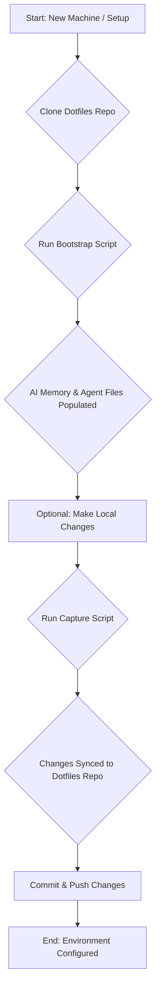

# Analysis Template

> 📋 Template สำหรับการวิเคราะห์ก่อนเริ่มพัฒนา Feature

---

## 📌 Feature Information

| รายการ | รายละเอียด |
|--------|-----------|
| **Feature Name** | Portable Dotfiles Bootstrap for Shared AI Memory and Global Agents |
| **Date** | 03/04/2026 |
| **Analyst** | Senior Technical Analyst |
| **Priority** | 🔴 High |
| **Status** | 📝 Draft |
| **Issue URL** | N/A |

---

## 1. Requirement Analysis

### 1.1 Problem Statement

> อธิบายปัญหาที่ต้องการแก้ไข

```
The current system stores shared AI memory and global agent instructions in machine-local files (e.g., `~/.ai-shared-memory.md`, `~/.codex/AGENTS.md`, `~/.gemini/GEMINI.md`). This makes these critical configurations vulnerable to loss when moving to a new machine and increases the likelihood of rule drift across different LLM vendors over time due to manual management.
```

### 1.2 User Stories

| # | As a | I want to | So that |
|---|------|-----------|---------|
| 1 | Developer | manage my AI memory and agent configurations using a portable dotfiles repository structure | I don't lose them when moving to a new machine and ensure setup is streamlined and consistent. |
| 2 | Project Maintainer | ensure global AI agent rules and shared memory are consistently applied across different machines and LLM providers | minimize rule drift and simplify onboarding for new developers. |
| 3 | User | easily bootstrap my AI environment on a new machine with a single script | reduce manual setup time and potential for errors. |

### 1.3 Acceptance Criteria

- [ ] **AC1:** A portable dotfiles repository structure exists for the following configurations:
    - `~/.ai-shared-memory.md`
    - `~/.codex/AGENTS.md`
    - `~/.gemini/GEMINI.md`
- [ ] **AC2:** The bootstrap flow works on a new machine without requiring manual copy-paste of files.
- [ ] **AC3:** Vendor-specific agent files correctly reference the shared memory via portable home-directory paths (using `~` or `$HOME`).
- [ ] **AC4:** A capture flow is implemented to sync machine-local changes back into the tracked dotfiles repository.
- [ ] **AC5:** The setup process is clearly documented for reuse across repositories.

---

## 2. Feature Analysis

### 2.1 User Flow



### 2.2 Screen/Page Requirements

> [!IMPORTANT]
> **Policy**: This feature primarily affects the command-line interface and file system configuration. No graphical user interface screens are directly involved.

| หน้าจอ | Actions | Components | UI Mock Status |
|--------|---------|------------|----------------|
| N/A | N/A | N/A | N/A |

### 2.3 Input/Output Specification

#### Inputs

| Field | Type | Required | Validation |
|-------|------|----------|------------|
| Dotfiles Repository | Git Repository | ✅ | N/A (Managed via Git) |
| Bootstrap Script Arguments | CLI Arguments (Optional) | ❌ | Standard shell argument parsing. |
| Capture Script Arguments | CLI Arguments (Optional) | ❌ | Standard shell argument parsing. |
| Local File Changes | File System Changes | ❌ | User-managed within `~/` paths. |

#### Outputs

| Field | Type | Description |
|-------|------|-------------|
| Populated Home Directory Files | Files | `~/.ai-shared-memory.md`, `~/.codex/AGENTS.md`, `~/.gemini/GEMINI.md` (and potentially others) are created or updated. |
| Dotfiles Repository Updates | Git Commits | Changes from local files are committed to the dotfiles repository. |
| Script Output | Console Messages | Feedback on bootstrap and capture process success/failure. |

---

## 3. Impact Analysis

### 3.1 Affected Components

| Component | Impact Level | Description |
|-----------|--------------|-------------|
| `~/.ai-shared-memory.md` | 🔴 High | This file will now be managed by the dotfiles repository. Existing content may need to be captured. |
| `~/.codex/AGENTS.md` | 🔴 High | This file will now be managed by the dotfiles repository. Existing content may need to be captured. |
| `~/.gemini/GEMINI.md` | 🔴 High | This file will now be managed by the dotfiles repository. Existing content may need to be captured. |
| `docs/templates/dotfiles-repo/` | 🟡 Medium | This directory will be created to host the template for the new dotfiles repository. |
| `main.py` / `luma_core/config.py` (or similar config loaders) | 🟡 Medium | May need to be updated to ensure they correctly reference these global configuration files using portable paths (e.g., `os.path.expanduser('~/.gemini/GEMINI.md')`) if they don't already. |
| Bootstrap/Capture Scripts | 🔴 High | New scripts (e.g., `install-dotfiles.sh`, `capture-dotfiles.sh`) will be introduced. |

### 3.2 Breaking Changes

- [ ] **BC1:** If any part of the Luma application directly hardcodes absolute paths to AI memory or agent instruction files instead of using user-home directory references (e.g., `~`), those parts might break if the new portable paths are not correctly handled. *Assumption*: The project likely uses `os.path.expanduser` or similar for these, so direct breaking changes are less likely but should be verified.
- [ ] **BC2:** If the capture script overwrites existing user-modified local files without proper warnings or backups, it could lead to data loss for users who have made manual, unsynced changes.

### 3.3 Backward Compatibility Plan

```
The primary backward compatibility concern is ensuring that existing Luma application logic that relies on these global configuration files continues to function correctly. The new bootstrap and capture scripts should be designed to:
1.  **Bootstrap:** If a file already exists in the target user-writable location (`~/`), the bootstrap script should prompt the user before overwriting it, or offer to capture it first.
2.  **Capture:** The capture script should gracefully handle existing files, potentially prompting for confirmation before overwriting them in the repository, especially if they differ from the repo version.
3.  **Path Handling:** Ensure all internal references to these files use `os.path.expanduser('~/.some-file.md')` or equivalent to handle the portable home directory paths correctly.
```

---

## 4. Feasibility Analysis

### 4.1 Technical Feasibility

> [!IMPORTANT]
> **Android Build Policy**: MUST use scripts in `Android/scripts/` (e.g., `build_android.sh`) instead of direct `./gradlew` to ensure correct JDK version (Java 21).

| คำถาม | คำตอบ | หมายเหตุ |
|-------|-------|----------|
| เทคโนโลยีรองรับหรือไม่? | ✅ | Python scripting for the bootstrap/capture logic, Git for repository management, and standard shell commands are well-supported. The project already uses Python and Git extensively. |
| ทีมมี Skills เพียงพอหรือไม่? | ✅ | The team is proficient in Python, shell scripting, and Git, which are the core technologies required for this feature. |
| Infrastructure รองรับหรือไม่? | ✅ | Standard file system operations and Git repositories are the only infrastructure requirements. |

### 4.2 Time Feasibility

| ประเด็น | รายละเอียด |
|--------|-----------|
| **Estimated Effort** | 3-5 days (includes template creation, script development, testing, and documentation) |
| **Deadline** | TBD (e.g., within next sprint) |
| **Buffer Time** | 1-2 days |
| **Feasible?** | ✅ |

### 4.3 Budget Feasibility

| รายการ | ค่าใช้จ่าย | หมายเหตุ |
|--------|-----------|----------|
| Development Time | Covered by existing team capacity | No external costs expected. |
| **Total** | $0 | |

---

## 5. Security Analysis

### 5.1 Sensitive Data

| ข้อมูล | Sensitivity Level | Protection Method |
|--------|------------------|-------------------|
| AI Memory Content (`~/.ai-shared-memory.md`) | 🟡 Sensitive | Could contain conversational history, personal preferences, or proprietary AI state. Protection relies on OS file permissions and secure Git repository access. |
| Agent Rules (`~/.codex/AGENTS.md`, `~/.gemini/GEMINI.md`) | 🟡 Sensitive | May contain specific LLM configurations, API endpoints, or proprietary agent logic. Protection relies on OS file permissions and secure Git repository access. |
| LLM API Keys / Credentials (Potentially stored in related config files, though usually in `.env`) | 🔴 Critical | If any sensitive API keys or credentials are *directly* stored in these managed files (less common, as `.env` is preferred), they would be 🔴 Critical. Protection relies on OS file permissions and secure Git repository access. *Assumption*: API keys are managed via `.env` and not directly in these config files. |

### 5.2 Attack Vectors

| Vector | Risk Level | Mitigation |
|--------|-----------|------------|
| Compromise of the dotfiles repository | 🔴 High | Implement robust Git access controls (e.g., MFA, branch protection rules). Use encrypted storage for sensitive data if absolutely necessary (though prefer `.env` for keys). Conduct regular security audits of the repository. |
| Malicious code in bootstrap/capture scripts | 🟡 Medium | Peer review of all scripts. Ensure scripts only perform intended file operations and do not execute arbitrary commands or download external content without verification. |
| Unauthorized access to user's home directory | 🔴 High | Relies on OS-level security. The feature itself does not introduce new vulnerabilities but makes the configuration files more centralized, thus a more attractive target if OS security is weak. |

### 5.3 Authentication & Authorization

```
Authentication and authorization for accessing the dotfiles repository will rely on standard Git mechanisms (SSH keys, HTTPS tokens, etc.). Access to the user's home directory and the files within it is governed by the operating system's file permissions. The scripts themselves do not introduce new authentication/authorization layers but leverage existing ones.
```

---

## 6. Performance & Scalability Analysis

### 6.1 Performance Targets

| Metric | Target | Current |
|--------|--------|---------|
| Bootstrap Script Execution Time | < 10 seconds | N/A |
| Capture Script Execution Time | < 5 seconds | N/A |
| File Read Operations (by Luma app) | Unchanged from current | N/A |

### 6.2 Scalability Plan

| Scenario | Expected Users | Scaling Strategy |
|----------|---------------|------------------|
| Initial Rollout | 1-10 users | Standard Git and file system operations are highly scalable for this number. |
| Wider Adoption | 10-100+ users | Git repository hosting platforms (GitHub, GitLab) handle large numbers of users and commits efficiently. Script performance remains constant per user. |
| Growth (1yr) | 100-1000+ users | No significant scaling challenges expected for the core functionality of managing dotfiles. |

---

## 7. Gap Analysis

| ด้าน | As-Is (ปัจจุบัน) | To-Be (ต้องการ) | Gap |
|------|-----------------|-----------------|-----|
| Configuration Management | Machine-local, prone to loss and drift. | Centralized via Git, portable, consistent. | Lack of a systematic, version-controlled approach for global AI configurations. |
| Onboarding New Machines | Manual copying and configuration. | Automated bootstrap script. | Manual, time-consuming, and error-prone setup process. |
| Consistency across Vendors/Machines | High risk of drift, manual reconciliation needed. | Portable paths and single source of truth in repo. | Inconsistent AI behavior or outdated rules due to manual divergence. |

---

## 8. Risk Analysis

| Risk | Probability | Impact | Score | Mitigation Plan |
|------|-------------|--------|-------|-----------------|
| Compromise of the dotfiles repository | 🟡 Medium | 🔴 High | 6 | Implement strict Git access controls (MFA, branch protection), and educate users on secure repository handling. Prefer `.env` for secrets. |
| Data Loss during capture/bootstrap | 🟡 Medium | 🟡 Medium | 4 | Implement user confirmation prompts for overwriting files, especially for capture. Offer a 'dry-run' option for scripts. |
| Errors in bootstrap/capture scripts | 🟢 Low | 🟡 Medium | 2 | Thorough unit and integration testing of scripts. Peer code reviews. Clear error messages. |
| Hardcoded paths in Luma app breaking compatibility | 🟢 Low | 🔴 High | 3 | Verify all file access paths within `luma_core` and `main.py` use portable home directory resolution (e.g., `os.path.expanduser`). |

> **Risk Score:** Probability × Impact (High=3, Medium=2, Low=1)

---

## 9. Summary & Recommendations

### 9.1 Analysis Summary

| หมวด | Status | Key Findings |
|--------|--------|--------------|
| Requirement | ✅ Clear | The need for portable, version-controlled AI configuration is well-defined and addresses significant pain points. |
| Feature | ✅ Defined | The proposed solution (dotfiles repo, scripts) directly addresses the requirements and acceptance criteria. |
| Impact | ⚠️ Medium | Primarily impacts setup and file management; core application logic might need minor path adjustments. |
| Feasibility | ✅ Feasible | Technically straightforward using existing project technologies (Python, Git). Team possesses the necessary skills. |
| Security | ⚠️ Needs Review | Potential for sensitive data exposure if not managed carefully via OS permissions and Git security. API keys should remain in `.env`. |
| Performance | ✅ Acceptable | Script performance is expected to be fast and not impact application runtime. |
| Risk | ⚠️ Some Risks | Repository compromise and script errors are the primary risks, both manageable with standard practices. |

### 9.2 Recommendations

1.  **Proceed with Implementation:** The feature is highly beneficial for maintainability, consistency, and developer experience.
2.  **Prioritize Script Robustness:** Develop comprehensive unit and integration tests for the bootstrap and capture scripts.
3.  **Verify Path Handling:** Explicitly check and ensure all internal references to global AI configuration files in `luma_core` and `main.py` correctly use portable home directory resolution (e.g., `os.path.expanduser`).
4.  **Secure Repository Management:** Establish clear guidelines for securing the dotfiles repository and handling sensitive information.

### 9.3 Next Steps

- [ ] Create the `docs/templates/dotfiles-repo/` directory and add a `README.md` detailing the structure and usage.
- [ ] Develop the `install-dotfiles.sh` script to clone the repository and link/copy configuration files to `~/`.
- [ ] Develop the `capture-dotfiles.sh` script to sync local changes back into the repository.
- [ ] Implement necessary checks in `luma_core` or `main.py` to use portable home directory paths for global configuration files.
- [ ] Write unit tests for the new scripts.
- [ ] Update project documentation (e.g., `README.md`) to reflect the new dotfiles management strategy.

---

## 📎 Appendix

### Related Documents

- [Link to PRD] N/A
- [Link to Design Docs] N/A
- [Link to API Specs] N/A

### Sign-off

| Role | Name | Date | Signature |
|------|------|------|-----------|
| Analyst | Senior Technical Analyst | 03/04/2026 | ✅ |
| Tech Lead | [Name] | ⬜ | ⬜ |
| PM | [Name] | ⬜ | ⬜ |