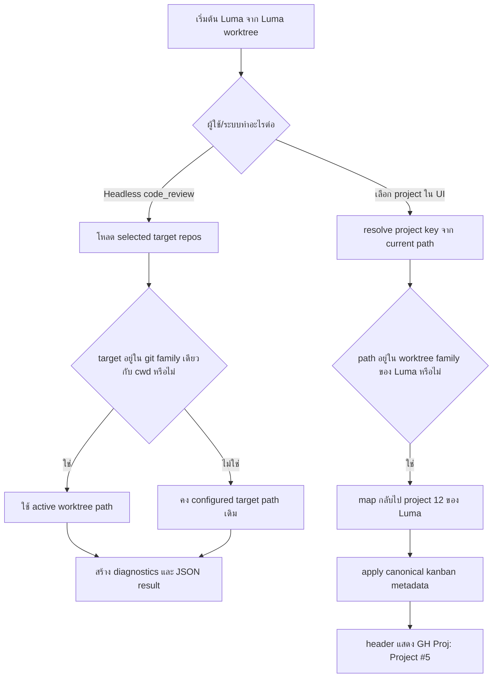

# Analysis Template

> 📋 Template สำหรับการวิเคราะห์ก่อนเริ่มพัฒนา Feature

---

## 📌 Feature Information

| รายการ | รายละเอียด |
|--------|-----------|
| **Feature Name** | Fix worktree-family resolution for headless `code_review` and Luma project selection |
| **Date** | 21 เมษายน 2026 |
| **Analyst** | Codex |
| **Priority** | 🔴 High |
| **Status** | 📝 Draft |
| **Issue URL** | [Issue #78](https://github.com/oatrice/Luma/issues/78), [Issue #79](https://github.com/oatrice/Luma/issues/79) |

---

## 1. Requirement Analysis

### 1.1 Problem Statement

> อธิบายปัญหาที่ต้องการแก้ไข

```
เมื่อรัน Luma จาก worktree ของ Luma เอง ระบบยังจัดการ "repo family" และ
"project identity" ไม่สอดคล้องกันใน 2 จุดสำคัญ:

1. Headless code_review (Issue #78)
   - target repo ภายนอก เช่น JarWise สามารถถูก rewrite path กลับมาเป็น path ของ
     Luma worktree ทั้งหมด
   - diagnostics และ machine-readable JSON จึงรายงาน path ผิด repo
   - ผลลัพธ์อย่าง status "clean" หรือ "reviewed" อาจอิงจาก checkout ผิดตัว

2. Interactive project selection / header metadata (Issue #79)
   - เมื่อเลือก project 12 (Luma) จาก Luma worktree, ระบบยังอาจ drift ไปหา
     project context ที่ไม่ถูกต้องหรือ stale kanban metadata
   - header จึงแสดง GitHub Project board ผิด เช่น Project #1 แทน Project #5

สรุปคือระบบยังไม่แยกให้ชัดว่า "ควร remap ไป active worktree เมื่อเป็น repo เดียวกัน"
กับ "ควร preserve configured path/metadata เมื่อเป็น repo คนละ family"
```

### 1.2 User Stories

| # | As a | I want to | So that |
|---|------|-----------|---------|
| 1 | External caller เช่น Zenith | เรียก headless `code_review` แล้วได้ `path` ของแต่ละ target repo ที่ถูกต้อง | parse JSON ได้อย่างเชื่อถือได้และไม่ review repo ผิดตัว |
| 2 | Developer ที่รัน Luma จาก Luma worktree | เลือก project `12` แล้วให้ header แสดง GitHub Project ของ Luma ที่ถูกต้อง | มั่นใจได้ว่ากำลังทำงานบน project และ board ที่ถูกต้อง |
| 3 | Maintainer ของ Luma | มี logic เดียวกันสำหรับแยก same-repo worktree กับ unrelated repo | ลด regression และลดการ drift ของ path / project metadata ในอนาคต |

### 1.3 Acceptance Criteria

- [ ] **AC1:** Headless `code_review` ต้อง preserve configured repo path สำหรับ target repos ที่อยู่นอก git/worktree family ของ active `cwd`
- [ ] **AC2:** Worktree remapping ต้องเกิดขึ้นเฉพาะเมื่อ target project อยู่ใน git family เดียวกันกับ active `cwd`
- [ ] **AC3:** Machine-readable JSON จาก `code_review` ต้องสะท้อน `path` ของแต่ละ project อย่างถูกต้อง
- [ ] **AC4:** เมื่อเลือก project `12` (`Luma`) จาก Luma worktree ระบบต้อง resolve กลับไปที่ configured Luma project key ไม่ drift เป็น dynamic context
- [ ] **AC5:** Header ของ Luma ต้องแสดง `GH Proj: Project #5` สำหรับ `oatrice/Luma`
- [ ] **AC6:** Known canonical repos ต้องไม่ drift ไป kanban/project metadata ที่ผิดจากค่ากลางของ repo นั้น
- [ ] **AC7:** ต้องมี regression tests ครอบคลุมทั้ง worktree path resolution, headless payload correctness, canonical kanban normalization และ worktree-family project detection

---

## 2. Feature Analysis

### 2.1 User Flow



### 2.2 Screen/Page Requirements

ฟีเจอร์นี้เป็น CLI/Terminal feature ไม่มีหน้าจอใหม่ แต่มี output สำคัญ 2 จุดที่ผู้ใช้รับรู้โดยตรง

| หน้าจอ | Actions | Components | UI Mock Status |
|--------|---------|------------|----------------|
| Headless CLI output | ส่ง JSON กลับ caller | `main.py`, `luma_core/actions/quality_actions.py` | ✅ Done |
| Terminal header | แสดง Project / Folder / GH Project | `luma_core/ui.py`, `luma_core/config.py` | ✅ Done |

### 2.3 Input/Output Specification

#### Inputs

| Field | Type | Required | Validation |
|-------|------|----------|------------|
| active `cwd` | string | ✅ | ต้องเป็น path ปัจจุบันที่ใช้รัน Luma |
| configured `project["path"]` | string | ✅ | ต้องเป็น path ของ project ที่อยู่ใน config |
| selected target repos | list[dict] | ✅ สำหรับ multi-repo review | แต่ละ repo ต้องมี `name` และ `path` |
| project repo metadata | dict | ✅ สำหรับ issue #79 | ใช้ `repo`, `kanban_number`, `kanban_id` เพื่อ normalize canonical board |

#### Outputs

| Field | Type | Description |
|-------|------|-------------|
| `projects[].path` | string | path ที่ resolve แล้วของแต่ละ target repo ใน headless `code_review` |
| `projects[].status` | string | ผลการ review ของ repo นั้น เช่น `clean`, `reviewed`, `error` |
| diagnostics | string | ข้อความอธิบาย worktree remap เมื่อเกิดขึ้น |
| project key | string | project key ที่ resolve ได้จาก current path |
| `kanban_number` | integer | GitHub Project number ที่ canonical สำหรับ repo ที่รู้จัก |
| header text | string | ข้อความ `GH Proj: Project #5` สำหรับ Luma |

---

## 3. Impact Analysis

### 3.1 Affected Components

| Component | Impact Level | Description |
|-----------|--------------|-------------|
| `luma_core/tools.py` | 🔴 High | เป็นจุดหลักของ worktree/repo-family path resolution สำหรับ issue #78 |
| `luma_core/actions/quality_actions.py` | 🔴 High | ใช้ resolved path เพื่อสร้าง diagnostics, ตรวจ changed files และคืน JSON payload ของ `code_review` |
| `luma_core/config.py` | 🔴 High | ต้องรองรับ canonical kanban normalization และ worktree-family project key detection สำหรับ issue #79 |
| `luma_core/ui.py` | 🟡 Medium | อ่าน `kanban_number` ที่ resolve แล้วไปแสดงใน header |
| `tests/test_worktree_detection.py` | 🔴 High | ใช้ล็อก contract ของ path resolution |
| `tests/test_action_code_review.py` | 🔴 High | ใช้ล็อก machine-readable payload ของ headless `code_review` |
| `tests/test_config.py` | 🔴 High | ใช้ล็อก canonical kanban normalization และ project key detection |

### 3.2 Breaking Changes

- [ ] **BC1:** `projects[].path` ใน headless `code_review` อาจเปลี่ยนค่าจากเดิมที่ผิดอยู่ให้เป็นค่าที่ถูกต้อง ซึ่งเป็น behavior correction ไม่ใช่ regression ที่ตั้งใจ
- [ ] **BC2:** Header ของ Luma อาจเปลี่ยนจาก board ที่ stale หรือผิด (`Project #1`) ไปเป็น board canonical (`Project #5`) สำหรับ repo ที่รู้จัก

### 3.3 Backward Compatibility Plan

```
พฤติกรรมที่ต้องรักษาไว้คือ:
1. ถ้า target project อยู่ใน git family เดียวกับ active cwd ยังสามารถ remap ไป active worktree ได้เหมือนเดิม
2. ถ้าเป็น main repo หรือ non-worktree flow ต้องยังทำงานได้ตามเดิม
3. ถ้าเป็น repo ที่ไม่มี canonical kanban metadata ต้อง preserve ค่า custom/config เดิม ไม่บังคับ override
```

---

## 4. Feasibility Analysis

### 4.1 Technical Feasibility

| คำถาม | คำตอบ | หมายเหตุ |
|-------|-------|----------|
| เทคโนโลยีรองรับหรือไม่? | ✅ | ใช้ `git rev-parse --show-toplevel` และ `--git-common-dir` เพียงพอสำหรับแยก repo family |
| ทีมมี Skills เพียงพอหรือไม่? | ✅ | เป็นการแก้ Python core logic และ tests ภายใน repo เดียว |
| Infrastructure รองรับหรือไม่? | ✅ | ไม่ต้องเพิ่ม infra ใหม่ ใช้ local git และ config เดิมได้ |

### 4.2 Time Feasibility

| ประเด็น | รายละเอียด |
|--------|-----------|
| **Estimated Effort** | 1-2 วัน |
| **Deadline** | ไม่ได้ระบุ |
| **Buffer Time** | 0.5 วัน |
| **Feasible?** | ✅ |

### 4.3 Budget Feasibility

| รายการ | ค่าใช้จ่าย | หมายเหตุ |
|--------|-----------|----------|
| Development Time | ภายในทีม | ไม่มี dependency ภายนอกที่มีค่าใช้จ่ายเพิ่ม |
| **Total** | 0 | |

---

## 5. Security Analysis

### 5.1 Sensitive Data

| ข้อมูล | Sensitivity Level | Protection Method |
|--------|------------------|-------------------|
| Local repo paths | 🟡 Medium | ใช้ใน diagnostics และ JSON เท่าที่จำเป็น |
| GitHub project metadata | 🟢 Normal | เป็น config metadata ไม่ใช่ secret |

### 5.2 Attack Vectors

| Vector | Risk Level | Mitigation |
|--------|-----------|------------|
| False repo remap | 🔴 High | เทียบ git common-dir ก่อน remap ทุกครั้ง |
| Wrong canonical override | 🟡 Medium | override เฉพาะ known repos ที่มี canonical mapping |

### 5.3 Authentication & Authorization

```
ฟีเจอร์นี้ไม่ได้เพิ่ม auth flow ใหม่ แต่ต้องไม่ทำให้การเลือก project หรือ review ไปใช้ repo/path ที่ผู้ใช้ไม่ได้ตั้งใจ
```

---

## 6. Performance & Scalability Analysis

### 6.1 Performance Targets

| Metric | Target | Current |
|--------|--------|---------|
| Path resolution per repo | < 100ms | N/A |
| Headless payload correctness | 100% | N/A |
| Header metadata correctness | 100% สำหรับ known repos | N/A |

### 6.2 Scalability Plan

| Scenario | Expected Users | Scaling Strategy |
|----------|---------------|------------------|
| Multi-repo headless review | หลาย repo ต่อรอบ | ทำ resolution ต่อ repo แบบ deterministic |
| หลาย worktree ต่อ repo | 1-หลาย worktrees | ใช้ git family detection แทน hardcoded path prefix |

---

## 7. Gap Analysis

| ด้าน | As-Is (ปัจจุบัน) | To-Be (ต้องการ) | Gap |
|------|-----------------|-----------------|-----|
| Headless code review path | ใช้ git context ของ cwd แบบ global เกินไป | resolve path ต่อ repo ตาม git family จริง | ขาด rule แยก same-family กับ unrelated repo |
| Project key detection | worktree path บางครั้งไม่ map กลับไป configured Luma project | path ใน worktree family ของ Luma ต้อง map กลับ key `12` | ขาด worktree-family fallback |
| GitHub Project metadata | known repo ยัง drift ไป board ที่ stale ได้ | known repo ต้องใช้ canonical board metadata | ขาด canonical normalization ที่เข้มพอ |

---

## 8. Risk Analysis

| Risk | Probability | Impact | Score | Mitigation Plan |
|------|-------------|--------|-------|-----------------|
| เผลอ preserve path เดิมแม้เป็น same-repo worktree | 🟡 Medium | 🔴 High | 6 | เพิ่ม test สำหรับ same git family และ active worktree remap |
| canonical override ไปทับ custom repo ที่ไม่ควรทับ | 🟡 Medium | 🟡 Medium | 4 | จำกัด override เฉพาะ known repos ที่มี canonical mapping |
| regression ใน non-worktree flows | 🟡 Medium | 🟡 Medium | 4 | รัน regression tests ของ worktree และ config ครอบทั้ง main repo/worktree |

> **Risk Score:** Probability × Impact (High=3, Medium=2, Low=1)

---

## 9. Summary & Recommendations

### 9.1 Analysis Summary

| หมวด | Status | Key Findings |
|------|--------|--------------|
| Requirement | ✅ Clear | Issue #78 และ #79 เป็นปัญหาคลาสเดียวกันเรื่อง worktree-family resolution |
| Feature | ✅ Defined | ต้องแก้ทั้ง headless payload correctness และ canonical project identity |
| Impact | ⚠️ Medium | กระทบ core utilities, config normalization, quality actions, tests |
| Feasibility | ✅ Feasible | แก้ได้ด้วย utility/helper และ regression tests ที่ targeted |

### 9.2 Recommendations

1. ใช้หลัก "same git family only" เป็นเกณฑ์กลางของการ remap path
2. แยก logic "known repo canonical metadata" ออกจาก "custom repo preservation" ให้ชัด
3. ครอบ behavior ทั้ง issue #78 และ #79 ด้วย test ที่อ่านง่ายและเจาะจง เพื่อกัน regression ข้าม feature

### 9.3 Next Steps

- [ ] เขียน RED tests สำหรับ external repo path preservation และ worktree-family project detection
- [ ] แก้ GREEN code ใน `luma_core/tools.py`, `luma_core/actions/quality_actions.py`, `luma_core/config.py`
- [ ] REFACTOR เพื่อลด duplicated git-family resolution logic และทำ diagnostics ให้อธิบายเหตุผลของ remap ชัดขึ้น

---

## 📎 Appendix

### Related Documents

- [Issue #78](https://github.com/oatrice/Luma/issues/78)
- [Issue #79](https://github.com/oatrice/Luma/issues/79)
- [Issue #74](https://github.com/oatrice/Luma/issues/74)
- [Issue #70](https://github.com/oatrice/Luma/issues/70)
- [Issue #56](https://github.com/oatrice/Luma/issues/56)
- [spec.md](./spec.md)
- [plan.md](./plan.md)
- [sbe.md](./sbe.md)

### Sign-off

| Role | Name | Date | Signature |
|------|------|------|-----------|
| Analyst | Codex | 21/04/2026 | ✅ |
| Tech Lead | - | - | ⬜ |
