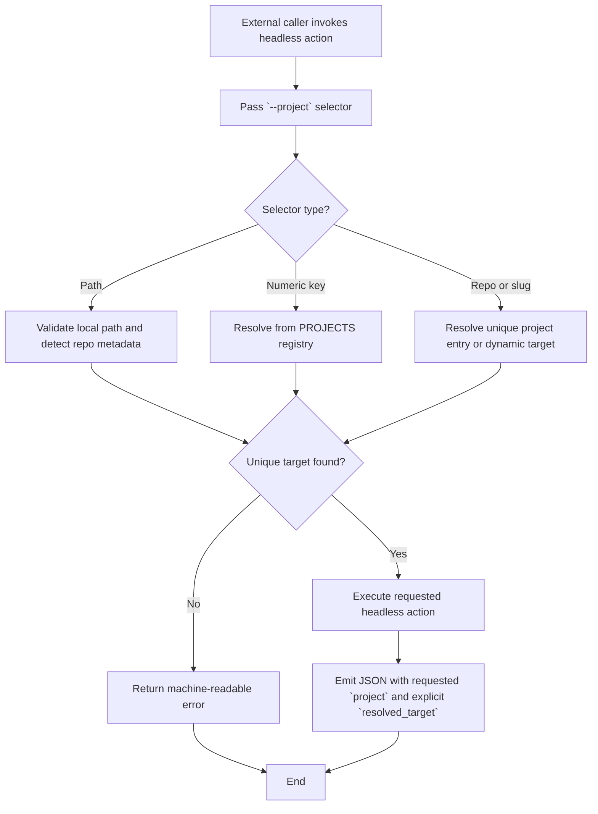

# Analysis Template

> 📋 Template สำหรับการวิเคราะห์ก่อนเริ่มพัฒนา Feature

---

## 📌 Feature Information

| รายการ | รายละเอียด |
|--------|-----------|
| **Feature Name** | CLI Contract: Support stable headless project selection by repo, path, or slug |
| **Date** | 2026-04-24 |
| **Analyst** | Senior Technical Analyst |
| **Priority** | 🔴 High |
| **Status** | 📝 Draft |
| **Issue URL** | [oatrice/Luma#84](https://github.com/oatrice/Luma/issues/84) |

---

## 1. Requirement Analysis

### 1.1 Problem Statement

> อธิบายปัญหาที่ต้องการแก้ไข

```
Luma headless contract ยังพึ่ง numeric `--project` มากเกินไป ทำให้ external callers อย่าง Zenith หรือ chain แบบ Cerebro -> Zenith -> Luma เสี่ยง resolve ไปผิด repo เมื่อเลข project key drift ระหว่าง environment ต่างกัน ปัญหานี้เกิดขึ้นจริงจาก live verification ที่ intent ควรชี้ Zenith แต่ downstream กลับ resolve ไป JarWise แทน นอกจากนี้ machine-readable JSON ปัจจุบันยัง echo เพียงค่าที่ caller ส่งมาใน field `project` โดยไม่ได้ระบุ target ที่ระบบ resolve ได้จริง ทำให้ upstream orchestration ตรวจความถูกต้องปลายทางไม่ได้ชัดเจน
```

### 1.2 User Stories

| # | As a | I want to | So that |
|---|------|-----------|---------|
| 1 | External caller เช่น Zenith | ระบุ `--project` ด้วย repo, path, slug หรือ durable selector ที่เสถียร | เลือก target project ได้เหมือนกันทุก environment โดยไม่พึ่ง numeric index อย่างเดียว |
| 2 | Upstream orchestrator เช่น Cerebro | เห็น `resolved_target` ใน JSON response | ตรวจสอบได้ว่า Luma ทำงานกับ repo/path ที่ตั้งใจจริง |
| 3 | Luma maintainer | คง backward compatibility ของ numeric `--project` | ไม่ทำให้ automation เดิมพังระหว่างเปลี่ยน contract |
| 4 | ผู้ใช้ headless `bootstrap` | ใช้ selector contract ใหม่กับ action เดิมได้ | ไม่ต้องแยก logic project resolution ระหว่าง actions |

### 1.3 Acceptance Criteria

- [ ] **AC1:** Headless `--project` รับ stable selector อย่างน้อยหนึ่งรูปแบบที่ durable กว่า numeric index เช่น repo, path, slug หรือ equivalent durable selector
- [ ] **AC2:** การ resolve project มี precedence ที่ deterministic และ explicit selector ชนะ stored project หรือ cwd inference
- [ ] **AC3:** Machine-readable response ระบุ target ที่ resolve ได้จริงในรูปแบบที่ parse ได้ง่าย
- [ ] **AC4:** Legacy numeric `--project` ยังใช้งานต่อได้โดยตั้งใจ
- [ ] **AC5:** Headless actions ที่มีอยู่แล้ว โดยเฉพาะ `bootstrap` ใช้ resolver เดียวกันได้โดยไม่ regress
- [ ] **AC6:** Scope ของ `#84` ถูกคุมให้เป็น selector correctness และ response contract โดยไม่ batch กับงาน `#43` หรือ `#44`

---

## 2. Feature Analysis

### 2.1 User Flow



### 2.2 Screen/Page Requirements

> [!IMPORTANT]
> **Policy**: Web Full Implementation must be implemented and verified FIRST before Android/iOS logic.

| หน้าจอ | Actions | Components | UI Mock Status |
|--------|---------|------------|----------------|
| N/A (CLI contract) | Headless invocation only | Argument parsing, project resolution, JSON payload | N/A |

### 2.3 Input/Output Specification

#### Inputs

| Field | Type | Required | Validation |
|-------|------|----------|------------|
| `--action` | string | ✅ | ต้องเป็นหนึ่งใน supported headless actions เช่น `code_review`, `bootstrap`, `create_issue`, `create_pr`, `auto_workflow` |
| `--project` | string | ✅ ใน headless action mode | ยอมรับ numeric key, local path, repo (`owner/repo`), หรือ unique slug; ค่า ambiguous/unresolvable ต้อง error แบบ machine-readable |
| `--json` | flag | ✅ สำหรับ external callers | ต้องคง stdout contract แบบ parseable JSON |
| `--issue` | string | ✅ สำหรับ `bootstrap` | ต้องเป็นเลข issue เดี่ยวหรือหลายเลขคั่นด้วย comma |
| `cwd` | environment context | ❌ | ใช้เป็น fallback เฉพาะกรณีไม่มี explicit selector ที่ใช้ได้ |

#### Outputs

| Field | Type | Description |
|-------|------|-------------|
| `status` | string | `success` หรือ `error` |
| `action` | string | ชื่อ headless action ที่รัน |
| `project` | string | ค่าที่ caller ส่งเข้ามาใน `--project` หรือ fallback request value เพื่อ backward compatibility |
| `resolved_target` | object | ข้อมูล target ที่ระบบ resolve ได้จริง |
| `resolved_target.project_key` | string or null | project key เดิมเมื่อ target มาจาก registry; `null` ได้ใน dynamic path/repo case |
| `resolved_target.repo` | string or null | canonical GitHub repo ที่ resolve ได้ |
| `resolved_target.path` | string | local path ที่ action จะรันจริง |
| `resolved_target.slug` | string or null | durable slug ที่ canonicalized แล้วถ้ามี |
| `resolved_target.selector_type` | string | ชนิดของ selector ที่ match เช่น `key`, `path`, `repo`, `slug`, `dynamic` |
| `result` | object or boolean | ผลลัพธ์ของ action ตาม contract เดิม |
| `error` | string | ข้อความ error เมื่อ resolve ไม่ได้หรือ action ล้มเหลว |

---

## 3. Impact Analysis

### 3.1 Affected Components

| Component | Impact Level | Description |
|-----------|--------------|-------------|
| `main.py` | 🔴 High | ปัจจุบัน parse และ resolve `--project` แบบ numeric/path เป็นหลัก รวมถึง build success/error payload โดยยังไม่มี `resolved_target` |
| `luma_core/config.py` | 🔴 High | มี `detect_project_key_for_path(...)` และ canonical repo metadata อยู่แล้ว เหมาะกับการเพิ่ม helper สำหรับ repo/slug normalization และ unique resolution |
| `.luma/projects.json` | 🟡 Medium | เป็น registry ของ known local projects; อาจต้องใช้เป็นแหล่งข้อมูลสำหรับ repo/slug resolution และรองรับกรณีที่บาง repo เช่น Zenith ยังไม่อยู่ใน numeric key list |
| `tests/test_main_headless_cli.py` | 🔴 High | ต้องเพิ่ม coverage สำหรับ `--project` แบบ repo/path/slug และ payload shape ใหม่ |
| `tests/test_main_global_config.py` | 🟡 Medium | ต้องยืนยัน precedence ระหว่าง explicit selector, stored project, และ cwd inference |
| `tests/test_headless_contract_stability.py` | 🔴 High | เหมาะสำหรับเพิ่ม regression test เรื่อง contract stability และ path/repo handling |
| `tests/test_headless_bootstrap.py` | 🟡 Medium | ต้องยืนยันว่า `bootstrap` ยังทำงานได้กับ resolver ใหม่ |
| `README.md` และ feature docs | 🟢 Low | ต้องอธิบาย contract ใหม่ให้ external callers ใช้งานได้ตรง |

### 3.2 Breaking Changes

- [x] **BC1:** External callers ที่เคยสมมติว่า field `project` มีความหมายเป็น numeric key เสมอ อาจต้องเปลี่ยนไปอ่าน `resolved_target` เป็น source of truth เมื่อเริ่มส่ง stable selector
- [ ] **BC2:** ไม่มี breaking change ที่บังคับกับ legacy callers ถ้ายังใช้ numeric `--project` และอ่าน response เดิมตาม contract ที่ preserve ไว้

### 3.3 Backward Compatibility Plan

```
แผน backward compatibility ควรยึดหลัก additive change:

1. คง `--project 12` และ numeric key เดิมให้ใช้งานได้ต่อ
2. คง top-level fields `status`, `action`, `project`, `result`/`error`
3. เพิ่ม `resolved_target` เป็นข้อมูลใหม่แทนการ rename field เดิม
4. ถ้า selector แบบ repo/slug resolve ไม่ได้อย่าง unique ต้อง error ชัดเจน ห้าม fallback ไป project อื่นแบบเงียบ ๆ
5. ใช้ explicit selector เป็น precedence สูงสุด เพื่อกัน drift จาก stored project และ cwd detection
```

---

## 4. Feasibility Analysis

### 4.1 Technical Feasibility

> [!IMPORTANT]
> **Android Build Policy**: MUST use scripts in `Android/scripts/` (e.g., `build_android.sh`) instead of direct `./gradlew` to ensure correct JDK version (Java 21).

| คำถาม | คำตอบ | หมายเหตุ |
|-------|-------|----------|
| เทคโนโลยีรองรับหรือไม่? | ✅ | โค้ดปัจจุบันมีฐานสำหรับ path detection, canonical repo metadata, และ headless JSON contract อยู่แล้ว เหลือเพิ่ม selector normalization และ payload shape |
| ทีมมี Skills เพียงพอหรือไม่? | ✅ | งานเป็น Python CLI contract, config normalization, และ tests ซึ่งอยู่ในขอบเขตความชำนาญของ repo นี้ |
| Infrastructure รองรับหรือไม่? | ✅ | ไม่ต้องใช้ service ใหม่ ใช้ local project registry, Git metadata, และ pytest เดิมได้ |

### 4.2 Time Feasibility

| ประเด็น | รายละเอียด |
|--------|-----------|
| **Estimated Effort** | 2-3 days |
| **Deadline** | To be scheduled after Spec/Plan approval |
| **Buffer Time** | 0.5-1 day |
| **Feasible?** | ✅ |

### 4.3 Budget Feasibility

| รายการ | ค่าใช้จ่าย | หมายเหตุ |
|--------|-----------|----------|
| Development Time | Internal engineering time | ไม่มี external service cost |
| Verification Time | Internal QA / manual routing check | ใช้ repo และ local environment ที่มีอยู่ |
| **Total** | N/A | งานอยู่ในขอบเขต maintenance และ contract hardening |

---

## 5. Security Analysis

### 5.1 Sensitive Data

| ข้อมูล | Sensitivity Level | Protection Method |
|--------|------------------|-------------------|
| `resolved_target.path` | 🟡 Sensitive | เอกสารต้องระบุว่าเป็น local environment metadata; ใช้ใน trusted local automation เท่านั้น |
| `resolved_target.repo` | 🟢 Normal | เป็น repo identifier สำหรับ automation |
| `resolved_target.slug` | 🟢 Normal | เป็น canonical selector สำหรับความสะดวกของ caller |
| `project` request echo | 🟢 Normal | ใช้เพื่อ debug contract และ backward compatibility |

### 5.2 Attack Vectors

| Vector | Risk Level | Mitigation |
|--------|-----------|------------|
| Selector spoofing / silent fallback | 🔴 High | ห้าม fallback ไป project อื่นเมื่อ explicit selector resolve ไม่ได้หรือ ambiguous |
| Ambiguous slug collision | 🟡 Medium | บังคับ unique match เท่านั้น; ถ้า slug ซ้ำให้คืน machine-readable error |
| Invalid path injection | 🟡 Medium | ตรวจ path ว่ามีอยู่จริงและเป็น directory ก่อนใช้เป็น target |
| Wrong-repo execution | 🔴 High | Echo `resolved_target` ทุกครั้งเพื่อให้ upstream ตรวจความถูกต้องได้ |

### 5.3 Authentication & Authorization

```
ฟีเจอร์นี้ไม่เพิ่ม authentication layer ใหม่ เพราะเป็น local CLI contract ภายใต้สิทธิ์ของผู้ใช้ที่รัน Luma อยู่แล้ว อย่างไรก็ตาม contract ต้องถือว่า caller เป็น automation ที่เชื่อถือได้ในเครื่องเดียวกัน และต้องไม่เลือก path/repo โดยอาศัย fallback ที่คาดเดาเองเมื่อมี ambiguity
```

---

## 6. Performance & Scalability Analysis

### 6.1 Performance Targets

| Metric | Target | Current |
|--------|--------|---------|
| Selector Resolution Time | < 100ms สำหรับ known local projects | N/A |
| JSON Payload Construction | < 10ms | N/A |
| Wrong-target Silent Resolution | 0 tolerated cases | N/A |

### 6.2 Scalability Plan

| Scenario | Expected Users | Scaling Strategy |
|----------|---------------|------------------|
| Normal | Individual local developers / local automation | ใช้ in-memory resolution จาก config + filesystem checks |
| Peak | หลาย subprocess invocations ต่อเนื่องใน automation chain | คง logic ให้ lightweight และไม่เรียก external services โดยไม่จำเป็น |
| Growth (1yr) | More repos in `.luma/projects.json` | ใช้ canonicalization + unique matching rules เพื่อคุม complexity เมื่อ project list โตขึ้น |

---

## 7. Gap Analysis

| ด้าน | As-Is (ปัจจุบัน) | To-Be (ต้องการ) | Gap |
|------|-----------------|-----------------|-----|
| Explicit project selection | `--project` รองรับ numeric key หรือ path ที่เป็น directory เป็นหลัก | `--project` รองรับ durable selector เช่น repo/path/slug หรือ equivalent selector | ยังไม่มี repo/slug resolution และ precedence ที่ชัดเจน |
| Resolved target visibility | JSON response echo เพียง requested `project` | JSON response ระบุ `resolved_target` แบบ machine-readable | Caller ยังตรวจ target ที่รันจริงไม่ได้ |
| Zenith compatibility | Zenith มี canonical repo metadata ใน `CANONICAL_KANBAN_BY_REPO` แต่ยังไม่ชัดว่าถูก resolve จาก headless contract ได้เสมอ | External caller ชี้ Zenith ได้อย่างเสถียรโดยไม่เผลอไป JarWise | ยังมีช่องว่างระหว่าง canonical metadata กับ CLI resolution path |
| Bootstrap compatibility | `bootstrap` ใช้ headless path เดิมและคืนค่า bool-centric | `bootstrap` ใช้ resolver เดียวกันและ echo resolved target | ยังไม่ชัดว่ารักษา parity ได้ครบเมื่อเพิ่ม selector contract ใหม่ |
| Scope discipline | มี issue ข้างเคียงอย่าง `#43` และ `#44` ที่น่าสน batch | `#84` ควรโฟกัส selector correctness และ explicit resolved target เท่านั้น | ต้องคุม scope ไม่ให้ review/implementation กว้างเกิน blocker หลัก |

---

## 8. Risk Analysis

| Risk | Probability | Impact | Score | Mitigation Plan |
|------|-------------|--------|-------|-----------------|
| Explicit selector ถูก ignore แล้ว fallback ไป project ที่ไม่ได้ตั้งใจ | 🔴 High | 🔴 High | 9 | ออกแบบ precedence ให้ explicit selector ชนะเสมอ และเพิ่ม tests สำหรับ wrong-target regression |
| Slug ซ้ำกันหลายโปรเจกต์ เช่น `backend` | 🟡 Medium | 🔴 High | 6 | ใช้ unique-match rule เท่านั้น; ambiguous slug ต้อง fail loudly |
| Repo selector resolve path ไม่ได้ในเครื่องที่ยังไม่ configure project นั้น | 🟡 Medium | 🟡 Medium | 4 | รองรับ error ที่ชัดเจนและแนะนำให้ใช้ path selector หรือเพิ่ม project config |
| เพิ่ม payload แล้ว consumer เก่ายังอ่าน `project` แบบ numeric-only | 🟡 Medium | 🟡 Medium | 4 | Preserve field เดิมและเอกสารให้ใช้ `resolved_target` เป็น source of truth ใหม่ |
| Bootstrap regression ระหว่างย้ายมาใช้ shared resolver | 🟡 Medium | 🔴 High | 6 | เพิ่ม compatibility tests ใน `tests/test_headless_bootstrap.py` และ manual verification เฉพาะ `bootstrap` |

> **Risk Score:** Probability × Impact (High=3, Medium=2, Low=1)

---

## 9. Summary & Recommendations

### 9.1 Analysis Summary

| หมวด | Status | Key Findings |
|------|--------|--------------|
| Requirement | ✅ Clear | ปัญหาและ acceptance ของ `#84` ชัดเจนจาก live routing issue และ downstream chain |
| Feature | ✅ Defined | เป้าหมายคือ stable selector + explicit `resolved_target`, ไม่ใช่ rich bootstrap payload ทั้งหมด |
| Impact | ⚠️ Medium-High | กระทบ `main.py`, config resolution, และ headless tests โดยตรง |
| Feasibility | ✅ Feasible | ใช้ฐาน logic ปัจจุบันได้ โดยเฉพาะ path detection และ canonical repo metadata |
| Security | ⚠️ Needs Review | ต้องไม่ fallback ผิดเงียบ ๆ และต้องจัดการ path disclosure ให้เข้าใจตรงกัน |
| Performance | ✅ Acceptable | งานเป็น local resolution และ JSON shaping ที่ lightweight |
| Risk | ⚠️ Some Risks | ความเสี่ยงหลักคือ wrong-target regression และ ambiguous slug |

### 9.2 Recommendations

1. **Generalize `--project` before adding new flags** เพื่อคง backward compatibility และลด surface area ของ contract
2. **Add `resolved_target` additively** โดย preserve top-level `project` field เดิมเพื่อไม่บังคับ breaking change กับ consumer เก่า
3. **Keep `#84` standalone** และเลื่อน `#43`, `#44`, หรือ bootstrap follow-up ที่ไม่ใช่ blocker ออกไปหลังจาก selector contract เสถียรแล้ว

### 9.3 Next Steps

- [ ] อนุมัติ `spec.md` และ `plan.md` สำหรับ `#84`
- [ ] เขียน RED tests สำหรับ repo/path/slug resolution และ payload shape ใหม่
- [ ] Implement shared resolver และเพิ่ม `resolved_target` ใน headless JSON contract

---

## 📎 Appendix

### Related Documents

- [Luma #40](https://github.com/oatrice/Luma/issues/40)
- [Luma #84](https://github.com/oatrice/Luma/issues/84)
- [Luma #43](https://github.com/oatrice/Luma/issues/43)
- [Luma #44](https://github.com/oatrice/Luma/issues/44)
- [Zenith #36](https://github.com/oatrice/Zenith/issues/36)
- [.luma/projects.json](../../../.luma/projects.json)

### Sign-off

| Role | Name | Date | Signature |
|------|------|------|-----------|
| Analyst | Senior Technical Analyst | 2026-04-24 | ✅ |
| Tech Lead | TBD | TBD | ⬜ |
| PM | TBD | TBD | ⬜ |
