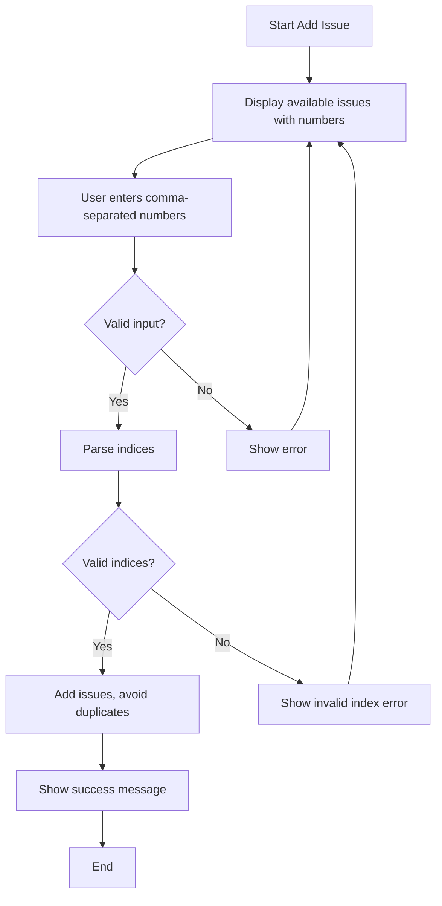

# Analysis Template

## 📌 Feature Information

| รายการ | รายละเอียด |
|--------|-----------|
| **Feature Name** | Fix Invalid Selection When Adding Multiple Issues |
| **Date** | 2026-04-29 |
| **Analyst** | Kilo |
| **Priority** | 🔴 High |
| **Status** | ✅ Approved |

---

## 1. Requirement Analysis

### 1.1 Problem Statement

When attempting to add multiple issues to the current work session by typing '1,2,3' (with commas), the system shows 'Invalid selection'. The system only supported single issue selection, rejecting comma-separated input as invalid.

### 1.2 User Stories

| # | As a | I want to | So that |
|---|------|-----------|---------|
| 1 | Developer | add multiple issues with comma-separated input like "1,2,3" | I can efficiently select multiple issues at once without individual selections |

### 1.3 Acceptance Criteria

- [x] **AC1:** System accepts comma-separated input (e.g., "1,2,3") for adding multiple issues
- [x] **AC2:** Invalid indices are handled with appropriate error messages
- [x] **AC3:** Duplicate issue selections are prevented
- [x] **AC4:** Single issue selection (e.g., "1") continues to work

---

## 2. Feature Analysis

### 2.1 User Flow

### 2.2 Screen/Page Requirements

| หน้าจอ | Actions | Components | UI Mock Status |
|--------|---------|------------|----------------|
| CLI Add Issue | Display issue list, accept multi-select input, show results | Issue list with indices, input prompt with multi-select hint | ✅ Done |

### 2.3 Input/Output Specification

#### Inputs

| Field | Type | Required | Validation |
|-------|------|----------|------------|
| selection | string | ✅ | comma-separated integers, 1-based indices |

#### Outputs

| Field | Type | Description |
|-------|------|-------------|
| success | boolean | Whether issues were added successfully |
| added_issues | list | List of added issue numbers |
| errors | list | List of error messages for invalid inputs |

---

## 3. Impact Analysis

### 3.1 Affected Components

| Component | Impact Level | Description |
|-----------|--------------|-------------|
| `luma_core/actions/issue_actions.py` - `action_add_issue` | 🔴 High | Modified to parse comma-separated input and support multi-select |
| `tests/test_issue_actions.py` | 🟡 Medium | Added test cases for comma-separated input |

### 3.2 Breaking Changes

- [ ] **BC1:** None - backward compatibility maintained

### 3.3 Backward Compatibility Plan

Single issue selection continues to work as before. No breaking changes.

---

## 4. Feasibility Analysis

### 4.1 Technical Feasibility

| คำถาม | คำตอบ | หมายเหตุ |
|-------|-------|----------|
| เทคโนโลยีรองรับหรือไม่? | ✅ | Python string parsing supports comma splitting |
| ทีมมี Skills เพียงพอหรือไม่? | ✅ | Basic Python development |
| Infrastructure รองรับหรือไม่? | ✅ | No additional infrastructure needed |

### 4.2 Time Feasibility

| ประเด็น | รายละเอียด |
|--------|-----------|
| **Estimated Effort** | 2 hours |
| **Deadline** | Completed |
| **Buffer Time** | N/A |
| **Feasible?** | ✅ |

### 4.3 Budget Feasibility

| รายการ | ค่าใช้จ่าย | หมายเหตุ |
|--------|-----------|----------|
| Development Time | Minimal | Existing codebase |
| **Total** | Low | |

---

## 5. Security Analysis

### 5.1 Sensitive Data

| ข้อมูล | Sensitivity Level | Protection Method |
|--------|------------------|-------------------|
| User input | 🟢 Normal | Input validation |

### 5.2 Attack Vectors

| Vector | Risk Level | Mitigation |
|--------|-----------|------------|
| Invalid input | 🟢 Low | Input validation and error handling |

### 5.3 Authentication & Authorization

No authentication required for this CLI feature.

---

## 6. Performance & Scalability Analysis

### 6.1 Performance Targets

| Metric | Target | Current |
|--------|--------|---------|
| Input parsing time | < 100ms | N/A |
| Issue addition time | < 500ms | N/A |

### 6.2 Scalability Plan

| Scenario | Expected Users | Scaling Strategy |
|----------|---------------|------------------|
| Normal | 1 user | No scaling needed |
| Peak | 1 user | No scaling needed |

---

## 7. Gap Analysis

| ด้าน | As-Is (ปัจจุบัน) | To-Be (ต้องการ) | Gap |
|------|-----------------|-----------------|-----|
| Input parsing | Single integer only | Comma-separated integers | Implemented parsing logic |
| Multi-select | Not supported | Supported | Added multi-select capability |
| Error handling | Basic | Enhanced | Added invalid index and duplicate handling |

---

## 8. Risk Analysis

| Risk | Probability | Impact | Score | Mitigation Plan |
|------|-------------|--------|-------|-----------------|
| Input parsing errors | 🟡 Medium | 🟡 Medium | 4 | Comprehensive try/except with validation |
| Duplicate additions | 🟡 Medium | 🟢 Low | 2 | Added duplicate checking |
| Regression in single select | 🟢 Low | 🟡 Medium | 2 | Maintained backward compatibility |

> **Risk Score:** Probability × Impact (High=3, Medium=2, Low=1)

---

## 9. Summary & Recommendations

### 9.1 Analysis Summary

| หมวด | Status | Key Findings |
|------|--------|--------------|
| Requirement | ✅ Clear | Well-defined issue with specific input format |
| Feature | ✅ Defined | CLI enhancement for better UX |
| Impact | 🟡 Medium | Code changes in core action, test additions |
| Feasibility | ✅ Feasible | Simple implementation, low risk |
| Security | ✅ Acceptable | No security concerns |
| Performance | ✅ Acceptable | Minimal performance impact |
| Risk | 🟡 Some Risks | Low to medium risks mitigated |

### 9.2 Recommendations

1. **Monitor usage:** Track how often multi-select is used vs single select
2. **Consider space-separated:** If users prefer spaces, could add support later
3. **Add more validation:** Consider maximum number of issues that can be added at once

### 9.3 Next Steps

- [x] Implementation completed
- [x] Tests added and passing
- [x] Manual verification done

---

## 📎 Appendix

### Related Documents

- Issue: https://github.com/oatrice/Luma/issues/90
- Implementation: `luma_core/actions/issue_actions.py` - `action_add_issue`

### Sign-off

| Role | Name | Date | Signature |
|------|------|------|-----------|
| Analyst | Kilo | 2026-04-29 | ✅ |
| Tech Lead | N/A | N/A | ⬜ |
| PM | N/A | N/A | ⬜ |