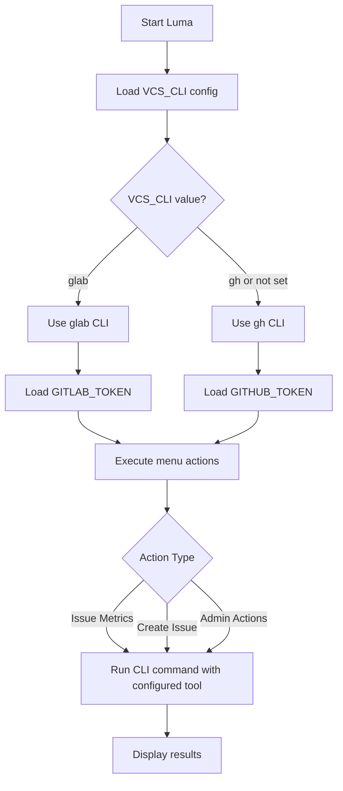

# Analysis Template

## 📌 Feature Information

| รายการ | รายละเอียด |
|--------|-----------|
| **Feature Name** | Add GitLab CLI Support |
| **Date** | 2026-04-29 |
| **Analyst** | Kilo |
| **Priority** | 🔴 High |
| **Status** | ✅ Approved |

---

## 1. Requirement Analysis

### 1.1 Problem Statement

Luma repository has been migrated from GitHub to GitLab, but the codebase still contains GitHub-specific CLI commands (`gh`). Users working with GitLab repositories need to use GitLab CLI (`glab`) instead of GitHub CLI (`gh`). Currently, there is no way to configure which CLI tool to use.

### 1.2 User Stories

| # | As a | I want to | So that |
|---|------|-----------|---------|
| 1 | Developer | configure Luma to use GitLab CLI (glab) | I can use Luma with GitLab repositories without being forced to use GitHub tools |
| 2 | Developer | maintain backward compatibility with GitHub CLI (gh) | I can continue using Luma with GitHub repositories without changes |
| 3 | Developer | easily switch between CLI tools | I can use the same tool with different VCS providers |

### 1.3 Acceptance Criteria

- [ ] **AC1:** VCS_CLI configuration option added to config.py
- [ ] **AC2:** Default value is "gh" for backward compatibility
- [ ] **AC3:** CLI wrapper created to abstract CLI command execution
- [ ] **AC4:** All `gh` CLI calls updated to use CLI wrapper
- [ ] **AC5:** `glab` CLI commands work when VCS_CLI=glab
- [ ] **AC6:** `gh` CLI commands continue to work when VCS_CLI=gh or not set
- [ ] **AC7:** Token environment variable mapping works correctly
- [ ] **AC8:** Issue metrics actions work with both CLIs
- [ ] **AC9:** Create issue actions work with both CLIs
- [ ] **AC10:** Admin actions work with both CLIs
- [ ] **AC11:** Documentation updated with CLI configuration instructions
- [ ] **AC12:** Tests pass with both `gh` and `glab`

---

## 2. Feature Analysis

### 2.1 User Flow

### 2.2 Screen/Page Requirements

| หน้าจอ | Actions | Components | UI Mock Status |
|--------|---------|------------|----------------|
| CLI Menu | All menu options with CLI commands | CLI wrapper abstraction | ⏳ To be implemented |
| Configuration | CLI tool selection | VCS_CLI env var | ⏳ To be implemented |

### 2.3 Input/Output Specification

#### Inputs

| Field | Type | Required | Validation |
|-------|------|----------|------------|
| VCS_CLI | string | ❌ | "gh" or "glab" |
| GITHUB_TOKEN | string | ❌ | Valid GitHub token (if using gh) |
| GITLAB_TOKEN | string | ❌ | Valid GitLab token (if using glab) |

#### Outputs

| Field | Type | Description |
|-------|------|-------------|
| cli_tool | string | Active CLI tool (gh or glab) |
| command_output | string | Output from CLI command execution |

---

## 3. Impact Analysis

### 3.1 Affected Components

| Component | Impact Level | Description |
|-----------|--------------|-------------|
| `luma_core/config.py` | � Medium | Add VCS_CLI configuration option |
| `luma_core/cli_wrapper.py` | 🟡 Medium | New CLI wrapper for command execution |
| `luma_core/issue_metrics.py` | 🟡 Medium | Update to use CLI wrapper |
| `luma_core/actions/create_issue_action.py` | 🟡 Medium | Update to use CLI wrapper |
| `luma_core/actions/admin_actions.py` | 🟡 Medium | Update to use CLI wrapper |
| `luma_core/actions/metrics_actions.py` | 🟡 Medium | Update to use CLI wrapper |
| `.env.example` | 🟢 Low | Add VCS_CLI configuration example |

### 3.2 Breaking Changes

- [ ] **BC1:** None - gh remains as default CLI

### 3.3 Backward Compatibility Plan

- gh CLI remains as default when VCS_CLI is not set
- Existing users continue to use gh without any changes
- Users can opt-in to glab by setting VCS_CLI=glab
- Documentation for CLI configuration

---

## 4. Feasibility Analysis

### 4.1 Technical Feasibility

| คำถาม | คำตอบ | หมายเหตุ |
|-------|-------|----------|
| เทคโนโลยีรองรับหรือไม่? | ✅ | glab CLI is available and well-documented |
| ทีมมี Skills เพียงพอหรือไม่? | ✅ | Python development, CLI wrapper pattern |
| Infrastructure รองรับหรือไม่? | ✅ | No infrastructure changes needed |

### 4.2 Time Feasibility

| ประเด็น | รายละเอียด |
|--------|-----------|
| **Estimated Effort** | 1-2 days |
| **Deadline** | TBD |
| **Buffer Time** | 0.5 day |
| **Feasible?** | ✅ |

### 4.3 Budget Feasibility

| รายการ | ค่าใช้จ่าย | หมายเหตุ |
|--------|-----------|----------|
| Development Time | Low | Simple CLI wrapper implementation |
| glab CLI | Free | User must install |
| **Total** | Low | |

---

## 5. Security Analysis

### 5.1 Sensitive Data

| ข้อมูล | Sensitivity Level | Protection Method |
|--------|------------------|-------------------|
| VCS Tokens | 🔴 High | Environment variables, never committed |
| API Credentials | 🔴 High | Same as tokens |
| Repository URLs | 🟢 Normal | Public for public repos |

### 5.2 Attack Vectors

| Vector | Risk Level | Mitigation |
|--------|-----------|------------|
| Token exposure | 🟡 Medium | Use environment variables, add to .gitignore |
| API rate limiting | 🟢 Low | Implement retry logic, respect rate limits |
| Malicious repo URLs | 🟢 Low | URL validation |

### 5.3 Authentication & Authorization

- Tokens must be set via environment variables
- Provider-specific token validation
- No hardcoded credentials

---

## 6. Performance & Scalability Analysis

### 6.1 Performance Targets

| Metric | Target | Current |
|--------|--------|---------|
| CLI wrapper initialization | < 10ms | N/A |
| CLI command execution | No change | Same as current |

### 6.2 Scalability Plan

| Scenario | Expected Users | Scaling Strategy |
|----------|---------------|------------------|
| Normal | 1-5 users | No scaling needed |
| Peak | 10 users | No scaling needed |

---

## 7. Gap Analysis

| ด้าน | As-Is (ปัจจุบัน) | To-Be (ต้องการ) | Gap |
|------|-----------------|-----------------|-----|
| CLI Commands | gh CLI only | gh + glab CLI | Add CLI wrapper |
| Configuration | GITHUB_TOKEN only | GITHUB_TOKEN + GITLAB_TOKEN | Add VCS_CLI config |
| CLI Execution | Direct gh calls | CLI wrapper abstraction | Implement CLI wrapper |

---

## 8. Risk Analysis

| Risk | Probability | Impact | Score | Mitigation Plan |
|------|-------------|--------|-------|-----------------|
| CLI command syntax differences | 🟡 Medium | � Medium | 4 | Map CLI commands carefully, test both tools |
| Output format differences between CLIs | 🟡 Medium | � Low | 2 | Parse output flexibly, handle both formats |
| Token environment variable confusion | 🟢 Low | 🟡 Medium | 2 | Clear documentation, use appropriate token based on CLI |
| Breaking existing GitHub workflows | � Low | � High | 3 | Maintain backward compatibility with gh as default |
| glab CLI not installed by users | 🟡 Medium | 🟢 Low | 2 | Document glab installation requirements clearly |

> **Risk Score:** Probability × Impact (High=3, Medium=2, Low=1)

---

## 9. Summary & Recommendations

### 9.1 Analysis Summary

| หมวด | Status | Key Findings |
|------|--------|--------------|
| Requirement | ✅ Clear | Well-defined CLI configuration scope with specific acceptance criteria |
| Feature | ✅ Defined | CLI wrapper pattern is appropriate and simple |
| Impact | � Medium | Changes in CLI command execution, configuration |
| Feasibility | ✅ Feasible | Simple implementation, low effort |
| Security | ✅ Acceptable | Standard token management practices |
| Performance | ✅ Acceptable | No significant performance concerns |
| Risk | � Some Risks | Low to medium risks mitigated with careful planning |

### 9.2 Recommendations

1. **Simple implementation:** Use CLI wrapper pattern for minimal changes
2. **Maintain backward compatibility:** Keep gh as default CLI
3. **Thorough testing:** Test both gh and glab extensively
4. **Documentation:** Update documentation with CLI configuration instructions
5. **User communication:** Clearly document glab installation requirements

### 9.3 Next Steps

- [ ] Add VCS_CLI configuration to config.py (Phase 1)
- [ ] Create CLI wrapper (Phase 1)
- [ ] Update CLI command usage in actions (Phase 2)
- [ ] Comprehensive testing (Phase 3)
- [ ] Documentation updates (Phase 3)

---

## 📎 Appendix

### Related Documents

- Issue: https://gitlab.com/oatricedev/Luma/-/work_items/91
- Repo: https://gitlab.com/oatricedev/Luma
- Reference Issue 90: https://github.com/oatrice/Luma/issues/90

### Sign-off

| Role | Name | Date | Signature |
|------|------|------|-----------|
| Analyst | Kilo | 2026-04-29 | ✅ |
| Tech Lead | N/A | N/A | ⬜ |
| PM | N/A | N/A | ⬜ |
