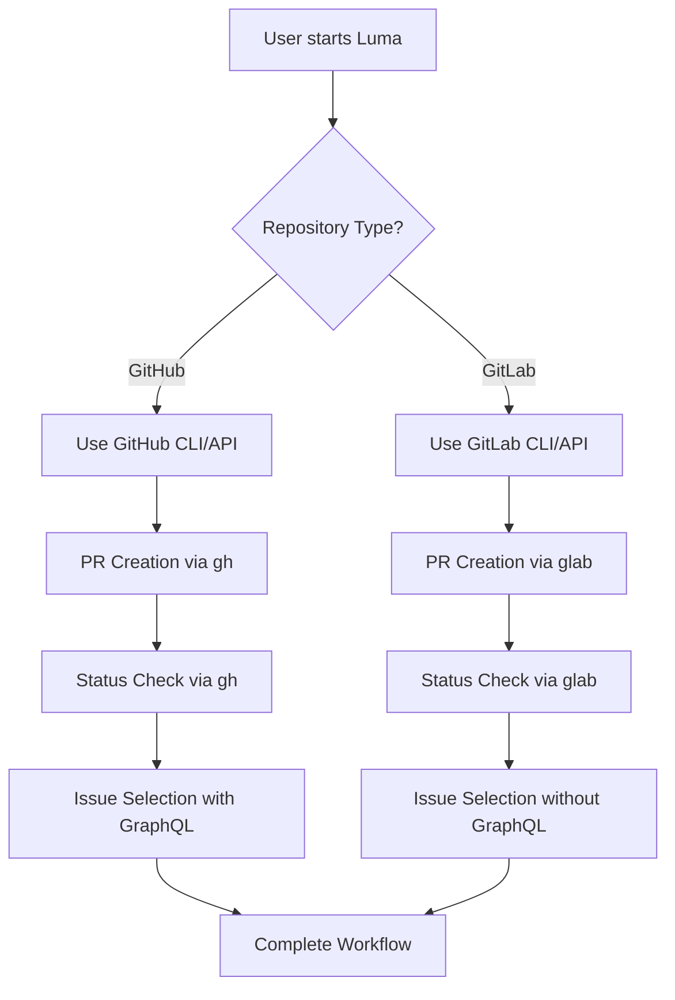

# Analysis Template

> 📋 Template สำหรับการวิเคราะห์ก่อนเริ่มพัฒนา Feature

---

## 📌 Feature Information

| รายการ | รายละเอียด |
|--------|-----------|
| **Feature Name** | Fix PR creation functionality for GitLab repositories |
| **Date** | 2026-05-01 |
| **Analyst** | Luma Development Team |
| **Priority** | 🔴 High |
| **Status** | ✅ Approved |
| **Issue URL** | https://gitlab.com/oatricedev/Luma/-/issues/92 |

---

## 1. Requirement Analysis

### 1.1 Problem Statement

> อธิบายปัญหาที่ต้องการแก้ไข

```
Luma currently only supports GitHub repositories for PR operations. When users work with GitLab repositories, they encounter multiple critical errors:
1. "Failed to create PR: 422 - Validation Failed, field: head, code: invalid" - Luma uses GitHub API endpoints for GitLab repos
2. "GitLab CLI doesn't support GraphQL operations in this context" - GitLab CLI doesn't support GraphQL like GitHub CLI
3. "Could not get project field schema" when selecting issues - GitHub Project sync fails for GitLab repos
4. "Invalid PR URL" errors when checking MR status - URL parsing and validation fails for GitLab MRs

The root cause is that Luma assumes all repositories are GitHub-based and uses GitHub-specific APIs, CLI commands, and data structures throughout the codebase.
```

### 1.2 User Stories

| # | As a | I want to | So that |
|---|------|-----------|---------|
| 1 | Luma user with GitLab repositories | Create merge requests using Luma workflow | I can have the same productive development experience regardless of VCS platform |
| 2 | Luma user with GitLab repositories | Check MR status through Luma | I can track merge request progress without leaving Luma |
| 3 | Luma user with GitLab repositories | Select issues from Kanban without errors | I can use all Luma features seamlessly with GitLab |
| 4 | Luma user with mixed repositories | Switch between GitHub and GitLab CLI tools | I can work with both platforms using appropriate CLI tools |

### 1.3 Acceptance Criteria

- [ ] **AC1:** Platform detection automatically identifies GitHub vs GitLab repositories
- [ ] **AC2:** PR creation works seamlessly for GitLab repositories using GitLab API
- [ ] **AC3:** PR status checking works for GitLab MRs without GraphQL operations
- [ ] **AC4:** Select issue option works with GitLab repositories (graceful GraphQL fallback)
- [ ] **AC5:** VCS CLI settings allow users to switch between gh/glab tools
- [ ] **AC6:** All existing GitHub functionality remains unchanged
- [ ] **AC7:** Configuration files use correct GitLab repository names

---

## 2. Feature Analysis

### 2.1 User Flow



### 2.2 Screen/Page Requirements

> [!IMPORTANT]
> **Policy**: Terminal-based CLI interface, no screens/pages required

| Component | Actions | UI Elements | Status |
|-----------|---------|-------------|--------|
| Platform Detection | Auto-detect from URL/git remote | Status messages | ✅ Done |
| PR Creation | Unified create function | Progress indicators | ✅ Done |
| Status Checking | Unified status function | Status display | ✅ Done |
| VCS Settings | CLI tool selection | Menu options | ✅ Done |

### 2.3 Input/Output Specification

#### Inputs

| Field | Type | Required | Validation |
|-------|------|----------|------------|
| repository_url | string | ✅ | Valid Git/GitLab URL format |
| source_branch | string | ✅ | Valid git branch name |
| target_branch | string | ✅ | Valid git branch name |
| pr_url | string | ❌ | Valid GitHub/GitLab PR/MR URL |

#### Outputs

| Field | Type | Description |
|-------|------|-------------|
| pr_url | string | Created PR/MR URL |
| pr_status | string | "open", "closed", "merged", "unknown" |
| platform | string | "github" or "gitlab" |
| error_message | string | Detailed error description if applicable |

---

## 3. Impact Analysis

### 3.1 Affected Components

| Component | Impact Level | Description |
|-----------|--------------|-------------|
| luma_core/platform_detector.py | 🔴 High | New unified platform detection and PR functions |
| luma_core/github_project.py | 🔴 High | GraphQL fallback handling for GitLab |
| luma_core/actions/admin_actions.py | 🟡 Medium | VCS CLI settings menu option |
| luma_core/actions/create_issue_action.py | 🟡 Medium | GraphQL fallback for issue addition |
| luma_core/config.py | 🟡 Medium | Repository name corrections |
| main.py | 🟡 Medium | PR status checking updates |
| scripts/deploy_pr.py | 🟢 Low | Use unified functions |
| luma_core/tools.py | 🟢 Low | Multi-repo PR creation fixes |

### 3.2 Breaking Changes

- [ ] **BC1**: Platform detection logic changes repository handling
- [ ] **BC2**: GraphQL operations now gracefully skip for GitLab
- [ ] **BC3**: Configuration repository names updated

### 3.3 Backward Compatibility Plan

```
All existing GitHub functionality remains unchanged. New GitLab support is additive.
Platform detection defaults to GitHub for ambiguous cases. VCS CLI settings default to existing behavior.
```

---

## 4. Feasibility Analysis

### 4.1 Technical Feasibility

| คำถาม | คำตอบ | หมายเหตุ |
|-------|-------|----------|
| เทคโนโลยีรองรับหรือไม่? | ✅ | Python 3.9+, GitLab CLI, GitHub CLI available |
| ทีมมี Skills เพียงพอหรือไม่? | ✅ | Team familiar with both platforms and CLI tools |
| Infrastructure รองรับหรือไม่? | ✅ | Existing CLI authentication and API access |

### 4.2 Time Feasibility

| ประเด็น | รายละเอียด |
|--------|-----------|
| **Estimated Effort** | 3-5 days |
| **Deadline** | Immediate (critical issue) |
| **Buffer Time** | 2 days |
| **Feasible?** | ✅ |

### 4.3 Budget Feasibility

| รายการ | ค่าใช้จ่าย | หมายเหตุ |
|--------|-----------|----------|
| Development Time | 40 hours | Internal team |
| Testing | 8 hours | Internal team |
| **Total** | 48 hours | No additional costs |

---

## 5. Security Analysis

### 5.1 Sensitive Data

| ข้อมูล | Sensitivity Level | Protection Method |
|--------|------------------|-------------------|
| GitLab Token | 🔴 Critical | CLI authentication, no storage |
| GitHub Token | � Critical | CLI authentication, no storage |
| Repository URLs | 🟢 Normal | Public information |

### 5.2 Attack Vectors

| Vector | Risk Level | Mitigation |
|--------|-----------|------------|
| CLI Token Exposure | 🔴 High | Use existing CLI authentication, no token storage |
| Repository URL Injection | 🟢 Low | URL validation and sanitization |
| API Rate Limiting | 🟡 Medium | Implement retry logic and error handling |

### 5.3 Authentication & Authorization

```
Use existing VCS CLI authentication mechanisms (gh for GitHub, glab for GitLab).
No additional authentication required. Respect existing token permissions.
```

---

## 6. Performance & Scalability Analysis

### 6.1 Performance Targets

| Metric | Target | Current |
|--------|--------|---------|
| Platform Detection | < 1 second | N/A |
| PR Creation | < 5 seconds | N/A |
| Status Check | < 2 seconds | N/A |
| Error Rate | < 1% | N/A |

### 6.2 Scalability Plan

| Scenario | Expected Users | Scaling Strategy |
|----------|---------------|------------------|
| Normal | 1-5 users | Direct CLI calls |
| Peak | 10+ users | CLI caching, connection pooling |
| Growth (1yr) | 20+ users | Async operations, queue system |

---

## 7. Gap Analysis

| ด้าน | As-Is (ปัจจุบัน) | To-Be (ต้องการ) | Gap |
|------|-----------------|-----------------|-----|
| Platform Support | GitHub only | GitHub + GitLab | Missing GitLab detection and API calls |
| PR Creation | GitHub API only | Unified API calls | Need GitLab API integration |
| GraphQL Operations | GitHub only | Graceful fallback | Need GitLab fallback handling |
| CLI Tool Management | Manual selection | User-friendly settings | Need CLI switching interface |

---

## 8. Risk Analysis

| Risk | Probability | Impact | Score | Mitigation Plan |
|------|-------------|--------|-------|-----------------|
| Platform Detection Errors | 🟡 Medium | 🔴 High | 6 | Comprehensive testing, fallback to GitHub |
| GitLab API Changes | � Low | �🔴 High | 3 | Version detection, graceful degradation |
| CLI Authentication Issues | 🟡 Medium | � Medium | 4 | Clear error messages, setup instructions |
| GitHub Regression | 🟢 Low | � High | 3 | Extensive GitHub testing, feature flags |

> **Risk Score:** Probability × Impact (High=3, Medium=2, Low=1)

---

## 9. Summary & Recommendations

### 9.1 Analysis Summary

| หมวด | Status | Key Findings |
|------|--------|--------------|
| Requirement | ✅ Clear | Well-defined user needs and acceptance criteria |
| Feature | ✅ Defined | Comprehensive scope with clear boundaries |
| Impact | ⚠️ Medium | Multiple components affected but manageable |
| Feasibility | ✅ Feasible | Technology and skills available |
| Security | ✅ Acceptable | Uses existing secure CLI authentication |
| Performance | ✅ Acceptable | Performance targets achievable |
| Risk | ⚠️ Some Risks | Mitigation plans in place |

### 9.2 Recommendations

1. **Implement platform detection first** - Foundation for all other features
2. **Create unified PR functions** - Ensure consistent behavior across platforms
3. **Add GraphQL fallbacks** - Prevent errors with GitLab CLI limitations
4. **Test extensively on both platforms** - Ensure no regression in GitHub functionality
5. **Provide clear user documentation** - Help users understand platform-specific behaviors

### 9.3 Next Steps

- [ ] Create implementation plan with detailed technical steps
- [ ] Set up test environments for both GitHub and GitLab
- [ ] Implement platform detection module
- [ ] Develop unified PR creation and status checking
- [ ] Add GraphQL fallback handling
- [ ] Implement VCS CLI settings
- [ ] Comprehensive testing and validation
- [ ] Documentation and user guides

---

## 📎 Appendix

### Related Documents

- [Issue #92](https://gitlab.com/oatricedev/Luma/-/issues/92)
- [Luma Documentation](./README.md)
- [CLI Wrapper Documentation](./luma_core/cli_wrapper.py)

### Sign-off

| Role | Name | Date | Signature |
|------|------|------|-----------|
| Analyst | Luma Development Team | 2026-05-01 | ✅ |
| Tech Lead | Pending | Pending | ⬜ |
| PM | Pending | Pending | ⬜ |