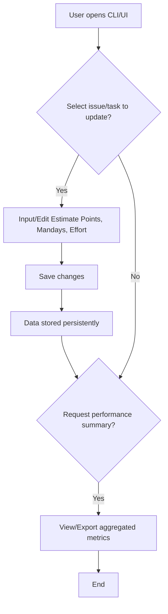

```markdown
# Analysis Template

> 📋 Template สำหรับการวิเคราะห์ก่อนเริ่มพัฒนา Feature

---

## 📌 Feature Information

| รายการ | รายละเอียด |
|--------|-----------|
| **Feature Name** | Tracking Estimate Points, Mandays, and Effort |
| **Date** | March 19, 2026 |
| **Analyst** | Gemini CLI |
| **Priority** | 🔴 High |
| **Status** | 📝 Draft |
| **Issue URL** | [#9](https://github.com/your-org/your-repo/issues/9) |

---

## 1. Requirement Analysis

### 1.1 Problem Statement

> อธิบายปัญหาที่ต้องการแก้ไข

โครงการปัจจุบันขาดวิธีการมาตรฐานในการติดตามตัวชี้วัดการพัฒนา เช่น Estimate Points, Mandays และ Effort สำหรับงานและ Issue ต่างๆ การขาดสิ่งนี้ทำให้ไม่สามารถวิเคราะห์ประสิทธิภาพการพัฒนา ติดตามความเร็วได้อย่างแม่นยำ และวางแผนทรัพยากรได้อย่างถูกต้องในทุกโครงการที่ระบบจัดการอยู่

### 1.2 User Stories

| # | As a | I want to | So that |
|---|------|-----------|---------|
| 1 | Project Manager | input and update Estimate Points, Mandays, and Effort for each issue | I can accurately plan resources and track project progress |
| 2 | Team Lead | view aggregated performance metrics across different projects | I can analyze team velocity and identify areas for improvement |
| 3 | Developer | understand the estimated effort for a task | I can better manage my workload and track my personal contributions |

### 1.3 Acceptance Criteria

- [x] **AC1:** Ability to input/edit Estimate Points, Mandays, and Effort for an issue.
- [x] **AC2:** Data is stored systematically (e.g., in `.luma_state.json` or database) and persists across sessions.
- [x] **AC3:** Mechanism to collect and aggregate these metrics across different projects.
- [x] **AC4:** Commands/UI to view or export the performance summary.

---

## 2. Feature Analysis

### 2.1 User Flow



### 2.2 Screen/Page Requirements

> [!IMPORTANT]
> **Policy**: Web Mock UI must be implemented and verified FIRST before any backend/Android logic.

| หน้าจอ | Actions | Components | UI Mock Status |
|--------|---------|------------|----------------|
| Issue Details (CLI/UI) | Input/Edit metrics, Save | Text fields for points, mandays, effort | ⬜ Pending |
| Performance Summary (CLI/UI) | View, Export | Tables/Charts for aggregated data | ⬜ Pending |

### 2.3 Input/Output Specification

#### Inputs

| Field | Type | Required | Validation |
|-------|------|----------|------------|
| `issue_id` | string | ✅ | e.g., "GH-123" |
| `estimate_points` | number | ❌ | min 0 (Story Points) |
| `mandays` | number | ❌ | min 0 (Estimated days) |
| `effort_level` | string | ❌ | "Low", "Medium", "High" |

#### Outputs

| Field | Type | Description |
|-------|------|-------------|
| `project_id` | string | ID ของโปรเจกต์ |
| `issue_id` | string | ID ของ Issue |
| `estimate_points` | number | Estimate Story Points |
| `mandays` | number | Estimate Mandays |
| `effort_level` | string | ระดับ Effort ("Low", "Medium", "High") |
| `total_points` | number | รวม Story Points สำหรับโปรเจกต์/ช่วงเวลา |
| `total_mandays` | number | รวม Mandays สำหรับโปรเจกต์/ช่วงเวลา |
| `velocity` | number | ความเร็ว (Velocity) ที่คำนวณได้สำหรับโปรเจกต์/ช่วงเวลา |

---

## 3. Impact Analysis

### 3.1 Affected Components

| Component | Impact Level | Description |
|-----------|--------------|-------------|
| `luma_core/state.py` / `luma_core/state_manager.py` | 🔴 High | การจัดการสถานะข้อมูลและการเก็บข้อมูลอย่างถาวรสำหรับ Issue จะต้องมีการปรับเปลี่ยนเพื่อเพิ่มฟิลด์ใหม่ |
| `luma_core/gemini_cli.py` | 🔴 High | คำสั่ง CLI ใหม่สำหรับการป้อน/แก้ไข และดูตัวชี้วัด |
| `luma_core/ui.py` | 🟡 Medium | การอัปเดต UI ที่อาจเกิดขึ้น หาก Luma มี UI แบบโต้ตอบ |
| `tests/` | 🔴 High | Unit test และ Integration test ใหม่สำหรับการจัดการสถานะ, คำสั่ง CLI, และการรวมข้อมูล |
| `main.py` | 🟡 Medium | การรวมคำสั่ง CLI ใหม่ |

### 3.2 Breaking Changes

- [ ] **BC1:** การเปลี่ยนแปลง schema ของ `.luma_state.json` อาจต้องมีการ migration หากไม่ได้รับการจัดการอย่างระมัดระวัง

### 3.3 Backward Compatibility Plan

ดำเนินการ migration schema สำหรับ `.luma_state.json` หากจำเป็นต้องมีการเปลี่ยนแปลง ฟิลด์ใหม่ควรเป็น optional ในเบื้องต้นเพื่อหลีกเลี่ยงการทำให้ข้อมูลเก่าเสีย

---

## 4. Feasibility Analysis

### 4.1 Technical Feasibility

> [!IMPORTANT]
> **Android Build Policy**: MUST use scripts in `Android/scripts/` (e.g., `build_android.sh`) instead of direct `./gradlew` to ensure correct JDK version (Java 21).

| คำถาม | คำตอบ | หมายเหตุ |
|-------|-------|----------|
| เทคโนโลยีรองรับหรือไม่? | ✅ | โครงสร้างข้อมูลและการจัดการไฟล์ (JSON) ของ Python เหมาะสม |
| ทีมมี Skills เพียงพอหรือไม่? | ✅ | ทักษะการจัดการข้อมูลและการพัฒนา CLI เป็นมาตรฐาน |
| Infrastructure รองรับหรือไม่? | ✅ | โครงสร้างโปรเจกต์ปัจจุบันรองรับการเพิ่มคุณสมบัติใหม่ |

### 4.2 Time Feasibility

| ประเด็น | รายละเอียด |
|--------|-----------|
| **Estimated Effort** | 5-7 days |
| **Deadline** | N/A |
| **Buffer Time** | 2 days |
| **Feasible?** | ✅ |

### 4.3 Budget Feasibility

| รายการ | ค่าใช้จ่าย | หมายเหตุ |
|--------|-----------|----------|
| [Item 1] | N/A | N/A |
| [Item 2] | N/A | N/A |
| **Total** | N/A | N/A |

---

## 5. Security Analysis

### 5.1 Sensitive Data

| ข้อมูล | Sensitivity Level | Protection Method |
|--------|------------------|-------------------|
| Estimate Points, Mandays, Effort level | 🟢 Normal | ไม่ใช่ข้อมูลที่ละเอียดอ่อนโดยตรง แต่เกี่ยวข้องกับประสิทธิภาพโครงการภายใน |

### 5.2 Attack Vectors

| Vector | Risk Level | Mitigation |
|--------|-----------|------------|
| Data Tampering | 🟡 Medium | การแก้ไข `.luma_state.json` โดยไม่หวังดีอาจทำให้ตัวชี้วัดผิดเพี้ยนได้ Mitigation: ตรวจสอบความถูกต้องของข้อมูลเมื่อป้อนเข้า |

### 5.3 Authentication & Authorization

คาดว่าใช้การจัดเก็บไฟล์แบบ local; ไม่จำเป็นต้องมีการตรวจสอบสิทธิ์/การอนุญาตเฉพาะนอกเหนือจากสิทธิ์ไฟล์ของระบบสำหรับ `.luma_state.json` หากรวมเข้ากับระบบระยะไกล จะใช้ API key/OAuth มาตรฐาน

---

## 6. Performance & Scalability Analysis

### 6.1 Performance Targets

| Metric | Target | Current |
|--------|--------|---------|
| Response Time (CLI) | < 500ms | N/A |
| Throughput | N/A | N/A |
| Error Rate | < 0.1% | N/A |

### 6.2 Scalability Plan

| Scenario | Expected Users | Scaling Strategy |
|----------|---------------|------------------|
| Normal (โครงการขนาดเล็ก) | 1-10 โปรเจกต์, หลายร้อย Issue | วิธีการจัดเก็บไฟล์ปัจจุบันเพียงพอ |
| Peak (โครงการขนาดใหญ่) | 50+ โปรเจกต์, หลายพัน Issue | พิจารณาการย้ายไปใช้ฐานข้อมูล lightweight local (เช่น SQLite) หากประสิทธิภาพมีปัญหาเมื่อไฟล์ `.luma_state.json` มีขนาดใหญ่ |
| Growth (1yr) | N/A | N/A |

---

## 7. Gap Analysis

| ด้าน | As-Is (ปัจจุบัน) | To-Be (ต้องการ) | Gap |
|------|-----------------|-----------------|-----|
| Current Metrics | ไม่มีการติดตามโครงสร้างสำหรับ estimate points, mandays, หรือ effort | ต้องการติดตาม metrics เหล่านี้อย่างมีโครงสร้างและเป็นมาตรฐาน | ขาดความสามารถในการวัดและจัดระเบียบข้อมูล |
| Performance Analysis | ไม่สามารถวัด velocity หรือการจัดสรรทรัพยากรได้อย่างแม่นยำ | ต้องการวัดและวิเคราะห์ velocity และการจัดสรรทรัพยากร | ขาดข้อมูลเชิงปริมาณสำหรับการวิเคราะห์ประสิทธิภาพ |
| Resource Planning | ขาดข้อมูลเชิงลึกที่ขับเคลื่อนด้วยข้อมูลสำหรับการวางแผนในอนาคต | ต้องการข้อมูลเพื่อสนับสนุนการวางแผนทรัพยากรอย่างมีประสิทธิภาพ | ขาดข้อมูลที่จำเป็นสำหรับการวางแผนและการคาดการณ์ |

---

## 8. Risk Analysis

| Risk | Probability | Impact | Score | Mitigation Plan |
|------|-------------|--------|-------|-----------------|
| Data Inconsistency | 🟡 Medium | 🟡 Medium | 4 | การป้อนข้อมูลที่ไม่สอดคล้องกันอาจทำให้ตัวชี้วัดผิดเพี้ยนได้ Mitigation: ใช้การตรวจสอบความถูกต้องของข้อมูลอย่างเข้มงวดและแนวทางปฏิบัติที่ชัดเจน |
| Complex Aggregation | 🟡 Medium | 🟡 Medium | 4 | การรวมตัวชี้วัดในหลายโครงการที่หลากหลายอาจมีความซับซ้อน Mitigation: ออกแบบโครงสร้างข้อมูลที่ยืดหยุ่นและตรรกะการรวมข้อมูลที่เป็นโมดูลาร์ |
| Performance with Large Data | 🟢 Low | 🟡 Medium | 2 | ไฟล์ `.luma_state.json` ที่มีขนาดใหญ่อาจทำให้การทำงานช้าลง Mitigation: ตรวจสอบประสิทธิภาพ, พิจารณา SQLite สำหรับชุดข้อมูลขนาดใหญ่มาก |

> **Risk Score:** Probability × Impact (High=3, Medium=2, Low=1)

---

## 9. Summary & Recommendations

### 9.1 Analysis Summary

| หมวด | Status | Key Findings |
|------|--------|--------------|
| Requirement | ✅ Clear | มีความต้องการที่ชัดเจนสำหรับการติดตามตัวชี้วัดการพัฒนา |
| Feature | ✅ Defined | มีวัตถุประสงค์และเกณฑ์การยอมรับที่ชัดเจน |
| Impact | 🟡 Medium | ต้องมีการเปลี่ยนแปลงในการจัดการสถานะหลักและ CLI |
| Feasibility | ✅ Feasible | สามารถทำได้ทางเทคนิคด้วยเครื่องมือที่มีอยู่ |
| Security | 🟢 Acceptable | ความกังวลด้านความปลอดภัยน้อยที่สุดสำหรับข้อมูล local |
| Performance | ✅ Acceptable | วิธีการจัดเก็บไฟล์เบื้องต้นควรมีประสิทธิภาพดีสำหรับการใช้งานทั่วไป |
| Risk | ⚠️ Some Risks | ความสอดคล้องของข้อมูลและความสามารถในการขยายในอนาคตเป็นความเสี่ยงปานกลาง |

### 9.2 Recommendations

1.  จัดลำดับความสำคัญของการตรวจสอบความถูกต้องของข้อมูลอย่างมีประสิทธิภาพและการจัดการข้อผิดพลาดที่ชัดเจนสำหรับการป้อนตัวชี้วัด
2.  ออกแบบโครงสร้างข้อมูลสำหรับตัวชี้วัดโดยคำนึงถึงความสามารถในการขยายเพื่อรองรับความต้องการในอนาคต
3.  ใช้ Unit test และ Integration test อย่างละเอียดสำหรับการจัดเก็บสถานะและการรวมข้อมูล

### 9.3 Next Steps

- [x] ออกแบบและ implement โมเดลข้อมูลสำหรับ Estimate Points, Mandays, และ Effort ภายใน `luma_core/state.py`
- [x] พัฒนาคำสั่ง CLI สำหรับการเพิ่ม/แก้ไขตัวชี้วัดเหล่านี้
- [x] implement กลไกการจัดเก็บข้อมูล (เช่น อัปเดต `.luma_state.json`)
- [x] พัฒนาคำสั่ง/ตรรกะสำหรับการรวมและแสดงสรุปประสิทธิภาพ

---

## 📎 Appendix

### Related Documents

- [Link to PRD]
- [Link to Design Docs]
- [Link to API Specs]

### Sign-off

| Role | Name | Date | Signature |
|------|------|------|-----------|
| Analyst | Gemini CLI | March 19, 2026 | ✅ |
| Tech Lead | [Name] | [Date] | ⬜ |
| PM | [Name] | [Date] | ⬜ |
```