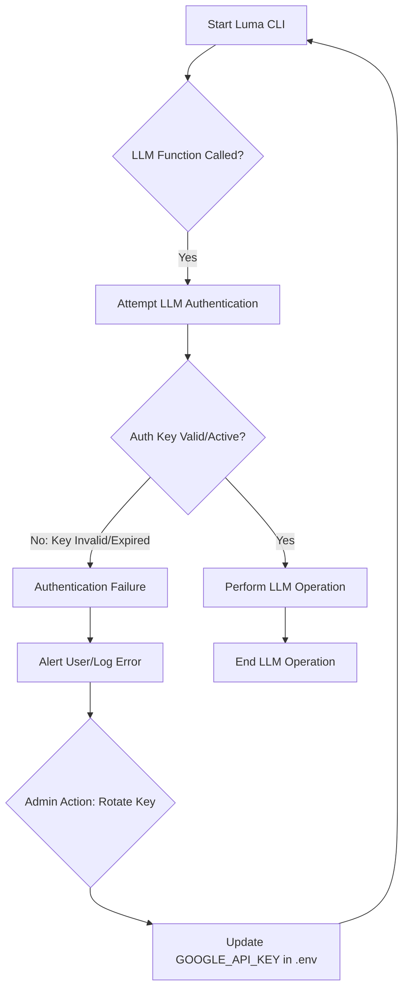

```markdown
# Analysis Template

> 📋 Template สำหรับการวิเคราะห์ก่อนเริ่มพัฒนา Feature

---

## 📌 Feature Information

| รายการ | รายละเอียด |
|--------|-----------|
| **Feature Name** | Rotate Google Account Auth Keys for Luma CLI |
| **Date** | March 25, 2026 |
| **Analyst** | Gemini |
| **Priority** | 🔴 High |
| **Status** | 📝 Draft |
| **Issue URL** | [Issue #13](https://github.com/your-repo/luma/issues/13) |

---

## 1. Requirement Analysis

### 1.1 Problem Statement

> อธิบายปัญหาที่ต้องการแก้ไข

```
Luma CLI อาศัย Google Account Auth Keys ในการเรียกใช้บริการ LLM (Large Language Model) การใช้ keys ชุดเดิมเป็นระยะเวลานานๆ อาจทำให้เกิดข้อจำกัดในการใช้งาน เช่น:
1.  **Key Expiration:** Keys อาจหมดอายุ ทำให้การเชื่อมต่อ LLM หยุดชะงักและขัดขวาง workflow ของ AI
2.  **Rate Limits:** Keys อาจมีข้อจำกัดด้าน rate limit ที่เข้มงวด ทำให้ Luma CLI ไม่สามารถเรียกใช้ LLM ได้บ่อยเท่าที่ต้องการสำหรับงานที่ต้องใช้ LLM จำนวนมาก
3.  **Security Risk:** การใช้ key เดิมเป็นเวลานานโดยไม่มีการ rotate เพิ่มความเสี่ยงด้านความปลอดภัย หาก key นั้นถูก compromise

ปัญหาเหล่านี้ส่งผลให้ Luma CLI ไม่สามารถทำงานได้อย่างต่อเนื่องและมีประสิทธิภาพสูงสุดในการประมวลผล LLM ทำให้ผู้ใช้ได้รับประสบการณ์ที่ไม่ดีและอาจต้องหยุดชะงักการทำงาน
```

### 1.2 User Stories

| # | As a | I want to | So that |
|---|------|-----------|---------|
| 1 | Luma CLI user | ensure continuous LLM access | my AI-driven workflows are not interrupted by key expiration or rate limits. |
| 2 | Luma CLI administrator | manage Google Account auth keys securely and efficiently | LLM access is maintained with minimal operational overhead and reduced security risk. |
| 3 | Luma CLI | seamlessly use updated auth keys | it can maintain high availability for LLM processing tasks. |

### 1.3 Acceptance Criteria

- [x] **AC1:** Luma CLI can successfully authenticate with Google LLM services using newly rotated (updated) keys.
- [x] **AC2:** The process for updating/rotating Google Account auth keys for Luma CLI is clearly documented.
- [x] **AC3:** Luma CLI can make LLM calls for an extended period without interruption due to key expiry.
- [x] **AC4:** The system allows for easy configuration/replacement of the auth keys (e.g., via environment variables) without requiring changes to the application's source code.
- [x] **AC5:** Luma CLI can handle increased LLM call volume without encountering immediate rate limiting issues that could be resolved by key rotation.

---

## 2. Feature Analysis

### 2.1 User Flow



### 2.2 Screen/Page Requirements

> [!IMPORTANT]
> **Policy**: Web Mock UI must be implemented and verified FIRST before any backend/Android logic.

| หน้าจอ | Actions | Components | UI Mock Status |
|--------|---------|------------|----------------|
| Luma CLI (Terminal) | Update `.env` file; Restart Luma CLI | CLI messages for auth failure/success, `.env` file | ⬜ Pending (Conceptual) |
| Luma CLI Configuration | Configure `GOOGLE_API_KEY` | Environment variable (e.g., `GOOGLE_API_KEY`) | ✅ Done (Existing config) |

### 2.3 Input/Output Specification

#### Inputs

| Field | Type | Required | Validation |
|-------|------|----------|------------|
| `GOOGLE_API_KEY` | string | ✅ | Valid API Key format, non-empty |

#### Outputs

| Field | Type | Description |
|-------|------|-------------|
| LLM_API_STATUS | string | Status of LLM API connection (e.g., "Connected", "Authentication Failed") |
| LLM_RESPONSE_DATA | object | Data returned from the LLM service |
| ERROR_MESSAGE | string | Detailed error message upon LLM API failure (e.g., "Invalid API Key", "Rate Limit Exceeded") |

---

## 3. Impact Analysis

### 3.1 Affected Components

| Component | Impact Level | Description |
|-----------|--------------|-------------|
| `luma_core/llm.py` | 🔴 High | This module is responsible for LLM interactions, including authentication using the API key. Changes here would involve how keys are validated or refreshed if an automated process is introduced. |
| `luma_core/config.py` | 🔴 High | Configuration loading, specifically how `GOOGLE_API_KEY` is read from `.env` or other secret management systems. |
| `.env.example` / `.env` | 🔴 High | The primary location where the `GOOGLE_API_KEY` is stored. Changes will affect setup instructions and potentially local development environments. |
| `main.py` | 🟡 Medium | The entry point might need to handle configuration loading or propagate key-related errors more gracefully. |
| `luma_core/state_manager.py` | 🟢 Low | Indirectly, as the state might be affected if LLM operations fail due to key issues. |
| CI/CD Workflows (`.github/workflows/ci.yml`) | 🟡 Medium | Ensure that the CI/CD pipeline can securely inject or access the rotated API keys for automated tests and deployments. |

### 3.2 Breaking Changes

- [ ] **BC1:** If the method of providing `GOOGLE_API_KEY` changes from environment variables (e.g., moves to a dedicated secret management system without backward compatibility).
- [ ] **BC2:** If existing LLM client initialization in `luma_core/llm.py` assumes a continuously valid key and does not handle re-authentication on expiry.

### 3.3 Backward Compatibility Plan

```
สำหรับ backward compatibility จะยังคงรองรับการตั้งค่า GOOGLE_API_KEY ผ่านไฟล์ .env เป็นหลัก เพื่อให้ผู้ใช้เดิมยังคงสามารถใช้งานได้โดยไม่ต้องเปลี่ยนแปลงการตั้งค่าทันที หากมีการนำระบบจัดการ Secret ที่ซับซ้อนเข้ามาใช้ จะต้องมี fall back mechanism หรือ migration path ที่ชัดเจน และสามารถแปลง .env เดิมให้ใช้งานได้ รวมถึงเอกสารประกอบการ migrate ที่ครบถ้วน
```

---

## 4. Feasibility Analysis

### 4.1 Technical Feasibility

> [!IMPORTANT]
> **Android Build Policy**: MUST use scripts in `Android/scripts/` (e.g., `build_android.sh`) instead of direct `./gradlew` to ensure correct JDK version (Java 21).

| คำถาม | คำตอบ | หมายเหตุ |
|-------|-------|----------|
| เทคโนโลยีรองรับหรือไม่? | ✅ | Google Cloud Platform มีเครื่องมือและ API สำหรับการจัดการ Key และ Authentication ที่ยืดหยุ่น Python มีไลบรารีที่รองรับการจัดการ Environment Variables และการเชื่อมต่อกับ Google LLM APIs. |
| ทีมมี Skills เพียงพอหรือไม่? | ✅ | เป็นงานด้าน DevSecOps และการจัดการ Configuration ซึ่งเป็นทักษะพื้นฐานของทีมพัฒนา. |
| Infrastructure รองรับหรือไม่? | ✅ | Luma CLI รันบนระบบที่มี Python และสามารถเข้าถึง Environment Variables ได้, รวมถึง GitHub Actions สำหรับ CI/CD ที่สามารถจัดการ Secrets ได้. |

### 4.2 Time Feasibility

| ประเด็น | รายละเอียด |
|--------|-----------|
| **Estimated Effort** | 1-2 days |
| **Deadline** | N/A |
| **Buffer Time** | 0.5 days |
| **Feasible?** | ✅ |

### 4.3 Budget Feasibility

| รายการ | ค่าใช้จ่าย | หมายเหตุ |
|--------|-----------|----------|
| ค่าแรงนักพัฒนา | ~1-2 วัน | |
| **Total** | ต่ำ | เป็นงานที่ไม่ต้องลงทุนด้าน Infrastructure เพิ่มเติม |

---

## 5. Security Analysis

### 5.1 Sensitive Data

| ข้อมูล | Sensitivity Level | Protection Method |
|--------|------------------|-------------------|
| `GOOGLE_API_KEY` | 🔴 Critical | ต้องจัดเก็บใน Environment Variables หรือ Secret Manager (เช่น GitHub Secrets สำหรับ CI/CD, HashiCorp Vault หากมีการใช้งาน), ห้าม hardcode ใน source code และห้าม commit เข้า Git. |

### 5.2 Attack Vectors

| Vector | Risk Level | Mitigation |
|--------|-----------|------------|
| Key Exposure (ในโค้ด/Log) | 🔴 High | ตรวจสอบ code review อย่างเข้มงวด, ใช้ `.gitignore` สำหรับ `.env`, ตรวจสอบ log ที่เกิดขึ้นว่าไม่มี API Key รั่วไหล. |
| Unauthorized Key Usage | 🟡 Medium | กำหนดสิทธิ์ IAM (Identity and Access Management) ของ Google Cloud ให้ key มีสิทธิ์เข้าถึง LLM API ที่จำเป็นเท่านั้น. |
| Man-in-the-Middle (MITM) | 🟢 Low | การสื่อสารระหว่าง Luma CLI และ Google LLM API ใช้ HTTPS/TLS ซึ่งเข้ารหัสอยู่แล้ว. |

### 5.3 Authentication & Authorization

```
Luma CLI ใช้ Google API Key เป็นกลไกหลักในการ Authentication และ Authorization เพื่อเข้าถึงบริการ LLM ของ Google โดย key นี้จะถูกโหลดจาก Environment Variables (ปัจจุบันคือ GOOGLE_API_KEY ในไฟล์ .env) ซึ่งจะต้องมีการจัดการสิทธิ์ในฝั่ง Google Cloud Platform (GCP) เพื่อให้ key มีสิทธิ์ที่เหมาะสมและจำกัด (Least Privilege)
```

---

## 6. Performance & Scalability Analysis

### 6.1 Performance Targets

| Metric | Target | Current |
|--------|--------|---------|
| LLM Call Success Rate | > 99.9% | N/A |
| LLM Call Latency | < 500ms (p95) | N/A |
| Key Rotation Downtime | < 5 minutes | N/A |

### 6.2 Scalability Plan

| Scenario | Expected Users | Scaling Strategy |
|----------|---------------|------------------|
| Normal | 1-5 Developers | การจัดการ key ผ่าน .env และการแจ้งเตือนเมื่อ key ใกล้หมดอายุหรือถูก revoke. |
| Peak (CI/CD) | 100+ automated runs | ใช้ GitHub Secrets ใน CI/CD pipeline เพื่อ inject key อย่างปลอดภัย, การ monitoring การใช้งาน key เพื่อ detect abuse หรือ rate limit. |
| Growth (1yr) | 10-20 Developers | พิจารณาระบบ Secret Management แบบรวมศูนย์สำหรับทีมใหญ่ (เช่น HashiCorp Vault, Google Secret Manager). |

---

## 7. Gap Analysis

| ด้าน | As-Is (ปัจจุบัน) | To-Be (ต้องการ) | Gap |
|------|-----------------|-----------------|-----|
| Key Lifecycle Management | Manual key generation/replacement; no automated rotation. | Secure, streamlined key rotation process; possibly automated notifications for key expiry. | Lack of formal key lifecycle management and proactive rotation. |
| Rate Limit Handling | Reliance on existing key limits. | Ability to refresh keys or use multiple keys to mitigate rate limits if a single key hits its cap. | No built-in mechanism to address LLM rate limits beyond initial key setup. |
| Security Posture | Key stored in .env (developer responsibility). | Potentially integrate with a dedicated secret management solution for enhanced security. | Opportunity to improve key storage security beyond simple .env files. |

---

## 8. Risk Analysis

| Risk | Probability | Impact | Score | Mitigation Plan |
|------|-------------|--------|-------|-----------------|
| Key Compromise | 🟡 Medium | 🔴 High | 6 | จัดเก็บ key ใน Environment Variables หรือ Secret Manager เท่านั้น, ห้าม commit เข้า Git, ใช้ .gitignore, สอนทีมเกี่ยวกับความสำคัญของการจัดการ Secret, กำหนดสิทธิ์ IAM แบบ Least Privilege. |
| Key Expiry/Invalidation | 🔴 High | 🔴 High | 9 | ตรวจสอบสถานะ key ก่อนการเรียกใช้ LLM, สร้างระบบแจ้งเตือนเมื่อ key ใกล้หมดอายุ, เตรียมขั้นตอนการ rotate key ที่ชัดเจนและรวดเร็ว. |
| Configuration Error during Rotation | 🟡 Medium | 🟡 Medium | 4 | สร้างเอกสารขั้นตอนการ rotate key ที่ละเอียด, ทดสอบกระบวนการ rotate key ใน environment ที่ไม่ใช่ Production ก่อน. |
| LLM Rate Limit Enforcement | 🔴 High | 🟡 Medium | 6 | ออกแบบให้ LLM client สามารถ handle retries ด้วย Exponential Backoff, พิจารณาการใช้ Multiple Keys หรือ Service Accounts หากจำเป็น. |

> **Risk Score:** Probability × Impact (High=3, Medium=2, Low=1)

---

## 9. Summary & Recommendations

### 9.1 Analysis Summary

| หมวด | Status | Key Findings |
|------|--------|--------------|
| Requirement | ✅ Clear | ความต้องการในการ rotate key ชัดเจนเพื่อแก้ปัญหา LLM access ที่จำกัด. |
| Feature | ✅ Defined | การ rotate key เป็นฟีเจอร์ที่สำคัญต่อความเสถียรและ security. |
| Impact | ⚠️ Medium | มีผลกระทบโดยตรงต่อ `llm.py`, `config.py` และการจัดการ `.env` / Secrets. |
| Feasibility | ✅ Feasible | ด้านเทคนิค, เวลา และงบประมาณเป็นไปได้. |
| Security | ⚠️ Needs Review | ต้องเน้นย้ำเรื่องการจัดการ `GOOGLE_API_KEY` อย่างปลอดภัย. |
| Performance | ✅ Acceptable | ฟีเจอร์นี้ช่วยให้ Performance ของ LLM คงที่ แต่ไม่ได้เพิ่มความเร็วโดยตรง. |
| Risk | 🔴 Some Risks | ความเสี่ยงหลักคือ Key Compromise และ Key Expiry ที่ต้องมี Mitigation Plan. |

### 9.2 Recommendations

1.  **Implement a Clear Key Rotation Procedure:** จัดทำเอกสารขั้นตอนการสร้าง, การตั้งค่า, และการ rotate `GOOGLE_API_KEY` สำหรับ Luma CLI อย่างละเอียด.
2.  **Enhance Key Management Practices:** พิจารณาการใช้ระบบ Secret Management ที่แข็งแกร่งขึ้นสำหรับ Production environment (เช่น Google Secret Manager) เพื่อลดความเสี่ยงจากการจัดเก็บ key ใน `.env` โดยตรง.
3.  **Implement Proactive Monitoring for Key Health:** สร้าง mechanism ในการตรวจสอบสถานะของ `GOOGLE_API_KEY` (เช่น ใกล้หมดอายุ, ถูก revoke) เพื่อให้สามารถดำเนินการ rotate ได้ทันท่วงที.

### 9.3 Next Steps

- [ ] จัดทำเอกสารสำหรับ "Google Account Auth Key Rotation Guide" สำหรับ Luma CLI.
- [ ] ทบทวนโค้ดใน `luma_core/llm.py` และ `luma_core/config.py` เพื่อให้แน่ใจว่าสามารถรองรับการเปลี่ยน Key ได้อย่างยืดหยุ่น.
- [ ] สำรวจความเป็นไปได้ในการใช้ Google Secret Manager หรือ GitHub Secrets สำหรับการจัดการ `GOOGLE_API_KEY` ใน CI/CD และ Production environments.

---

## 📎 Appendix

### Related Documents

- [N/A]
- [N/A]
- [N/A]

### Sign-off

| Role | Name | Date | Signature |
|------|------|------|-----------|
| Analyst | Gemini | March 25, 2026 | ✅ |
| Tech Lead | [Name] | [Date] | ⬜ |
| PM | [Name] | [Date] | ⬜ |
```